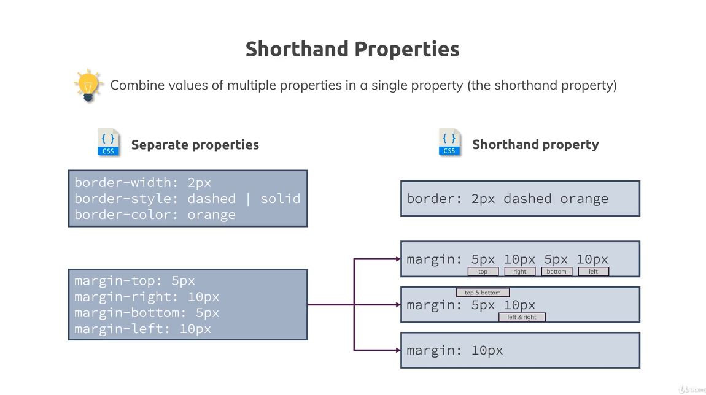
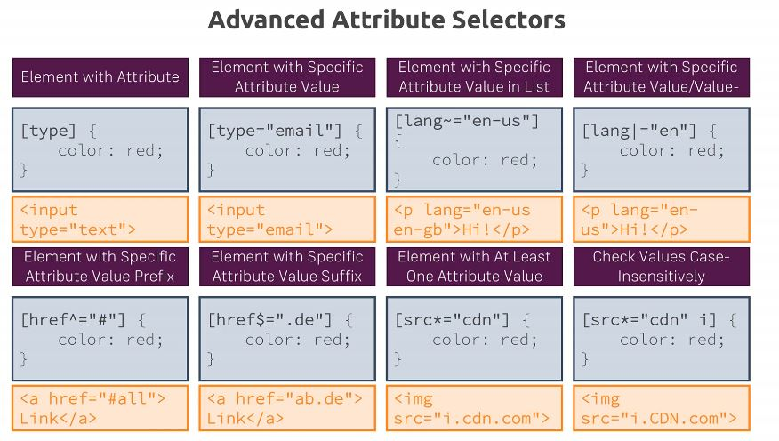
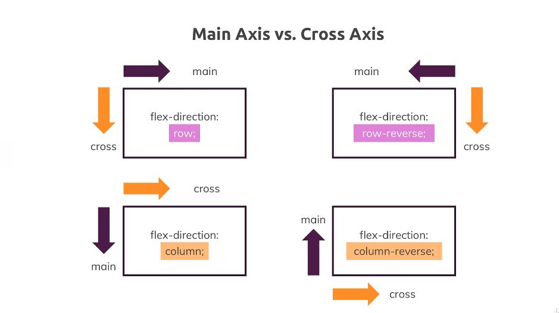
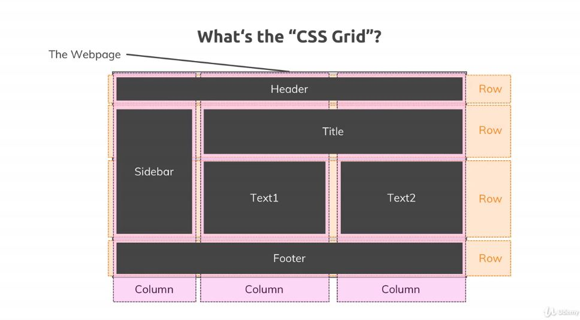

# CSS Complete Guide

Notes based on Udemy Course [CSS - The Complete Guide 2020 (incl. Flexbox, Grid, & Sass)](https://www.udemy.com/course/css-the-complete-guide-incl-flexbox-grid-sass)

## 1. Getting Started

### 1.1 What is CSS

- Cascading Style Sheets
- HTML Required, structure of the page.
- CSS allows for the styling of the page (is optional!)
- Simple provided example

### 1.2 CSS History, Present and Future

- CSS 1
    - Released in 1996
- CSS 2
    - Released in 1998
- CSS 3
    - In Development
- There will never be a CSS 4
    - Development changed
    - Split up into independent modules based on different features

### 1.3 Course Outline

- Basic Track
    - Getting Started
    - The Basics
    - Diving Deeper
    - More on Selectors & CSS Features
    - Practicing the Basics
    - Positioning
- Advanced Track
    - Backgrounds & Images
    - Dimensions, Units, & Sizes
    - Javascript & CSS
    - Responsiveness
    - Styling Forms
    - Working with Text & Fonts
- Expert Track
    - Flexbox
    - CSS Grid
    - Transformations
    - Transitions & Animations
    - Writing Future-Proof CSS
    - Sass Introduction

## 2. Diving into the Basics of CSS

### 2.1 Introduction

- How to Add CSS to HTML
- Setting up CSS Rules
- Selectors, Properties & Values
- Conflicting Styles

### 2.2 Adding CSS to our Project with Inline Styles

- Inline styling
    - Shortcuts for colors, but comes down to hex codes.

```html
<section style=style="background: #ff1b68;">
    <h1>Get the freedom you deserve!</h1>
</section>
```

- Doesn't scale well, makes it difficult to read.

### 2.3 Understanding the `<style>` Tag and Creating a `.css` file

- Can use `<style>` tag in `<head>` part of the HTML
    - Need to use *selectors*
    - Select all `<section>` elements:

```html
<head>
    <style>
        section {
            background: #ff1b68;
        }
    </style>
</head>
```

- Can use an external style sheet
    - `main.css`
    - Dont use style tags
    - Separates structure and styles.
        - Helps to keep HTML file from becoming bloated
    - Browser can cache.

```css
section {
    background: #ff1b68;
}
```

- Have to explicitly tell include the file

```html
<head>
    <link rel="stylesheet" href="main.css">
<head>
```

### 2.4 Applying Additional Styles and Importing Google Fonts

- Changing more properties:

```css
h1 {
    color: white;
    font-family: sans-serif;
}
```

- Given set of preinstalled font families, but can use Google Fonts for others
    - Get import link
    - Modify CSS file to use new font

```css
h1 {
  color: white;
  font-family: 'Anton', sans-serif;
}
```

### 2.5 Theory Time - Selectors

- More about Selectors

|                             Selector                              |                 `html`                  |             `css`             |
| :---------------------------------------------------------------: | :-------------------------------------: | :---------------------------: |
|           Elements (Set equal style for these elements)           |          `<h1>Our Header</h1>`          |     `h1 { color: red; }`      |
| Classes  (Set equal style for the elements within the same class) | `<h1 class="blog-post">Our Header</h1>` | `.blog-post { color: red; }`  |
|                      Universal (rarely use)                       |          `<h1>Our Header</h1>`          |      `* { color: red; }`      |
|              IDs (Set style to one specific element)              |  `<h1 id="main-title">Our Header</h1>`  | `#main-title { color: red; }` |
| Attributes (Set equal styles to all elements with attributes(s))  |    `<button disabled>Click</button>`    | `[disabled] { color: red; }`  |

- IDs not only used for styling, but also can add `#` at end of URL and browser will jump down to that element.
    - Semantically should only occur once in page
    - Kebab case recommended due to CSS being case-insensitive
- Class good choice for multiple-use scenarios
    - You can also assign multiple classes with a space between the classes, e.g. `class="section-title article-title`

- Modify index.html and main.css

```html
<section id="product-overview">
    <h1>Get the freedom you deserve!</h1>
</section>
<section id="plans">
    <h1 class="section-title">Choose Your Plan</h1>
</section>
```

```css
#product-overview {
  background: #ff1b68;
}

h1 {
  color: white;
  font-family: 'Anton', sans-serif;
}

.section-title {
  color: #2ddf5c;
}
```

### Understanding the "Cascading" Style and Specificity

- Both `h1` and `.section-title` selectors apply
- Class selector overrides the element one here
- Multiple rules affect same element, and have different priorities.
- Inspector with dev-tools
    - Inline at top, since inline styling takes highest priority
    - Class selector has higher priority than element selector, and second element selector takes priority over the first.
- Multiple rules applied to the same element is the cascading part of CSS
    - Rules can lead to conflicts, as shown
- To resolve conflicts, use Specificity

- Cascading Style Sheets & Specificity

|                  Cascading                   |                      Specificity                      |
| :------------------------------------------: | :---------------------------------------------------: |
| Multiple rules can apply to the same element |     Resolve conflicts arising from multiple Rules     |
|                      -                       |                     Inline Styles                     |
|                      -                       |                     #ID selectors                     |
|                      -                       | `.class`, `:pseudo-class` and `[attribute]` selectors |
|                      -                       |       `<Tag>` and `::pseudo-element` selectors        |

### Understanding Inheritance

- An element also inherits some styles of the parent element.
- Add in a global rule

```css
body {
  font-family: 'Montserrat', sans-serif;
}
```

- Any direct selector has higher specificity and will overwrite inheritance if it defines the same property as parent

### Adding Combinators

- Can use `inherit` to be explicit
    - e.g. `font-family: inherit;`
    - Not necessarily the best way
    - Apply to only the one h1 tag:
        - Class not good for only one use
        - Already have ID for section, semantically not good
        - Can use Combinator
- Combinator allows to combine multiple selectors
- More combinators, higher specificity

### Theory Time - Combinators

- Adjacent Sibling
    - `div + p {    }`
    - Using `h2 + p { color: red }`:
        - Applied: `<h2>Not Applied</h2><p>CSS Applied<p>`
        - Not applied: `<h3>Not Applied</h3><p>CSS Not Applied<p>`
    - Elements share the same parent
    - Second element comes **immediately** after first element
- General Sibling
    - `div ~ p {    }`
    - Using `h2 ~ p { color: red }`:
    - Applied: `<h2>Not Applied</h2><p>CSS Applied<p>`
    - Not applied: `<h3>Not Applied</h3><p>CSS Applied<p>`
    - Applies to same level
    - Elements share the same parent
    - Second element comes after first, but doesn't have to be directly after it.
- Child
    - `div > p {    }`
    - Using `div > p { color: red }`:
        - Applied: `<div>Not Applied</div><p>CSS Applied</p>`
        - Not applied: `<div>Not applied</div><article><p>Not applied</p></article>`
        - Second element is *direct* child of first element.
- Descendant
    - `div p {  }`
    - Level doesn't matter, all descendants
    - Using `div > p { color: red }`:
        - Applied: `<div>Not Applied</div><p>CSS Applied</p>`
        - Applied: `<div>Not applied</div><article><p>Applied</p></article>`
    - Second element is a descendant of the first element

### Summarizing Properties and Selectors

|   Selectors   |     Properties     |  Values   |
| :-----------: | :----------------: | :-------: |
|     `div`     | `background-color` |   `red`   |
| `.blog-post`  |      `width`       |   `30%`   |
| `#main-title` |      `color`       | `#fa923f` |
| `[disabled]`  |      `margin`      |  `10px`   |
|      `*`      |     `display`      |  `block`  |

- [Mozilla Developer Network CSS Reference](https://developer.mozilla.org/en-US/docs/Web/CSS/Reference)

- Value Types
    - Values are tightly coupled to specific property

| Pre-defined Options |       Colors       | Length, Sizes & Numbers |        Functions         |
| :-----------------: | :----------------: | :---------------------: | :----------------------: |
|  `display: block;`  | `background: red;` |    `height: 100px;`     | `background: url(...);`  |
|  `overflow: auto;`  |  `color: #fa923f`  |      `width:20%;`       | `transform: scale(...);` |
|          -          |   `color: #ccc;`   |       `order: 1;`       |            -             |

## 3. Diving Deeper into CSS

### Introduction

- The Box Model
- Height & Width
- The `display` Property
- "Properties Worth to Remember"
- Pseudo Classes & Elements

### Introducing the CSS Box Model

- Margin > Border > Padding > Content
- Margin not part of core element
    - Space between element and next sibling
- The layers are the Box Model

### Understanding the Box Model

```css
#product-overview {
  background: #ff1b68;
  /* below added */
  padding: 20px;
  border: 5px black solid; /* shorthand */
  margin: 20px;
}
```

### Understanding Margin Collapsing and Removing Default Margins

```css
body {
  font-family: 'Montserrat', sans-serif;
  /* below added */
  margin: 0;
}
```

- Margin Collapsing
    - Margins between elements are collapsed to one margin, bigger one "wins"
    - [MDN Reference](https://developer.mozilla.org/en-US/docs/Web/CSS/CSS_Box_Model/Mastering_margin_collapsing)

### Theory Time - Working with Shorthand Properties

- Shorthand Properties
    - Combine values of multiple properties in a single property (the shorthand property)



### Applying Shorthands in Practice

```css
#product-overview {
  background: #ff1b68;
  padding: 20px;
  /* border-style: solid;
  border-color: black;
  border-width: 5px; */
  border: 5px black solid;
  margin: 20px;
}
```

- Can see splitting up in Dev-tools

### Diving into the Height and Width Properties

- Set width to 100%

```css
#product-overview {
  background: #ff1b68;
  width: 100%;
}
```

- Default behavior here anyway
    - `section`, like `div` or `h1` elements are block elements
        - HTML feature
    - Block-level elements always take full available width by default
- Percentages, absolute pixel values

- Heigh to 100%

```css
#product-overview {
  background: #ff1b68;
  width: 700px;
  height: 100%;
}
```

- Uses *available* height
    - *Relative* height of 100%

### Understanding Box Sizing

- Height & Width

```css
#product-overview {
  background: #ff1b68;
  width: 100%;
  height: 528px;
  padding: 10px;
  border: 5px solid black;
  margin: 10px;
}
```

- Now have total width and height bigger than we specified
- All elements by default have a certain way of calculating width and height.
    - Content box

```css
#product-overview {
  /* added: */
  box-sizing: border-box;
}
```

- Now width and height include padding and border.
    - Height property setting now takes these into account
- Move box-sizing to body
    - Inheritance doesn't take effect because browser sets its own block sizing
- Use the `*` selector now to reset all elements to have certain behavior
    - Overwriting inheritance and defaults

```css
* {
  box-sizing: border-box;
}
```

### Adding the Header to our Project

- Add and modify header code

```html
<header class="main-header">
    <div>
        <a href="index.html">
            uHost
        </a>
    </div>
    <nav>
        <ul>
            <li>
                <a href="packages/index.html">Packages</a>
            </li>
            <li>
                <a href="customers/index.html">Customers</a>
            </li>
            <li>
                <a href="start-hosting/index.html">Start Hosting</a>
            </li>
        </ul>
    </nav>
</header>
```

- Add to main.css

```css
.main-header {
  width: 100%;
  background-color: #2ddf5c;
  padding: 8px 16px;
}
```

### Understanding the Display Property

- Add class to `nav`, `ul` and all `li` elements
- Use certain way of writing classes, BEM (Block element modifier)

```html
<nav class="main-nav">
    <ul class="main-nav__items">
        <li class="main-nav__item">
```

- Inline and block elements
    - `display: block` and `display: none`
        - `visibility: hidden;` alternative
- Modify main.css

```css
.main-nav__item {
  display: inline-block;
}

```

- Can still style list items like block elements, but now displayed like inline elements now

### Applying the Display Property and Styling our Navigation Bar

- Modify main.css

```css
.main-header > div {
  display: inline-block;
}

.main-nav {
  display: inline-block;
  text-align: right;
  width: calc(100% - 49px);
}

.main-nav__items {
  margin: 0;
  padding: 0;
  list-style: none;
}
```

### Understanding an Unexpected `inline-block` Behavior

- Empty whitespace is added as extra inline element
- Can remove space, but there is a better way
    - `width: calc(100% - 54px)` for now, better solution later

### Working with `text-decoration` and `vertical-align`

- Add class to brand part of header
    - `<a href="index.html" class="main-header__brand">`
- Modify main.css & change

```css
.main-header > div {
  display: inline-block;
  vertical-align: middle; /* added */
}

.main-header__brand { /* added */
  color: #0e4f1f;
  text-decoration: none;
  font-weight: bold;
  font-size: 22px;
}

.main-nav {
  display: inline-block;
  text-align: right;
  width: calc(100% - 74px); /* was 54px */
  vertical-align: middle; /* added */
}
```

### Styling Anchor Tags

```css
.main-nav__item {
  display: inline-block;
  margin: 0 16px;
}

.main-nav__item a {
  text-decoration: none;
  color: #0e4f1f;
}
```

### Adding Pseudo Classes

- Modifying main.css, using pseudo classes:

```css
.main-nav__item a:hover {
  color: white;
}

.main-nav__item a:active {
  color: white;
}
```

### Theory Time- Pseudo Classes and Pseudo Elements

- Pseudo
    - Class
        - Defines the style of a *special state* of an element
        - `:class name`
        - [MDN Reference](https://developer.mozilla.org/en-US/docs/Web/CSS/Pseudo-classes)
    - Element
        - Defines the style of a *specific part* of an element
        - `: : element name`
        - [MDN Reference](https://developer.mozilla.org/en-US/docs/Web/CSS/Pseudo-elements)

- Examples:

```css
.main-nav__item a::after {
  content: " (Link)";
  color: red;
}

p::first-letter {
  color: red;
  font-size: 20px;
}
```

### Grouping Rules

- Modify main.css

```css
.main-nav__item a:hover, .main-nav__item a:active {
    color: white;
}
```

### Working with `font-weight` and `border`

- Modifying main.css:

```css
.main-nav__item a {
  text-decoration: none;
  color: #0e4f1f;
  font-weight: bold;
  padding: 3px 0;
}

.main-nav__item a:hover, .main-nav__item a:active {
  color: white;
  border-bottom: 5px solid white;
}
```

### Adding and Styling a CTA-Button

- Call to Action button

```html
<li class="main-nav__item main-nav__item--cta">
```

```css
.main-nav__item--cta a {
  color: white;
  background: #ff1b68;
  padding: 8px 16px;
  border-radius: 8px;
}

.main-nav__item--cta a:hover,
.main-nav__item--cta a:active {
  color: #ff1b68;
  background: white;
  border: none;
}
```

### Adding a Background Image to our Project

- Modifying main.css

```css
#product-overview {
  background: url("freedom.jpg");
  width: 100%;
  height: 528px;
  padding: 10px;
}
```

### Properties Worth to Remember


## 4. More on Selectors and CSS Features

### Introduction (4)

- More on CSS Classes
- `!important`
- More on Pseudo Classes & Elements
- `not()`

### Using Multiple CSS Classes and Combined Selectors

- More on CSS Classes
    - You can use multiple classes on one element
        - html: `<div class="class1 class2"`
        - css: `.class1 { ... } .class2 { .. }`
    - You can select a same-element combination
        - html: `<a href="#" class="active">`
        - css: `a.active { ... }`

### Classes or IDs

- Classes 1st pick

| CSS Class Selectors                                           | Class ID Selectors                           |
| ------------------------------------------------------------- | -------------------------------------------- |
| `.some-class{ ... }`                                          | #some-id {...}                               |
| `<div class="some-class">`                                    | `<div id="some-id">`                         |
| Re-usable                                                     | Only used once per page                      |
| Allow you to "mark" and name things for styling purposes only | Also got non-CSS meaning (e.g. on-page link) |
| Most-used selector type                                       | Use if available anyways                     |

- Link to elsewhere on a page
    - Baked into HTML
    - HTML: `href="#test"`
    - URL: ~#test

### (Not) using `!important`

```css
div {
  color: red !important;
  /*
    overwrites specifity and all other selectors
  */
}
```

Do **NOT** use, bad practice

### Selecting the Opposite with `:not()`

Excludes selectors

#### [:not()](https://developer.mozilla.org/en-US/docs/Web/CSS/:not)

### CSS and Browser Support

- Whenever you use a certain feature, browser must support it.
- There's a way to go around this in some cases, come back to this later
- Can be found at the bottom of MDN references
- Also: caniuse.com

## 5. Practicing the Basics

### Adding Style to our Plans

Add class to each article plan
`<article class="plan">`

Add CSS

```css
.section-title {
  color: #2ddf5c;
  text-align: center; /* added */
}
/* ... */
.plan {
  background: #d5ffdc;
  text-align: center;
  padding: 16px;
  margin: 8px;
  display: inline-block;
  width: 30%;
  vertical-align: middle;
}
```

### Working on the Recommended Plan

Add article class and modify title

`<article class="plan plan--hightlighted">`

`<h1 class="plan__annotation">RECOMMENDED</h1>`

Modify `main.css`, introducting new `box-shadow` and `rgb()`/`rbga()` color function

```css
.plan--hightlighted {
  background: #19b84c;
  color: white;
  box-shadow: 2px 2px 2px 2px rgba(0, 0, 0, 0.5);
}
```

### Styling the Badge with `border-radius`

Can use border-radius to round the corners

```css
.plan__annotation {
  background: white;
  color: #19b84c;
  padding: 8px;
  box-shadow: 2px 2px 2px 2px rgba(0, 0, 0, 0.5);
  border-radius: 8px;
}
```

### Styling our List

Get rid of margin and padding from all `ul`

`<ul class="plan__features">`

```css
.plan__features {
  list-style: none;
  margin: 0;
  padding: 0;
}
```

Adjust individual list items

`<li class="plan__feature">`

```css
.plan__feature {
  margin: 8px 0;
}
```

### Working on the Title and the Price of our Packages

New Classes

`<h1 class="plan__title">FREE</h1>`

`<h2 class="plan__price">$0/month</h2>`

```css
/* main.css */
.plan__title {
  color: #0e4f1f;
}

.plan__price {
  color: #858585;
}

.plan--hightlighted .plan__title {
  color: white;
}

.plan--hightlighted .plan__price {
  color: #0e4f1f;
}
```

### Improving our Action Button

Add class

`<button class="button">CHOOSE PLAN</button>`

Styling, using `inherit` for font

```css
.button {
  background: #0e4f1f;
  color: white;
  font: inherit;
  border: 1.5px solid #0e4f1f;
  padding: 8px;
  border-radius: 8px;
  font-weight: bold;
  cursor: pointer;
}

.button:hover,
.button:active {
  background: white;
  color: #0e4f1f;
}
```

### Understanding Outlines

Comparable to border but is not part of box model, can use on focus active pseudo property

```css
.button:focus {
  outline: none;
}
```

### Presenting the Core Features to the User

Add new given HTML section

### Styling the Headline of the Core Features Section

Reuse section-title class, and add id to section

`<section id="key-features">`

`<h1 class="section-title">Many Good Reasons to Stick Around</h1>`

Styling

```css
#key-features {
  background: #ff1b68;
  margin-top: 80px;
  padding: 16px;
}

#key-features .section-title {
  color: white;
  margin: 32px;
}
```

### Preparing the Content of the Key Feature Area

Add classes

`<ul class="key-feature__list">`

`<li class="key-feature">`

`<p class="key-feature__description">Lightning Fast CDN</p>`

`<div class="key-feature__image"></div>`

Styling

```css
.key-feature__list {
  list-style: none;
  margin: 0;
  padding: 0;
  text-align: center;
}

.key-feature {
  display: inline-block;
  width: 30%;
  vertical-align: top;
}

.key-feature__image {
  background: #ffcede;
  width: 128px;
  height: 128px;
  border: 2px solid #424242;
  border-radius: 50%;
  margin: auto;
}

.key-feature__description{
  text-align: center;
  font-weight: bold;
  color: white;
  font-size: 20px;
}
```

### Adding the Footer

Add given new html code, assign classes

`<footer class="main-footer">`

`<ul class="main-footer__links">`

`<li class="main-footer__link">`

Styling

```css
.main-footer {
  background: black;
  padding: 32px;
  margin-top: 48px;
}

.main-footer__links {
  list-style: none;
  margin: 0;
  padding: 0;
  text-align: center;
}

.main-footer__link {
  display: inline-block;
  margin: 0 16px;
}

.main-footer__link a {
  color: white;
  text-decoration: none;
}
.main-footer__link a:hover,
.main-footer__link a:active {
  color: #ccc;
}
```

### Adding Packages Page

Reuse everything but what's in `<main>`

`./packages/index.html`

`./packages/packages.css`

Separate out CSS files

`./shared.css`

### Styling the Links

Add classes

`<section class="package">`

Styling

```css
main {
  padding-top: 32px;
}

.package {
  width: 80%;
  margin: 16px 0;
  border: 4px solid #0e4f1f;
  border-left: none;
}

.package a {
  text-decoration: none;
  color: inherit;
  display: block;
  padding: 32px;
}
```

### Styling our Package Boxes

Add classes

`<h1 class="package__title">`

`<h2 class="package__subtitle">`

`<p class="package__info">`

Also add individual IDs for each plan:

`<section class="package" id="plus">`

`<section class="package" id="free">`

`<section class="package" id="premium">`

Styling

```css
.package:hover,
.package:active {
  box-shadow: 2px 2px 4px rgba(0, 0, 0, 0.5);
  border-color: #ff5454;
}

#plus {
  background: rgba(213, 255, 220, 0.95);
}

#free {
  background: rgba(234, 252, 237, 0.95);
}

#premium {
  background: rgba(14, 79, 31, 0.95);
}

#premium .package__title {
  color: white;
}

#premium .package__subtitle {
  color: #bbb;
}
```

### Adding "float" to our Package

Overwrite default positioning and tell browser to push element to left or right of page. Not great for moving block style elements.

Add properties

```css
#free {
  background: rgba(234, 252, 237, 0.95);
  float: right;
  border-right: none;
  border-left: 4px solid #0e4f1f;
  text-align: right;
}
```

Need clearfix to fix float.

`<div class="clearfix"></div>`

```css
.clearfix {
  clear: both;
}
```

### Fixing the Hover Effect

Specificity border rule overrides, because of ID selector

Simple fix with redundant code

```css
#free:hover,
#free:active {
    border-left-color: #ff5454;
}
```

An alternative fix, only on *very very* rare occasions, using `!important`

```css
.package:hover,
.package:active {
  box-shadow: 2px 2px 4px rgba(0, 0, 0, 0.5);
  border-color: #ff5454 !important;
}
```

***NOT RECOMMENDED!***

### Adding Final Touches

On main page, add class

`<div class="plan__list">`

Styling

```css
.plan__list {
  width: 80%;
  margin: auto;
  text-align: center;
}
```

## 6. Positioning Elements with CSS

### 6. Introduction

**Positioning** - How to change the position of Elements

1. Understanding the `position` Property
2. Fixed Navigation Bars with `fixed`
3. Positioning Elements with `z-index`
4. Using `absolute` and `relative` - Stand Alone and Combined
5. "Sticky" Positioning
6. The "Stacking Context"

### Why Positioning will Improve our Website

- Fixed Navigation Bar
- Background Image, slogan, positioning.
- Background Image on Packages page
- Add Badge to Plus plan on Packages page

### Understanding Positioning - The Theory

`position` property applied automatically with `static` default value

Other values include `absolute`, `relative`, `fixed`, `sticky`(new)

Changing the Position

Top, bottom, left, right options.

Refer to initial position in ***Document Flow***

Options to **Positioning Context**

### Working with the `fixed` Value

`top: 100px;`

- Not reflected
- Need to provide value other than default

`position: fixed;`

- Removed from document flow

```css
.parent .child-1 {
  position: fixed;
  width: 400px;
  top: 100px;
}
```

- Now applied
- Use `top: 0;` and `margin: 0;` to see *context*
- Now has viewport for the positioning context
- Example navbar:

```css
.parent .child-1 {
  position: fixed;
  width: 100%;
  top: 0;
  left: 0;
  margin: 0;
  box-sizing: border-box;
}
```

- Can apply positioning no matter if it's a block level element or inline element

### Creating a Fixed Navigation Bar

- Modify `main-header`

```css
.main-header {
  width: 100%;
  position: fixed;
  top: 0;
  left: 0;
  background-color: #2ddf5c;
  padding: 8px 16px;
}
```

### Using `position` to Add a Background Image

Add `div` for background: `<div class="background"></div>` (in between header and beginning of body)

For image, add property `background`

- Set width/height to 100%, but cannot see image?
    - This is due to position property.
    - Use pixels, can now see.
    - Change to fixed position and can now use percentages

```css
.background {
  background: url('../images/plans-background.jpg');
  width: 100%;
  height: 100%;
  position: fixed;
}
```

### Understanding the Z-Index

- Were able to position along axis, now need `z-index`
- Every element has `z-index: auto;` by default, which is `z-index: 0;`
- Use positive numbers to position above, negative for below
- **NOTE**: If element doesn't have position property applied (different from default), `z-index` has no effect
- Because background is fixed, covers up all package elements even though `z-index` may be 0.
    - Can see Navbar because it is also fixed
- Now can add to background:

```css
.background {
  /* ... */
  z-index: -1;
}
```

### Adding a Badge to our Package

Add badge on 'Plus' package

`<h2 class="package__badge">RECOMMENDED</h2>`

Styling:

```css
.package__badge {
  position: fixed;
  top: 0;
  left: 0;
  margin: 20px;
}
```

- Problem here is, the position context is the viewport, and that's not what we want here.
    - Change to `absolute`
        - No longer stuck to viewport
    - Context based on two cases
        - If no ancestors have position property, then positioning context is just the HTML element
        - If it does have ancestors, the the closest one with position property applied is the positioning context for this element
- Apply `absolute` to whole `package` instead, breaks all packages.
    - Change to `relative`
        - Fixes this and gives badge a positioning context

```css
.package {
  /* ... */
  position: relative;
}
```

### Styling and Positioning our Badge with `absolute` and `relative`

Adjust package badge styling

```css
.package__badge {
  position: absolute;
  top: 0;
  right: 0;
  margin: 20px;
  font-size: 12px;
  color: white;
  background-color: #ff5454;
  padding: 8px;
}
```

Also on `.main-header`: `z-index: 1;`, to keep package from going over navbar

### Diving Deeper into Relative Positioning

- Using demo code, appling relative position to first child
    - Initially, nothing changes
    - Add a top/left, element moves
- With `position: relative`, element is **not** taken out of document flow.
- `absolute` and `fixed` specifiy distance to parent element basically
- `relative` just specifies how it should move from current position
    - Can end up moving directly out of parent

### Working with `overflow` and Relative Positioning

- In parent, can apply `overflow: hidden`
    - Elements positioned out of parent are hidden
    - Doing with `body` and `parent` instead, doesn't work.
        - Is passed to HTML selector
            - Default CSS behavior
        - Now doesn't apply to child
    - Can add to **both**

### Introducing `sticky` Positioning

Using demo code

Add `position: sticky;` to `.parent .country`

Behaves like fixed, but then has a limit

- `sticky` is a combination of relative and fixed
    - Doesn't do anything without setting top or right, etc
    - Can specify distance between element and viewport
    - End of the content in the parent is limit
    - Rather new value for `position` property, browser support not perfect yet

### Understanding the Stacking Context

Using demo code

Fixed elements, taken out of document flow, with default `z-index`

Stacking context comes into play when dealing with the children. 

Image will never go below its parent, will never go above elements higher than the parent

Only effects elements *inside* the parent

Stacking context depends on `z-index` of the **parent**

## 7. Understanding Background Images and Images

### 7. Introduction

1. Understanding the `background` Property
2. Images and Background Images
3. Gradients
4. Filters

### Understanding `background-size`

- Using direct background properties such as `background-image` and `background-color`
- Can define multiple backgrounds, just one color, but muiltiple images
- Can also use `background-size`
    - `background-size: 100px;` affects the width here, can set width and height with `background-size: 100px 50%;`
        - Also have pre-defined keywords, such as `cover`
            - `cover` finds out if height or weight is more important, sets width to 100% here, landscape container
        - `contain` is another
            - entire image
    - Can turn off repeating effect with `background-repeat: no-repeat;`
        - Other options, such as `repeat-x` and `repeat-y`

### Working with `background-position`

- `background-position` first value is x-axis, second is y-axis, top edge
- Can also use percentage values here, which is based off of the excess space
    - Default for y-axis is 50%
    - Keyword `center` = `background-position: 50% 50%;`
    - Also `left`, `top`, `bottom`, `right`
    - Able to combine
        - `background-position: left 10% bottom 20%;`

### The `background` Shorthand - Theory

- The background property
    - `background: red;`
    - `background` is a shorthand property
        - `background-image`
            - Set one or more background images
        - `background-color`
            - Set a background color
        - `background-position`
            - Set initial position, relative to background position layer
            - Defined by `background-origin`
        - `background-size`
            - Set size of background image
        - `background-repeat`
            - Defines how background images are repeated
        - `background-origin`
            - Set background positioning area
        - `background-clip`
            - Define whether background extends underneath border
        - `background-attachment`
            - Sets the scrolling behavior of the background image
    - All except for `background-color` and `background-clip` refer to `background-image` only

### Applying `background` Origin, Clip and Attachment

- Comparable to box-sizing, but has extra value
- By default cropped before border, can change here
- Can set `background-origin: border-box;` to have it go below border, away from default
- `content-box` means content without border padding
- `padding-box` including content and padding, but not border, is default value

- Can affect the cropping with `background-clip`
    - Setting to `border-box`, same as before
    - Setting to `padding-box` will clip image *after* padding
    - Can set to `content-box` to clip *before* padding
        - Also affects width here
    - Overwrites `background-origin`

- `background-attachment` defines how scrolling behaves in a container that has a background image but not fixed itself
    - Can set `fixed`, `scroll`, or `local`
    - Rarely used

### Using the `background` Shorthand on our Project

```css
#product-overview {
  background: url('freedom.jpg') left 10% bottom 20% / cover no-repeat
    border-box;
  width: 100%;
  height: 528px;
  padding: 10px;
  margin-top: 43px;
  position: relative;
}
```

`border-box` at end applies to origin and clip, can give two separate values

### Styling Images

```html
<a href="index.html" class="main-header__brand">
  
</a>
```

- Need to adjust size
- Default behavior is if you enter an image tag and you point to an image, then the default height and width of the original image will be used, regardless of the surrounding element
- Setting height on image elemnt as percentage dont respect surrounding container due to it being an inline element
- Must set `display: inline-block;`

```css
.main-header__brand {
  color: #0e4f1f;
  text-decoration: none;
  font-weight: bold;
  font-size: 22px;
  height: 22px;
  /* width: 20px; */
  display: inline-block;
}

.main-header__brand img {
  height: 100%;
  /* width: 100%; */
}
```

### Adding the Customers Page to our Website

Add given code and fix links

### Working on the Image Layout

```css
.testimonial__image-container {
  width: 65%;
  display: inline-block;
  vertical-align: middle;
  box-shadow: 3px 3px 3px 3px rgba(0,0,0,0.3);
}

.testimonial__image {
  width: 100%;
  vertical-align: top;
}

.testimonial__info {
  text-align: right;
  padding: 14px;
  display: inline-block;
  vertical-align: middle;
  width: 30%;
}
```

### Understanding Linear Gradients

- Treated as images
- `background-image: linear-gradient(red, blue);`
    - Line top to bottom by default, can give direction
- `background-image: linear-gradient(to bottom, red, blue);`
    - Same as previous
    - Can do `to right bottom`
- Also use degrees
    - `background-image: linear-gradient(0deg, red, blue);`
        - Bottom, `180deg` for top
- Define multiple colors, hex codes
    - `background-image: linear-gradient(180deg, red, blue, green, yellow, #fa923f);`
    - Or `transparent`
    - Also `rgba()`
- Can also define percentages of color in gradient
    - `background-image: linear-gradient(180deg, red 70%, blue 60%, rgba(0,0,0,0.5));`
        - Hard cutoff here

### Applying Radial Gradients

- `background-image: radial-gradient(red, blue);`
- Circlular elipse, can change shape:
    - `background-image: radial-gradient(circle, red, blue, green);`
- Position:
    - `background-image: radial-gradient(circle at top left, red, blue, green);`
    - Custom values
        - `background-image: radial-gradient(circle at 20% 50%, red, blue, green);`
- Size: `background-image: radial-gradient(circle 20px at 20% 50%, red, blue, green);`
- Other keywords
    - `background-image: radial-gradient(ellipse farthest-side at 20% 50%, red, blue, green);`
        - `closest-side`
        - `closest-corner`
        - `farthest-corner`
- Also treated as images like linears

### Stacking Multiple Backgrounds

- Using multiple backgrounds
    - `background:`
    - Only one `background-color` may be used
    - But can use multiple images
    - Separate different layers with commas
- Modify main.css background

```css
#product-overview {
  background: linear-gradient(to top, rgba(80, 68, 18, 0.6) 10%, transparent), url('./images/freedom.jpg') left 10% bottom 20% / cover no-repeat
    border-box, #ff1b68;
    /* ... */
}
```

### Understanding Filters

- Can change look of an element by applying filters
- For example
    - `filter: blur(10px);`
- [MDN CSS filter Reference](https://developer.mozilla.org/en-US/docs/Web/CSS/filter)
- Modify packages.css:

```css
.background {
  background: url('../images/plans-background.jpg') center/cover;
  filter: grayscale(40%);
  width: 100%;
  height: 100%;
  position: fixed;
  z-index: -1;
}
```

- Not supported in IE

### Adding and Styling SVGs - The Basics

- Full topic all on it's own
- Add given `svg` code to HTML
- Icons added
- Can style `svg`
- `fill` and `stroke` properties

## 8. Sizes and Units

### 8. Introduction

- Dimensions, Sizes, and Units
- In this Module
    - Theory - Which Units can we Use?
    - `%` and the Containing Block
    - `min-width` & `max-width`
    - Understanding `rem` vs `em`
    - Working with `vw` and `vh`

### Where Units Matter

- Pixels, Percentages & More

|      Units      |   -   |
| :-------------: | :---: |
|     pixels      | `px`  |
|   percentages   |  `%`  |
|     root em     | `rem` |
|       em        | `em`  |
| viewport height | `vh`  |
| viewport width  | `vw`  |

- **3 Core Questions**
    1. Which properties can I use in connection with these units?
    2. How is the size calculated?
    3. What's the right unit to choose?

- Where Units Matter
    - Box model (`box-sizing: border-box;`), content, padding, border, margin
    - Which properties can I use?
        1. `font-size`
        2. `padding`
        3. `border`
        4. `margin`
        5. `width`
        6. `height`
        7. `top`
        8. `bottom`
        9. `left`
        10. `right`

- Different units, properties

### An Overview of Available Sizes and Units

- How is the Size Calculated?

|      Absolute Lengths       |      Viewport Lengths      |    Font-Relative Lengths    |
| :-------------------------: | :------------------------: | :-------------------------: |
| Mostly ignore user settings | Adjust to current viewport | Adjust to default font size |
|            `px`             |            `vh`            |            `rem`            |
|             cm*             |            `vw`            |            `em`             |
|             mm*             |           `vmin`           |             ...             |
|             ...             |           `vmax`           |              -              |
|              -              |            `%`             |             `%`             |

- *Different depending on browser, not regularly used
- Percentages are a special case
- How is the Box Size for % Units Calculated?

### Rules to Remember: *Fixed* Positioning & `%`

- Reference for element with a percentage unit is called the *containing block*
- Element
    - With `position: fixed;`
        - Has an impact
        - Containing block is actually viewport
        - Example with Nav Bar

### Rules to Remember: *Absolute* Positioning & `%`

- Refers to Ancestor content + the padding.
- Containing block is the closest ancestor which is not `position: static;`
    - Example with slogan and `section` on main page

### Rules to Remember: *Relative* / *Staic* Positioning & `%`

- Only Ancestor content
- Closest that is block level element
- Example with customer image container

### Fixing the Height 100% Issue

`<div class="backdrop"></div>`

```css
.backdrop {
  position: fixed; /* demo with absolute */
  display: none; /* hide for now */
  top: 0;
  left: 0;
  z-index: 100;
  width: 100%;
  height: 100%;
  background: rgba(0,0,0,0.5)
}
```

Also fixes the margin stacking

### Defining the Font Size in the Root Element

```css
html {
  font-size: 75%;
}
```

### Using `min-width`/`min-height` and `max-width`/`max-height`

- Modifying customer images

```css
.testimonial__image-container {
  max-width: 580px;
  /* ... */
}
```

### Working with `rem` and `em`

- Based on font-size
- `2em` in example calculates to 40px
- Modify project to make font-size more dynamic with thes units

```css
/* customers.css */
.testimonial {
  font-size: 1.2em;
  /* ... */
}

.testimonial__name {
  font-size: 2em;
  /* ... */
}

.testimonial__subtitle {
  font-size: 1.1em;
  /* ... */
}
```

- `em` inherits previous sizes
- Can get out of control easily, careful
- `rem` for root
    - Switch all above to `rem`

### Adding `rem` to Additional Properties

```css
.testimonial {
  font-size: 1.2rem;
  /* ... */
}

.testimonial:first-of-type {
  margin-top: 6rem;
}

.testimonial__info {
  padding: 0.9rem;
  /* ... */
}

.testimonial__name {
  margin: 0.2rem;
  /* ... */
}

.testimonial__text {
  margin: 0.2rem;
}
```

- Not recommended to use `rem` of `box-shadow` here

### Finishing `rem`

Modifying packages.css

```css
main {
  padding-top: 2rem;
}

.package {
  margin: 1rem 0;
  /* ... */
}

.package a {
  padding: 2rem;
  /* ... */
}

.package__badge {
  margin: 1.2rem;
  padding: 0.5rem;
  font-size: 0.8rem;
  /* ... */
}

.package__info {
  padding: 1rem;
  font-size: 1.2rem;
  /* ... */
}
```

- Use rest of given code


### Understanding the Viewport Units `vw` and `vh`

- Modify shared.css:
    - Also have `vmin` & `vmax`

```css
.backdrop {
  width: 100vw;
  height: 100vh;
  /* ... */
}
```

- Modify main.css as well:

```css
#product-overview {
  /* changed bottom to 70% below */
  background: linear-gradient(to top, rgba(80, 68, 18, 0.6) 10%, transparent),
    url('images/freedom.jpg') left 10% bottom 70% / cover no-repeat border-box,
    #ff1b68;
  /* ... */
  width: 100vw;
  height: 33vh;
  /* ... */
}
```

### Windows, Viewport Units and Scrollbars

`vw` in Windows does not include scrollbars, can use `width: 100%;` and other solutions

### Choosing the Right Unit

- Which Unit Should I Choose?

|            Property             |     "Recommended" Unit      |
| :-----------------------------: | :-------------------------: |
|   `font-size (root element)`    |          `%`, `-`           |
|           `font-size`           | `rem (em => Children only)` |
| `padding` **`border`** `margin` |    `rem` **`px`** `rem`     |
|        `width` `height`         |      `%` `vw` `%` `vh`      |
|         `top` `bottom`          |           `%` `%`           |
|         `left` `right`          |           `%` `%`           |

### Using `auto` to Center Elements

- `margin: auto;` only works for block level elements with an explicitly assigned width though

### Cleaning Up our Code

- One modification in packages.css:

```css
.background {
  /* ... */
  width: 100vw;
  height: 100vh;
}
```

### Understanding Property Notations

- In Javascript, etc. using `border-radius` equates to `borderRadius` (Camel Case)

## 11. Adding and Styling Forms

### Advanced Attribute Selectors



## 13. Adding FlexBox to our Project

### 13. Introduction

1. The Flex-Container
2. Main Axis vs. Cross Axis
3. The Flex Items

### How we Could Improve our Project

- Get rid of `display: inline-block;` declarations and fix other small issues

### Understanding Flexbox

- Change the way elements are displayed
- Need the `display:` property
    - Assign flex: `display: flex;`
- We create a flex container this way
    - Parent = Flex container
        - Can apply various properties:
            - `flex-flow:`
            - `justify-content:`
            - `align-content:`
            - `align-items:`
    - Children = Flex Items
        - Can apply various properties:
            - `order:`
            - `flex:`
            - `align-self:`

### Creating a Flex Container

- Using demo code for theory
- Start by just adding `display: flex;`
    - Now in a row
    - Elements are using entire height available in the parent
    - Height defined by element with largest height, 300px in this case
    - All items in container are now flex items
- `display: inline-flex;` alternative, behaves like inline element, uses size needed for content.
    - The height is still used according to definition of the 4th element

### Using `flex-direction` and `flex-wrap`

- Apply `flex-direction: row;` (default behavior)
- Apply `flex-wrap: nowrap;` (default behavior)
    - Change to `wrap`
    - Now the height will change, while width will decrease/increase as needed
- Change direction to `column`
    - Now behaves like we expect block level elements to
    - Elements with no width defined will change even less than needed by content
    - Also have `column-reverse` and `row-reverse`

### Understanding the Importance of Main Axis and Cross Axis

- Starting point for main axis is top left corner of element or website, to the top right
- Cross axis has same starting point, goes down to bottom left corner
- `row-reverse` flips main axis, for example
    - Cross axis starts in right top corner, always has same starting point



### Working with `align-items` and `justify-content`

- First, can do `flex-flow:` shorthand to do both `flex-direction` and `flex-wrap`
    - For example: `flex-flow: row wrap;`

- `align-items: stretch;`
    - Default value
    - Height always follow maximum height
- Change to `align-items: center;`
    - Centered along cross-axis
    - Different behavior when `column` flex instead of `row`
- Change to `align-items: flex-start;`
    - Aligned to start of cross axis
    - Can also use `flex-end;`
- What about main axis?
    - Can use `justify-content: center;` for example, to center along main axis

#### **Justify Content** defines poisition of flex elements along *main axis*

#### **Align Items** defines poisition of flex elements along *cross axis*

- Using value `baseline` for `align-content`, aligns to baseline of actual content

### And What About `align-content`

- `align-content` allows us to align items along the cross axis
    - Use values such as `space-between`, `center`
    - Aligns a flex-containers lines within the flex container when there is *extra space in the cross-axis*
    - Similar to how `justify-content` aligns individual items within the main axis

### Improving Navigation Bar with Flexbox

Turn main header into flex-container and improve

```css
.main-header {
  /*  */
  display: flex;
  align-items: center;
  justify-content: space-between;
}
/* can now remove .main-header > div {...} */
/* ... */
.main-header__brand {
  /* can remove two below: */
  display: inline-block;
  vertical-align: middle;
}
/* need to change image height now */
.main-header__brand img {
  height: 2.5rem;
  vertical-align: middle;
}
/* ... */
.main-nav__items {
  margin: 0;
  padding: 0;
  list-style: none;
  display: flex;
}

.main-nav__item {
  margin: 0 1rem;
}
/* ... */
@media (min-width: 40rem) {
  .toggle-button {
    display: none;
  }

  .main-nav {
    /* display: inline-block;
    text-align: right;
    width: calc(100% - 44px);
    vertical-align: middle; */
    display: flex;
  }
}
```

### Working on the Mobile Navigation Bar

```css
.mobile-nav__items {
  /* ... */
  /* text-align: center; */
  display: flex;
  flex-flow: column;
  justify-content: center;
  align-items: center;
}
```

### Improving the Footer

```css
.main-footer__links {
  /*  */
  /* text-align: center; */
  display: flex;
  flex-direction: column;
  align-items: center;
}

.main-footer__link {
  /* display: block; */
  margin: 0.5rem 0;
}
/* ... */
@media (min-width: 40rem) {
  .main-footer__link {
    /* display: inline-block; */
    margin: 0 1rem;
  }

  .main-footer__links {
    flex-direction: row;
    justify-content: center;
  }
}
```

### Improving Plans and Features

- Plans

```css
@media (min-width: 40rem) {
  .plan__list {
    width: 100%;
    /* text-align: center; */
    display: flex;
    justify-content: center;
    align-items: center;
  }

  .plan {
    /* display: inline-block; */
    /* vertical-align: middle; */
    width: 30%;
    min-width: 13rem;
    max-width: 25rem;
    display: flex;
    flex-direction: column;
    justify-content: space-between;
    height: 28rem;
  }

  .plan--highlighted {
    box-shadow: 2px 2px 2px 2px rgba(0, 0, 0, 0.5);
    height: 30rem;
    z-index: 50;
  }
}
```

- Features

```css
@media (min-width: 40rem) {
  .key-feature {
    /* display: inline-block; */
    /* vertical-align: top; */
    width: 30%;
    max-width: 25rem;
  }

  .key-feature__list {
    display: flex;
    justify-content: center;
  }
}
```

### Adding Flexbox to Customers Page

```css
@media (min-width: 40rem) {
  .testimonial {
    margin: 3rem auto;
    max-width: 1500px;
    display: flex;
    align-items: center;
    justify-content: space-around;
  }

  .testimonial__image-container {
    /* display: inline-block; */
    /* vertical-align: middle; */
    width: 66%;
  }

  .testimonial__info {
    /* display: inline-block; */
    /* vertical-align: middle; */
    width: 30%;
  }
}
```

### Using the `order` Property for a Flex Item

- Changing the order of elements
- Default value is `order: 1;`

```css
.item-4 {
  /*  */
  order: 1;
}
```

- The bigger number, the later it will be positioned in the order
    - opposite for negative values (earlier in order)

### Working with `align-self`

- `align-self` allows for positioning a single flex item along cross axis, overwriting default alignment
    - i.e. `align-self: flex-end;`

### Understanding `flex-grow`

- Default is `flex-grow: 0;`
    - Elements will grow given the fraction of the space given
    - Adjusts to remaining space
    - Two elements with `flex-grow: 1;` will divide remaining space by two
    - Giving an element flex-grow larger than 0 means it will take up all the space available

### Applying `flex-shrink`

- Default is `flex-shrink: 1;`
    - Defines behavior when width is decreased, or remaining space
    - Given `0`, element will not shrink below predefined width
- Define *if* an element is allowed to shrink, and how much more one element is allowed to shrink when compared with another

### Comparing `flex-basis` vs `width` and `height`

- `flex-basis` defines size of an element depending on main axis
    - `auto` will fallback to a width/height given depending on flex direction
    - Can use percentage values
    - Always refers to main axis
    - Can only be applied to flex items

- Shorthand for `flex-grow, flex-grow, flex-shrink`
- `flex: 0 1 auto;`

## 14. Using the CSS Grid

### What is the CSS Grid



- Not supported by older browsers

### Turning a Container into a Grid

```css
.container {
  margin: 20px;
  display: grid;
}
```

### Defining Columns and Rows

- On `.container`
    - `grid-template-columns: 200px 150px 20% 1fr;`
        - Defines 4 columns
    - `grid-template-rows: 5rem 2.5rem;`
        - Defines 2 rows

### Positioning Child Elements in a Grid

- On inner element:
    - For columns
        - `grid-column-start: 3;`
        - `grid-column-end: 5;`
    - For rows
        - `grid-row-start: 1;`
        - `grid-row-end: 3;`

### Using `element-sizing`, `repeat` and `minmax`

- Use `auto` to size element only as big as it needs to be, or as much as content r
- Filly empty spaceequires
    - *If* no height defined
- Equally sized columns
    - Using `repeat` function
    - `25% 25% 25% 25%;` --> `repeat(4, 25%);`
- Certain minimum and maximum height
    - Using `minmax`
    - `grid-template-rows: 5rem minmax(10px, 200px);`

### Advanced Element Positioning

- Can use `span` to occupy certain number of cells
    - `grid-column-end: span 3;`
- Also can use negative values for positioning
    - `grid-column-start: 1;`
    - `grid-column-end: -1;`
        - One column from the right, the end. In other words, should take an entire row.
- Can force an overlap.
    - Grid will always try to avoid overlap, but can explicitly force it
    - Can use `z-index` here to define overlap

### Working with Named Lines

```css
.container {
  /* ... */
  grid-template-rows: [row-1-start] 5rem [row-1-end row-2-start] minmax(10px, 200px) [row-2-end row-3-start] 100px [row-3-end];
}
/* ... */
.el3 {
  /* ... */
  grid-row-start: row-1-start;
  grid-row-end: row-2-end;
}
```

### Understanding Column and Row Shorthands

- Summarize column or row start/end
    - `grid-column: 1 / -1;`
    - `grid-row: row-2-start / span 1;`
- Or both:

```css
.el3 {
  /* ... */
  /* grid-column-start: 2;
  grid-column-end: span 3;
  grid-row-start: row-1-start;
  grid-row-end: row-2-end; */
  grid-area: row-1-start / 2 / row-2-end / span 3;
}
```

### Working with Gaps

- Define a gap
    - `grid-column-gap: 20px;`
    - `grid-row-gap: 10px;`
    - Or same with shorthand:
        - `grid-gap: 10px 20px;`

*Obsolete according to editor?*

### Adding Named Template Areas

- Can divide grid into areas which you assign names to
    - Reference the area:
        - `grid-area: header;`
        - Define the grid names:

```css
.container {
  /* ... */
  grid-template-areas:
    'header header header header'
    'side side main main'
    'footer footer footer footer';
}
```

## 15. Transforming Elements with CSS Transforms

## 16. Transistions and Animations in CSS

## 17. Writing Future-Proof CSS Code

## 18. Introducing Sass

## 19. Course Roundup
