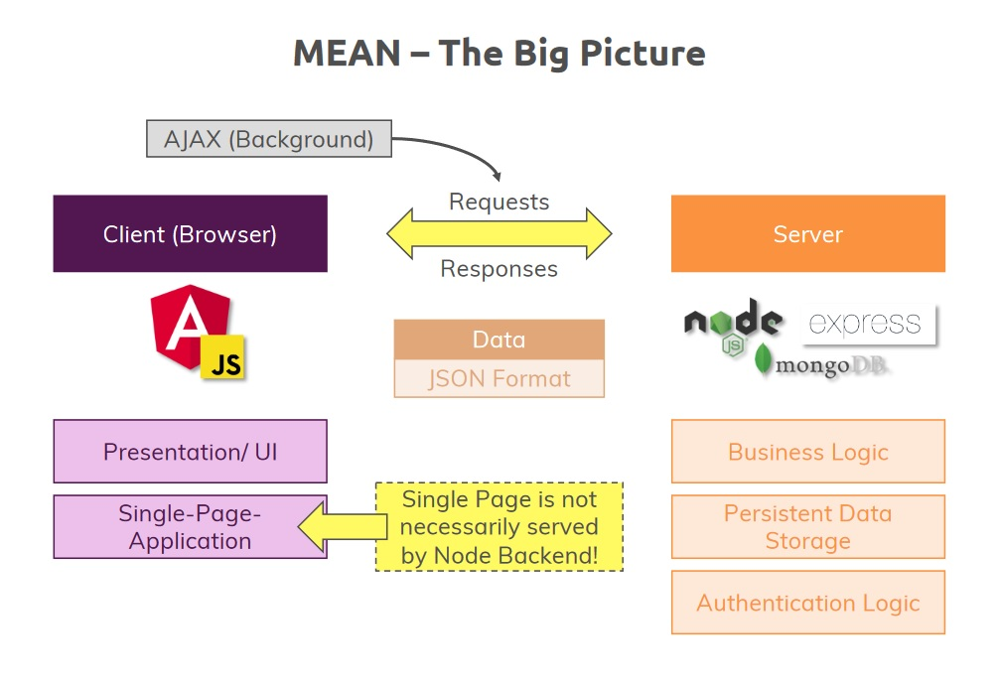

# MEAN Stack



## Layout

    backend/
        app.js
    script.js
    e2e/
    node_modules/
    src/
    ...           # Other
---

## Angular Frontend

Using Angular Material

- `c:\project> ng add @angular/material`

---

## Adding Node.js & Express Backend

---

### Node Backend

```javascript
// backend/app.js
const express = require('express');

const app = express();

app.use('/api/posts', (req, res, next) => {
    console.log('middleware');
    next();
});
module.exports = app;
```

---

### Express Framework (Simple)

```javascript
// server.js
const http = require('http');
const app = require('./backend/app');

const port = process.env.PORT || 3000;

app.set('port', port);
const server = http.createServer(app);

server.listen(port);
```

### Express Framework (Improved)

```javascript
// server.js
const app = require("./backend/app");
const debug = require("debug")("node-angular");
const http = require("http");

const normalizePort = val => {
  var port = parseInt(val, 10);

  if (isNaN(port)) {
    // named pipe
    return val;
  }

  if (port >= 0) {
    // port number
    return port;
  }

  return false;
};

const onError = error => {
  if (error.syscall !== "listen") {
    throw error;
  }
  const bind = typeof port === "string" ? "pipe " + port : "port " + port;
  switch (error.code) {
    case "EACCES":
      console.error(bind + " requires elevated privileges");
      process.exit(1);
      break;
    case "EADDRINUSE":
      console.error(bind + " is already in use");
      process.exit(1);
      break;
    default:
      throw error;
  }
};

const onListening = () => {
  const addr = server.address();
  const bind = typeof port === "string" ? "pipe " + addr : "port " + port;
  debug("Listening on " + bind);
};

const port = normalizePort(process.env.PORT || "3000");
app.set("port", port);

const server = http.createServer(app);
server.on("error", onError);
server.on("listening", onListening);
server.listen(port);
```

---

### Adding the GET Backend API Point

```javascript
// backend/app.js
const express = require('express');

const app = express();

app.get('/api/posts', (req, res, next) => {
    const posts = [
        {
            id: "f01dofoen",
            title: "first server-side post",
            content: "this is coming from the server"
        },
        {
            id: "f02dofoen",
            title: "second server-side post",
            content: "this is coming from the server!"
        }
    ];

    console.log('posts fetched from /api/posts');

    res.status(200).json({
        message: 'Posts fetched successfully!',
        posts: posts
    });
});

module.exports = app;
```

### Handling GET request with Angular

```typescript
// posts.service.ts
constructor(private http: HttpClient) {}
getPosts() {
  this.http.get<{message: string, posts: Post[]}>('http://localhost:3000/api/posts')
    .subscribe((postData) => {
      this.posts = postData.posts;
      this.postsUpdated.next([...this.posts]);
  });
}
```

### Backend: CORS and Setting Headers

```javascript
// backend/app.js

app.use((req, res, next) => {
    res.setHeader("Access-Control-Allow-Origin", "*");
    res.setHeader(
        "Access-Control-Allow-Header", 
        "Origin, X-Requested-With, Content-Type, Accept"
    );
    res.setHeader(
        "Access-Control-Allow-Methods",
        "GET, POST, PATCH, DELETE, OPTIONS"
    )
    next();
});
```

### Adding the POST Backend API Point

```typescript
app.post('/api/posts', (req, res, next) => {
    const post = req.body;
    console.log(post);
    res.status(201).json({
        message: 'Post added successfully'
    });
});
```

## Integrating MongoDB

### What is MongoDB?

- A NoSQL Database which stores "Documents" in "Collections" (instead of "Records" in "Tables" as in SQL)
  - Store Application Data
  - Enforces no Data Schema or Relations
  - Easily connected to Node/Express (**NOT to Angular!**)

### NoSQL vs SQL

- NoSQL
  - MongoDB, CouchDB
  - Enforces no Data Schema
  - Less Focused on Relations
  - "Independant Documents"
  - Great for: Logs, Orders, (Chat) Messages
- SQL
  - MySQL, MS SQL
  - Enforces a Strict Data Schema
  - Relations are a Core Feature
  - Records are Related
  - Great for: Shopping Carts, Contracts, Networks
- Connect Angular to the Database?
  - **NO!**
  - Secure Authentication is not really possible
  - Full database would be exposed.
- Mongoose
  - Package built on top of MongoDB driver
  - `npm i mongoose --save`
- Constructing Post schema & model

```javascript
// backend/models/post.js
const mongoose = require('mongoose');

const postSchema = mongoose.Schema({
    title: { type: String, required: true },
    content: { type: String, required: true }
});

module.exports = mongoose.model('Post', postSchema);
```

- Saving a Post

```javascript
// backend/app.js
// in app.post
const post = new Post({
    title: req.body.title,
    content: req.body.content
});
post.save();
```

- Fetch Posts from collection

```javascript
// backend/app.js
// in app.get
Post.find().then(documents => {
  res.status(200).json({
    message: 'Posts fetched successfully!',
    posts: documents
  });
});
```

- Delete from collection with ID

```javascript
// backend/app.js
app.delete('/api/posts/:id', (req, res, next) => {
  Post.deleteOne({ _id: req.params.id }).then(result => {
    console.log(result);
    res.status(200).json({message: 'Post deleted!'});
  });
});

// src/app/posts/posts.service.ts
deletePost(postId: string){
  this.http.delete('http://localhost:3000/api/posts/' + postId)
    .subscribe(() => {
      // console.log('Deleted!');
      // updating posts
      const updatedPosts = this.posts.filter(post => post.id !== postId);
      this.posts = updatedPosts;
      this.postsUpdated.next([...this.posts]);
    });
}
```

- Adding Posts with an ID

```typescript
//  src/app/posts/posts.service.ts 
addPost(title: string, content: string) {
  const post: Post = { id: null, title, content};
  this.http
    .post<{message: string, postId: string}>('http://localhost:3000/api/posts', post)
    .subscribe(responseData => {
      const id = responseData.postId;
      post.id = id;
      this.posts.push(post);
      this.postsUpdated.next([...this.posts]);
  });
}

//  backend/app.js
app.post('/api/posts', (req, res, next) => {
  const post = new Post({
      title: req.body.title,
      content: req.body.content
  });
  post.save().then(result => {
      console.log(result);
      res.status(201).json({
          message: 'Post added successfully',
          postId: result._id
      });
  });
});
```

## Enchancing the App

### Adding Routing

```typescript
//  src/app/app-routing.module.ts
import { NgModule } from '@angular/core';
import { RouterModule, Routes } from '@angular/router';

import { PostListComponent } from './posts/post-list/post-list.component';
import { PostCreateComponent } from './posts/post-create/post-create.component';

const routes: Routes = [
    { path: '', component: PostListComponent },
    { path: 'create', component: PostCreateComponent }
];

@NgModule({
    imports: [RouterModule.forRoot(routes)],
    exports: [RouterModule]
})

export class AppRoutingModule {}
//  import to app.module.ts
```

#### Header Links with RouterLink

```html
<!--
  src/app/header/header.component.html 
-->
<mat-toolbar color="primary">
  <span><a routerLink="/">MyMessages</a></span>
  <ul>
      <li>
          <a routerLink="/create">New Post</a>
      </li>
  </ul>
</mat-toolbar>
```

### Styling Links

```css
/*
  src/app/header/header.component.css 
*/
ul {
    list-style: none;
    padding: 0;
    margin: 0;
}

a {
    text-decoration: none;
    color: white;
}

.spacer {
    flex: 1 1 auto;
}
```

```html
<!--
  src/app/header/header.component.html 
-->
<mat-toolbar color="primary">
    <span><a routerLink="/">MyMessages</a></span>
    <span class="spacer"></span>
    <ul>
        <li>
            <a mat-button routerLink="/create" routerLinkActive="mat-accent">New Post</a>
        </li>
    </ul>
</mat-toolbar>
```

### Creating the Edit Form

- Using ActivatedRoute to find postId (if any) and distinguish create/edit modes

```typescript
//  src/app/posts/post-create.component.ts    (not all file contents as of this point shown here)
export class PostCreateComponent implements OnInit {
enteredTitle = '';
enteredContent = '';
private mode = 'create';
private postId: string;
private post: Post;

constructor(public postsService: PostsService, public route: ActivatedRoute) {}

ngOnInit() {
  this.route.paramMap.subscribe((paramMap: ParamMap) => {
    if (paramMap.has('postId')) {
      this.mode = 'edit';
      this.postId = paramMap.get('postId');
      this.post = this.postsService.getPost(this.postId);
    } else {
      this.mode = 'create';
      this.postId = null;
    }
  });
}
```

```html
  <!-- src/app/posts/post-create.component.html    (not all file contents as of this point shown here) -->
  <!-- edit button -->
  <a mat-button color="primary" [routerLink]="['/edit', post.id]">EDIT</a>
```

### Finishing Edit Feature

- Creating PUT request

```javascript
//  backend/app.js
app.put('/api/posts/:id', (req, res, next) => {
  const post = new Post({
      _id: req.body.id,
      title: req.body.title,
      content: req.body.content
  });
  Post.updateOne({ _id: req.params.id }, post).then(result => {
      console.log(result);
      res.status(200).json({message: 'Update Successful!'});
  });
});
```

- Adding updatePost method to Posts Service

```typescript
//  src/app/posts/post.service.ts  
updatePost(id: string, title: string, content: string) {
  const post: Post = { id, title, content };
  this.http.put('http://localhost:3000/api/posts/' + id, post)
    .subscribe(response => console.log(response));
}
```

- Update onAddPost to onSavePost and adding logic to differentiate modes

```typescript
//  src/app/posts/post-create.component.ts
onSavePost(form: NgForm) {
  if (form.invalid) {
    return;
  }
  if (this.mode === 'create'){
    this.postsService.addPost(form.value.title, form.value.content);
  } else {
    this.postsService.updatePost(this.postId, form.value.title, form.value.content);
  }
  form.resetForm();
}
```

### Updating Posts on the Server

- Changing updatePost to locally update posts after successful response

```typescript
//  src/app/posts/post.service.ts
updatePost(id: string, title: string, content: string) {
  const post: Post = { id, title, content };
  this.http.put('http://localhost:3000/api/posts/' + id, post)
    .subscribe(response => {
      const updatedPosts = [...this.posts];
      const oldPostIndex = updatedPosts.findIndex(p => p.id === post.id);
      updatedPosts[oldPostIndex] = post;
      this.posts = updatedPosts;
      this.postsUpdated.next([...this.posts]);
    });
}
```

- Getting post data from server while on Post create component
- Add new route to backend API:

```javascript
//  backend/app.js
app.get('/api/posts/:id', (req, res, next) => {
  Post.findById(req.params.id).then(post => {
      if (post) {
          res.status(200).json(post);
      } else {
          res.status(404).json({message: 'Post not found!'});
      }
  });
});
```

- Changing getPost in Posts Service

```typescript
//  src/app/posts/post.service.ts
getPost(id: string) {
  return this.http.get<{_id: string, title: string, content: string}>('http://localhost:3000/api/posts/' + id);
}
```

- Updating post-create method to reflect changes

```typescript
//  src/app/posts/post-create/post-create.component.ts
this.postsService.getPost(this.postId).subscribe(postData => {
  this.post = {id: postData._id, title: postData.title, content: postData.content};
});
```

- Now must change ngModel in HTML file to check if post title & content exists

```html
<!-- src/app/posts/post-create.component.html -->
[ngModel]="post?.title"
[ngModel]="post?.content"
```

### Reorganizing Backend Routes

- Moving all routes in app.js to new folder & file backend/routes/posts.js

```javascript
//  backend/routes/posts.js
import { Router } from 'express';
const Post = require('../models/post');

const router = Router();

// ...

module.exports = router;
```

- Using express router and exporting. Require in app.js and use

```javascript
//  backend/app.js
const postsRoutes = require('./routes/posts');

// ...

app.use(postsRoutes);
```

- Change to limit to /api/posts routes

```javascript
//  backend/app.js
app.use('/api/posts', postsRoutes);

//  backend/routes/posts.js
router.post('',  // ...
router.put('/:id', // ...
//  etc  
```

### Adding Loading Spinners and Redirecting to Messages page on Edit/Add

- Use isLoading property in list and create post components
  - Set to false initially, true when needed

  `isLoading = false;`

- Redirects

  `this.router.navigate(['/']);`

- Using mat-spinner with *ngIf

```html
<mat-spinner *ngIf="isLoading"></mat-spinner>
<mat-accordion multi="true" *ngIf="posts.length > 0 && !isLoading">
```

## Adding Image Uploads to our App

- Allowing an uploaded image with Post

### Adding the File Input Button

- Adding button and an input, proxy button to input and hide

```html
<div>
  <button mat-stroked-button type="button" (click)="filePicker.click()">Pick Image</button>
  <input type="file" #filePicker>
</div>
```

- Hiding with CSS

```css
input[type="file"] {
  visibility: hidden;
}
```

### Converting the Form from a Template Driven to a Reactive Approach

- Going from Angular handling form, registering controls with ngModel, to Reactive with advanced features
  - Features include custom validators
  - We define all of this, including controls, in Reactive approach
  - Must import to App Module:
  
```typescript
// replace FormsModule with ReactiveFormsModule in import and imports array
import { ReactiveFormsModule } from '@angular/forms';
// ...
imports: [
//...
ReactiveFormsModule,
//...
]
```

- Remove the ngModel, postForm ngForm, and validators
- Now create form programmatically in Typescript
- Starting with form Property

```typescript
//  import & use FormGroup instead of NgForm:
// import { NgForm } from '@angular/forms';      
import { FormGroup } from '@angular/forms';
//  ...
form: FormGroup;

//  define in ngOnInit : 
this.form = new FormGroup({
  title: new FormControl(null, {
    validators: [Validators.required, Validators.minLength(3)]
  }),
  content: new FormControl(null, {
    validators: [Validators.required]
  })
});

//  for form reset, use this.form.reset() instead:
this.form.reset();
// form.resetForm();
```

- Changes to HTML:

```html
<form [formGroup]="form" (submit)="onSavePost()" *ngIf="!isLoading">
  <mat-form-field>
    <input
      matInput
      type="text"
      formControlName="title"
      placeholder="Post Title">
    <mat-error *ngIf="form.get('title').invalid">Please enter a post title.</mat-error>
  </mat-form-field>
```

### Adding Image Controls to Store the Image

- First add change event to input control:
  
```html
<input type="file" #filePicker (change)="onImagePicked($event)">
```

- Implement onImagePicked:

```typescript
onImagePicked(event: Event) {
  const file = (event.target as HTMLInputElement).files[0];
  this.form.patchValue({ image: file });
  this.form.get('image').updateValueAndValidity();
}
```

### Adding Image Preview

- Add to HTML template:

```html
<div class="image-preview">
  
</div>
```

- New property in TS file and access with FileReader:

```typescript
imagePreview: string;
//  ...
//  in onImagePicked:
  //  ...
  const reader = new FileReader();
  reader.onload = () => {
    this.imagePreview = (reader.result as string);
  };
  reader.readAsDataURL(file);
```

- Adjust HTML element

```html
<div class="image-preview" *ngIf="imagePreview !== '' && imagePreview">
  
</div>
```

### Setting up a validator with Mime-Type Validator

- Create file mime-type.validator.ts in posts-create
  - will be async

```typescript
//  src/app/posts/post-create/mime-type.validator.ts
import { AbstractControl } from '@angular/forms';
import { Observable, Observer } from 'rxjs';

export const mimeType = (control: AbstractControl): Promise<{[key: string]: any}> | Observable<{[key: string]: any}> => {
    const file = control.value as File;
    const fileReader = new FileReader();
    const frObs = new Observable(
        (observer: Observer<{[key: string]: any}>) => {
            fileReader.addEventListener('loadend', () => {
                const arr = new Uint8Array(fileReader.result as ArrayBuffer).subarray(0, 4);
                let header = '';
                let isValid = false;
                // tslint:disable-next-line: prefer-for-of
                for (let i = 0; i < arr.length; i++) {
                    header += arr[i].toString(16);
                }
                switch (header) {
                    case '89504e47':
                        isValid = true;
                        break;
                    case 'ffd8ffe0':
                    case 'ffd8ffe1':
                    case 'ffd8ffe2':
                    case 'ffd8ffe3':
                    case 'ffd8ffe8':
                        isValid = true;
                        break;
                    default:
                        isValid = false; // Or you can use the blob.type as fallback
                        break;
                }
                if (isValid) {
                    observer.next(null);
                } else {
                    observer.next({ invalidMimeType: true });
                }
                observer.complete();
            });
            fileReader.readAsArrayBuffer(file);
        }
    );
    return frObs;
};
```

### Adding Server Side Upload

`npm i --save multer`

- Attach to certain routes that should be able to accept files
  - Import to backend/routes/posts.js
    `const multer = require('multer')`
  - Use diskStorage

```javascript
//  backend/posts.js
const storage = multer.diskStorage({
    destination: (req, file, cb) => {
        const isValid = MIME_TYPE_MAP[file.mimetype];
        let error = new Error('Invalid mime type');
        if (isValid) {
            error = null;
        }
        cb(error, 'backend/images');
    },
    filename: (req, file, cb) => {
        const name = file.originalname.toLowerCase().split(' ').join('-');
        const ext = MIME_TYPE_MAP[file.mimetype];
        cb(null, name + '-' + Date.now() + '.' + ext);
    }
});

//  pass as arg into post route:
router.post('', multer({storage}).single('image'), (req, res, next) => {
//  ...
```

### Adding the code to Angular and Front-end to Upload File

- In addPost (posts service), now use FormData instead of JSON

```javascript
//  posts.service.ts
addPost(title: string, content: string, image: File) {
  // const post: Post = { id: null, title, content};
  const postData = new FormData();
  postData.append('title', title);
  postData.append('content', content);
  postData.append('image', image, title);
  this.http
    .post<{message: string, postId: string}>(
      'http://localhost:3000/api/posts',
      postData
    )
    .subscribe(responseData => {
      const post: Post = {
        id: responseData.postId,
        title,
        content
      };
      this.posts.push(post);
      this.postsUpdated.next([...this.posts]);
      this.router.navigate(['/']);
  });
}
```

### Working with file URL

- Add to posts.js, posts.service.ts, post-create, and update models

```javascript
//  posts.js
//  in router.post
const url = req.protocol + '://' + req.get('host');
const post = new Post({
    title: req.body.title,
    content: req.body.content,
    imagePath: url + '/images/' + req.file.filename
});
//  ...
//  use of spread syntax for post instance:
message: 'Post added successfully',
res.status(201).json({
    message: 'Post added successfully',
    post: {
        ...createdPost,
        id: createdPost._id
        // title: createdPost.title,
        // content: createdPost.content,
        // imagePath: createdPost.imagePath
    }
});

//  posts.service.ts
return {
  title: post.title,
  content: post.content,
  id: post._id,
  imagePath: post.imagePath
};

//  imagePath set to null for now in post-create component
```

### Fetch images on the Front-End

- First, in HTML

```html
<!-- post-list component in between post title and content -->
<div class="post-image">
  
</div>
```

- Use Express & Path to serve images to front-end

  `app.use('/images', express.static(path.join('backend/images')));`

### Edit/Update Posts

- Change our update function

```typescript
//  posts.service.ts
//  in updatePost
// const post: Post = { id, title, content, imagePath: null };
let postData: Post | FormData;
if (typeof(image) === 'object') {
  postData = new FormData();
  postData.append('title', title);
  postData.append('content', content);
  postData.append('image', image, title);
} else {
  postData = {
    id,
    title,
    content,
    imagePath: image
  };
}
```

- Add a check for control value in mime-type validator 

```typescript
if (typeof(control.value) === 'string') {
    return of(null);
}
```

- Add imagePath to what getPost returns in post service

```typescript
getPost(id: string) {
  return this.http.get<{
    _id: string,
    title: string,
    content: string,
    imagePath: string
  }>('http://localhost:3000/api/posts/' + id);
}
```

- Add a check for undefined in put request '/:id', and if it is a file, use same logic as in post request

```typescript
//  posts.js, in router.put('/:id')
let imagePath = req.body.imagePath;
if (req.file) {
    const url = req.protocol + '://' + req.get('host');
    imagePath = url + '/images/' + req.file.filename
}
const post = new Post({
    _id: req.body.id,
    title: req.body.title,
    content: req.body.content,
    imagePath
});
```

- Also must append id to prevent new one being generated in updatePost within post service:
`postData.append('id', id);`

## Adding Pagination

- Sets of Posts, pages
- Also give user flexibility to decide # of posts on page.
- Use Angular Material
`import { ..., ... MatPaginatorModule, ... } from '@angular/material';`
`imports: [..., ..., MatPaginatorModule,...]`

### Adding the Component

- In post-list.component.html
`<mat-paginator [length]="totalPosts" [pageSize]="postsPerPage" [pageSizeOptions]="pageSizeOptions" (page)="onChangedPage($event)"></mat-paginator>`

- In post-list.component.ts

```typescript
totalPosts = 10;
postsPerPage = 2;
pageSizeOptions = [1, 2, 5, 10];
// ...
onChangedPage(pageData: PageEvent) {
```

- Fix spacing in CSS
`mat-paginator { margin-top: 1rem; }`

### Working on Pagination Backend

- Implement pagination on get all posts using Query Parameters

```javascript
router.get('', (req, res, next) => {
    const pageSize = req.query.pagesize;
    const currentPage = req.query.page;
    const postQuery = Post.find();
    if (pageSize && currentPage) {
        postQuery
            .skip(pageSize * (currentPage - 1))
            .limit(pageSize);
    }
    postQuery.then(documents => {
        res.status(200).json({
            message: 'Posts fetched successfully!',
            posts: documents
        });
    });
});
```

### Connecting the Angular Paginator to the Backend

- Add query params to getPosts() in posts service

```typescript
getPosts(postsPerPage: number, currentPage: number) {
  const queryParams = `?pagesize=${postsPerPage}&page=${currentPage}`;
  this.http
    .get<{ message: string, posts: any }>(
      'http://localhost:3000/api/posts' + queryParams
    )
    .pipe(map((postData) => {
      return postData.posts.map(post => {
        return {
          title: post.title,
          content: post.content,
          id: post._id,
          imagePath: post.imagePath
        };
      });
    }))
    .subscribe(transformedPosts => {
      this.posts = transformedPosts;
      this.postsUpdated.next([...this.posts]);
    });
}
```

- Adjust in list component

```typescript
// ngOnInit
  this.postsService.getPosts(this.postsPerPage, this.currentPage);
//... 
onChangedPage(pageData: PageEvent) {
  this.currentPage = pageData.pageIndex + 1;
  this.postsPerPage = pageData.pageSize;
  this.postsService.getPosts(this.postsPerPage, this.currentPage);
}
```

### Fetching posts correctly

- Display spinner by integrating isLoading to new function
- Adjust get all posts query

```javascript
router.get('', (req, res, next) => {
    const pageSize = +req.query.pagesize;
    const currentPage = +req.query.page;
    const postQuery = Post.find();
    let fetchedPosts;
    if (pageSize && currentPage) {
        postQuery
            .skip(pageSize * (currentPage - 1))
            .limit(pageSize);
    }
    postQuery
        .then(documents => {
            fetchedPosts = documents;
            return Post.count();
        })
        .then(count => {
            res.status(200).json({
                message: 'Posts fetched successfully!',
                posts: fetchedPosts,
                maxPosts: count
            });
        });
});
```

- Update Posts Service
  - Subject: `private postsUpdated = new Subject<{posts: Post[], postCount: number}>();`
  - Get posts

```typescript
  getPosts(postsPerPage: number, currentPage: number) {
  const queryParams = `?pagesize=${postsPerPage}&page=${currentPage}`;
  this.http
    .get<{ message: string, posts: any, maxPosts: number }>(
      'http://localhost:3000/api/posts' + queryParams
    )
    .pipe(
      map(postData => {
        return { posts: postData.posts.map(post => {
          return {
            title: post.title,
            content: post.content,
            id: post._id,
            imagePath: post.imagePath
          };
        }),
        maxPosts: postData.maxPosts
      };
    }))
    .subscribe(transformedPostData => {
      this.posts = transformedPostData.posts;
      this.postsUpdated.next({posts: [...this.posts], postCount: transformedPostData.maxPosts});
    });
}
```

### Finishing Touches

- Adjust subscribe in posts service, update and add post, to just navigate. Not needed here anymore.
- Change delete post to just return the http request
- Adjust post list component to subscribe and call get posts:

```typescript
onDelete(postId: string) {
    this.isLoading = true;
    this.postsService.deletePost(postId).subscribe(() => {
    this.postsService.getPosts(this.postsPerPage, this.currentPage);
  });
}
```

- Adjust subscription in post list component NgOnInit

```typescript
ngOnInit() {
  this.isLoading = true;
  this.postsService.getPosts(this.postsPerPage, this.currentPage);
  this.postsSub = this.postsService.getPostUpdateListener()
    .subscribe((postData: {posts: Post[], postCount: number}) => {
      this.isLoading = false;
      this.totalPosts = postData.postCount;
      this.posts = postData.posts;
    });
}
```
