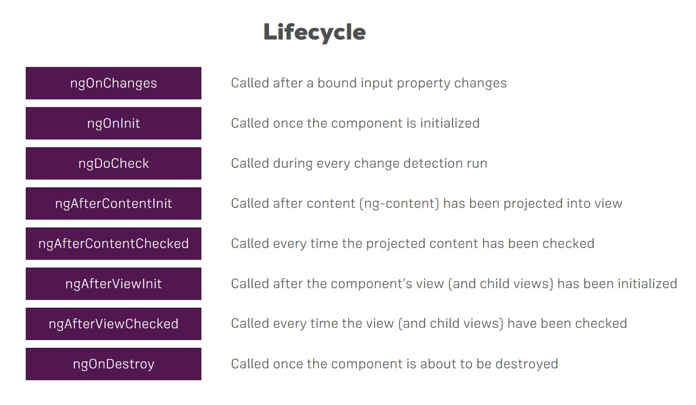

# Angular Notes

Based on Udemy Course [Angular 8 The Complete Guide by Maximilian Schwarzmüller](https://www.udemy.com/the-complete-guide-to-angular-2)

## Introduction

### What is Angular

#### Reactive Single-Page Applications

#### Angular Versioning

- AngularJS (Angular 1) -old
- Angular (Angular 2) -rewrite of Angular 1
- ...
- Angular 8
      - Big release every 6 months

#### CLI

- `ng new my-first-app`

#### Data-binding

- `{{ title }}`

#### Selectors

- `<app-root>`

#### ngModel

- Importing forms module

#### Typescript

- More features than vanilla JS
- Strongly typed
- Compiled to JS
      - Handled by CLI

#### Bootstrap Styling

- `npm install bootstrap`
- angular.json

## The Basics

- `app-root`
      - Root component
- `main.ts`
      - First code executed
        - Passes AppModule to method
- `app.module.ts`
      - Bootstrap array
- main.ts > bootstrap angular application > pass module as arg > selector > html template > html

### Components

- Whole application is composed of different components, starting with app component / root component

### Create a new Component

- Selectors for other components added - `app.component.html`
- Folder for component *in* app folder
      - Same name as component for good practice
- Example

```typescript
// server/server.component.ts
@Component({
  // decorators - all start with @
  selector: 'app-server',
  templateUrl: './server.component.html'
})
export class ServerComponent {}
```

### AppModule

- Components used to build webpages, bundled by modules into packages.
- Has NgModule decorator
- Need to declare component here, declarations array
- Imports array for other modules
- Can create components with CLI
      - `ng generate component servers` OR `ng g c servers`
      - Can nest components, a nd/or use multiple times

### Component templates

- **Must be** template property **at all times**
- Can use templateUrl,  or insert HTML:
      - `template: '<app-server><app-server>`

### Component Styles

- Can wrap bootstrap classes if used
- Can also add to component CSS file
- Reference multiple stylesheets in styleUrls array

### Component Selector

- Must be unique
- Can use HTML attribute or tags, class, etc
- *Selecting by id **not** supported*

### Databinding

- Communication
      - TS Code **-->** HTML (template)
- Output data
      - String interpolation
        - Surround in double curly brace
        - `{{ data }}`
      - **Any** expression that can resolve to a **string**
        - Or easily converted
      - Property binding
        - Surround in brackets
            - `[property]="data"`
        - Directly binding to native html property
        - Can update dynamically:
            - `[disabled]="!allowNewServer"`
        - Can also bind to directives or components, other properties
- React to User Events
      - Event-binding
          - Surround in parentheses
          - `(event)="expression"`
          - `(click)="onCreateServer()`
          - On input event
              - `(input)="onUpdateServerName($event)"`
          - In Method
              - `this.serverName = (<HTMLInputElement>event.target).value`
- Combination
      - Two-way binding
        - Brackets **&** Parentheses
        - `[(ngModel)]="data"`
        - `[(ngModel)]="serverName"`

### Directives

- Instructions in the DOM
- `<p appTurnGreen>`
- `@Directive`
- Attribute Selector

#### ngIf

- `<p *ngIf="serverCreated">`
      - built in
      - ' * ' -> structural directive (changes DOM)
- Attribute directors don't add or remove elements, changes element it's placed on

#### ngStyle

- `<p [ngStyle]="{backgroundColor: getColor()}">`
      - binding to property of directive

#### ngClass

- `[ngClass]="{online: serverStatus ==='online'}"`
  - adds CSS class if condition is true

#### ngFor

- `<app-server *ngFor="let server of servers">`
      - Can use `server` in template
        - `{{ server }}`
        - get index
            - `let i = index`

### Course Project, Planning

- Shopping List, Recipe Book
- Always Root component
- Header component for connecting List & Book
- Shopping List -> Features
      - Shopping List, Edit components
- Recipe Book -> Features
      - Recipe List, Recipe Ittem, Recipes Component, Recipes Detail
- Ingredient MModel
- Recipe Model

### Creating a Model

```typescript
export class Recipe {
  public name: string;
  public description: string;
  public imagePath: string;

  constructor(name: string, desc: string, imagePath: string) {}
}
```

## Debugging

- Error Messages
- Console in browser
- Sourcemaps
      - map JS bundles to TS code
- Webpack
      - TS files
- Augury (browser extension)

## Components & Data-binding Deep Dive

- Splitting into separate Components
  - Array in AppComponent -> Cockpit Component -> Server-Elements Component
- Can use Event & Property binding on directives and components
  - Binding to custom properties
- By default component properties only accessible in that component
  - Decorators
- `@Input() // pass a new string for new name outside component`
  - ie: `[element]="serverElement"`
- Alias
  - bind to custom event
    - Data up component hierarchy
    - New event emitter
- `@Output() serverCreated = new EventEmitter<{serverName: string, serverContent: string}>();`
  - Optional alias -> arg passed to @Output

### View Encapsulation

- CSS between components
- Attributes applied by Angular
  - Style encapsulation
  - Same attribute to all elements in component
- "Emulates shadow DOM"
- in @Component: `encapsulation: ViewEncapsulation.Emulated // None, Native (other options)`

### Load references in Templates

- In input element: `#serverNameInput`
- On button: `(click)="onAddServer(serverNameInput)"`

### @ViewChild

```typescript
@ViewChild('serverContentInput', {static: true})

serverControlInput: ElementRef;

this.serverContentInput.nativeElement.value
```

### Projecting content into Components with ng-content

- Everything between open and close of tags on own component will be lost unless: `<ng-content></ng-content>`

### Component Lifecycle



- ngOnChanges
  - Called after a bound input property changes
- ngOnInit
  - Called once component is initialized
- ngDoCheck
  - Called during every change detection run
- ngAfterContentInit
  - Called after content (`ng-content`) has been projected into view
- ngAfterContentChecked
  - Called every time the projected content has been checked
- ngAfterViewInit
  - Called after the component's view (and child views) has been initialized
- ngAfterViewChecked
  - Called every time the view (and child views) has been checked
- ngOnDestroy
  - Called once the component is about to be destroyed

Concept: ***CONTENT/VIEW***

- ngOnChanges example
  - ngOnChanges(changes: SimpleChanges)
    - object, with bound property
      - 'element' in this case

- @ContentChild
  - `@ContentChild('contentParagraph', { static: true })`
    - `paragraph: ElementRef`
    - Using projected content/content to be generated

- App component:

```html
<app-component>
<!-- CONTENT -->
</app-component>
```

- Access via ViewChild in app.component
- Access via ContentChild in server-element.component

## Directives Deep Dive

- Attribute Directives (ngClass, ngStyle)
  - Change properties of element
- Structured Directives (ngIf, ngFor)
  - Affects whole area in DOM

- **Can't have more than one structural directive on an element**

### Creating a Basic Attribute Directive

- Must import Directive from angular core
- Configure:
  -`selector: '[myDirective]' // select as attribute`
- Must inform angular directive exists via app module
- `<p myDirective> ... </p>`

- Renderer for better Basic Attribute Directive
  - Renderer2
  - Better practice: `ngOnInit(){ this.renderer.setStyle(this.elRef.nativeElement, 'background-color', 'blue'); }`
  - Better to use Renderer for DOM access and it's methods to access DOM

- Using HostListener to Listen to Host Events
  - `@HostListener('mouseenter')mouseover(eventData: event) { // ... }`

- Using HostBinding to Bind to Host Properties
  - `@HostBinding('style.backgroundColor') backgroundColor: string`
  - Element must have a property
    - `this.backgroundColor = 'blue';`
  - Can bind to any property of element directive is sitting on

- Binding to directive properties
  - `@Input() defaultColor: string = 'blue'`
  - `this.backgroundColor = this.defaultColor`
  - `<p appBetterHighlight [defaultColor]="'yellow'">`
- **CAN** bind to properties of our own directives
- **CAN** omit square brackets, single quotes when passing down a string
  - Make **clear** property binding is happening, **NOT** an attribute

- Creating a Structured Directive
  - \* indicates a structured directive
  - Transformed into something else no \* syntax
- There is **only**:
  - *Property binding*
  - *Event binding*
  - *Two-way binding*
  - *String interpolation*

- *ngIf example
  - norm: `<div *ngIf="!onlyOdd">`
  - transform: `<ng-template [ngIf]="!onlyOdd">`

- Building one
  - `@Input()` set unless `(value: boolean)`
  - **Must store name!**

- Understanding ngSwitch

```html
<div [ngSwitch]="value">
  <p *ngSwitchCase="5">Value is 5</p>
  <p *ngSwitchDefault>Default</p>
```

## Using Services & Dependency Injection

- Services address duplicating code or data storage/access
- Centralize a certain task

### Creating a Service

- Decorator not needed
- **Injecting** service into components
- Dependency Injector
  - *Hierarchal* Injector
    - **AppModule** -> Some instance of service available application-wide
      - **App Component** -> Available for all components (not for other services)
        - **Any other component** -> Same service instance for component and add all child components

- Add constructor in component where service will be used:
  - `constructor(private loggingService: LoggingService) {} // must give type`

- Must give providers in component decorator
  - `providers: [LoggingService]`

- Different instances in this example, providers array dictates new instance if service included, otherwise, same instance.
- Declare Service in providers array overrides the instance next, up, creating it's own.
  - Thus, can inject a service into a service
  - Injecting requires 'meta-data', found in decorators
    - Must use `@Injectable` for service -> service
      - Into *receiving* service

### Cross-Component Communication with Services

- In service:
  - `statusUpdated = new EventEmitter<string>();`
- In account, onSetTo:
  - `this.accountService.statusUpdated.emit(status);`
- In new account, constructor:
  - `this.accountService.statusUpdated.subscribe((statis: string) => alert('New status ' + status));`
- Provide at AppModule level

- Alternative syntax:
  - `@Injectable({ providedIn: 'root' })`
    - For application-wide service

## Changing Pages with Routing

### Why

- Navigation, other pages

### Setting up, in AppModule

```typescript
const appRoutes: Routes = [
  { path: 'user', component: UsersComponent }, // no slash
  { path: '', component: HomeComponent } // home page: '/'
];
```

- In component.html: `<router-outlet></router-outlet>`

- Implement Navigation with a Directive
- Using `href` will reload the app, reseting state.
  - Not ideal behavior
- in HTML: `<a routerLink="/">Home</a>`
- OR (array): `<a [routerLink]="['/users']">` -> Property binding (non-string); For nested links

- '**/**' indicates absolute path
- Navigation will build on what component it's in
  - `/servers/servers` example
- '**./**' for relative path, or '**../**'

- Setting selected nav tab as active dynamically: `routerLinkActive="active"`
- Empty home path always there, always active
  - To fix: `[routerLinkActiveOptions]="{ exact: true }"`
    - Exact path, instead of including

### Navigating Programmatically

```typescript
onLoadServer() {
  // calculations
  this.router.navigate(['/servers']);
}
```

- Inject via constructor: `constructor(private router: Router)` -> Import from angular/router

- With relative
  - Navigate method above does not know which route you're currently on, opposed to routerLink
- Pass second arg to inform: `this.router.navigate(['servers'], { relativeTo: this.route });`
  - Must inject! `private route: ActivatedRoute`

- Passing parameters to routes
  - Add dynamic part to route: `{ path: 'users/:id', component: UserComponent }`
  - Fetch route parameters (inject ActivatedRoute) `this.route.snapshot.params['id']`

- Snapshot works for first instance, won't re-render if already on component, need approach to get updated data

```typescript
this.route.params   // Observable
  .subscribe( // update user object when params change
    (params: Params) => { // import
      this.user.id = params['id'];
    }
  );
```

- Snapshot sufficient **if** component never reloads.

- For manual unsubscribe: `ngOnDestroy(){ this.paramsSubscription.unsubscribe() }`
  - Component must implement ngOnDestroy
  - Params imported
  - ***Angular does this automatically!*** Good practice to do manually

- Passing query params and fragments
  - `[routerLink]="['/servers', 5, 'edit']"`
  - `[queryParams]="{ allowEdit: '1' }"`
  - `fragment="loading"`

- Dynamic:
  - HTML: `(click)="onLoadServer(1)"`
  - TS:

    ```typescript
    onLoadServer(id: number) {
      // do stuff
      this.router.navigate(
        ['/servers', id, 'edit']
      )
    }
    ```

- Retrieve query params & fragments
  - In constructor: `private route: ActivatedRoute`
- ngOnInit:
  - `this.route.snapshot.queryParams` OR `.fragment`
  - `this.route.queryParams.subscribe()`
  - `this.route.fragment.subscribe()`

- Params come in as string, convert to number: `const id = +this.route.snapshot.params['id']`

### Setting up Child (nested) Routes

- Add property to route:

```typescript
{ path: 'servers', component: ServersComponent,
  children: [
    { path: ':id', component: ServerComponent }, // servers will be pre-appended
    { // ... }
  ]
}
```

- Must **NEST** a `<router-outlet>`
- onEdit button

```typescript
this.router.navigate(
  ['edit'], { relativeTo: this.route,
  queryParamsHandling: 'preserve' } 
  // blank for new, keep old overwrite new, merge for no overwrite
);
```

- Redirecting & Wildcard routes
  - `{ path: 'something', redirectTo: '/not-found' }`
    - ^ `path: '**'`
      - Wildcard route, all routes that are not known
      - ***Must be at bottom/last route!***

### Outsourcing Route Config

- `app-routing.module.ts`
  - `@NgModule
  - **Must export!**

### Guards

- canActivate:
  - `{ path: 'servers', canActivate: [AuthGuard], } // ...`

- Protecting child (nested) routes:
  - canActivateChild:
    - `canActivateChild: [AuthGuard] // fake or mimic read Auth`

### Controlling navigation with canDeactivate

- Use for prompting discard of changes or navigate, component must implement
- Given as property in route
- Similar format to canActivate

### Passing Static Data to a Route

- Date property in route definition:
  - `{ path: 'not-found', component: ErrorPageComponent, data: { message: 'Page not found!' }}`

### Resolving Dynamic Data with the resolve Guard

- Resolver Service
- Resolve property on route (best for async)
  - Takes an object

- `{ path: ':id', component: ServerComponent, resolve: { server: ServerResolver }}`
  - "server" is choice of name

```typescript
this.route.data.subscribe((data: Data) => {
  this.server = data['server']; // choice of name "server" here
});
```

### Location Strategies

- Add configs for old browsers
  - `RouterModule.forRoot(appRoutes, { useHash: true })`
    - Hash mode routing

## Understanding Observables

- Observable - A data source
  - (user input) events, http request, triggered in code.
- Observer
  - Handle data, handle error, handle completion
- RxJs
- Unsubscribe if no longer using
  - Avoid memory leaks
- Custom Observable
  - Imports
  - Handle next, complete, error
- Can use built-in operators in between Observer/Observable
  - Pipe, operators
- Subject
  - More active observable, event emitter
  - For communicating between components with Services

## Handling Forms in Angular Apps

- Form as a JS object
  - Value, metadata
- 2 Approaches
  - Template-Driven
    - Form object inferred from DOM
  - Reactive
    - Synced with DOM

- Template Driven:

```typescript
@ViewChild('f', { static: false })
signupForm: NgForm;
```

```html
<form (ngSubmit)="onSubmit(f)" #f="ngForm">
```

### Validation

- Built-In Validators
  - Required
  - Email
- Form states
  - ng-valid
  - ng-invalid
  - example: `[disabled]="!f.valid"`, `#email="ngModel"` <--> `*ngIf="!email.valid"`
- Default value:
  - `[ngModel]="defaultQuestion"`
- Grouping data:
  - `ngModelGroup="userData" // key`
  - `#userData="ngModelGroup"`
- Radio buttons
  - Similar to other inputs, add ngModel

### Setting & Fetching Form Values

- `form.setValue`
- `form.patchValue`
- Extract with ViewChild
- Reset Form
  - `signupForm.reset()`

### Reactive Approach

- In component:
  - `signupForm: FormGroup;`
- In Module:
  - `ReactiveFormsModule`

```typescript
// in OnInit:
this.signupForm = new FormGroup({
  'username': new FormControl(null),
  'email': new FormControl(null),
  'gender': new FormControl('male')
});
```

- Submit
  - `<form (ngSubmit)="onSubmit()">`
- Validation
  - Not using required
  - Not configured at template
  - `new FormControl(null, Validators.required)`
- Access to Controls
  - `*ngIf="!signupForm.get('email').valid"`
- Grouping
  - `FormGroup({ FormControl, Form Control })`
- In template:
  - `<div formGroupName="userData"> <input formControlName="username">`
- Access:
  - `*ngIf="!signupForm.get('userData.username').valid"`

### Arrays of Form Control

- Component:

```typescript
'hobbies': new FormArray([]) // empty

onAddHobby() {
  const control = new FormControl(null);
  (<FormArray>this.signupForm.get('hobbies')).push(control);
}
```

- Template:

```html
<button
  (click)="onAddHobby()">
<div
  *ngFor="let hobbyControl of signupForm.get('hobbies').controls;
  let i = index"
>
<input [formControlName]="i">
```

### Custom Validators

- A function checked during validation

```typescript
forbiddenNames(control: FormControl): {[s: string]: boolean} { }
```

- Errors:
  - `signupForm.get('userData.email').errors['nameIsForbidden']`

- ASYNC Validator:

```typescript
forbiddenEmails(control: FormControl): Promise<any> | Observable<any> {
  const promise = new Promise<any>((resolve, reject) => {
    setTimeout(() => {
      if (control.value === 'test@test.com') {
        resolve({ 'emailIsForbidden': true });
      } else {
        resolve(null);
      }
    }, 1500);
  });
  return promise;
}
```

- statusChanges & valueChanges

```typescript
this.signupForm.statusChanges.subscribe(
  (value) => console.log(value)
);
```

## Using Pipes to Transform Output

- For transforming values
  - `<p>{{ username | uppercase }}</p>`
- Built-in & Custom
  - Using `{{ var | date }}`
- Parameterizing Pipes
  - `{{ var | date: 'fullDate' }} // parameter -> fullDate`
  - For multiple: `date:param:param`
  - Can combine
    - `{{ var | date:'fullDate' | uppercase }}`
- Custom

```typescript
// shorten.pipe.ts
@Pipe({
  name: 'shorten'
})
export class ShortenPipe implements PipeTransform {
  transform(value: any) {
    return value.substr(0, 10);
  }
}
```

- Decorator, also in declarations in app.module.ts
- Parameterizing `shorten: 10`
- Can use as filter of loop content
- Pure/Impure Pipes
  - Recalculated pipe when data changes - Impure Pipe
- Async Pipe
  - Works with Promises, Observables

## Making Http Requests

### How does Angular interact with backends?

- How to connect Angular to a database
  - Not directly
- HTTP Requests/responses

### Server

- HTTP Request -> [Server/API (REST, GraphQL)] -> HTTP Response -> Angular -> Store and Fetch Data -> SQL/NoSQL
- HTTP Anatomy
  - HTTP Verb
  - URL (API Endpoint)
  - Headers(metadata)
  - Body
- Google Firebase - complete backend service (.json)
- POST
  - Need HttpClientModuke in imports -> app.module
  - Inject to component
    - `constructor(private http: HttpClient) { }`
  - `http.post` returns Observable, must subscribe or won't be sent
    - Same with GET
  - Transform with Pipe
    - Example with Map
- Using Services for HttpRequests
- Service and Components Working together

- DELETE
  - Handle Errors
    - Second arg in `subscribe`
  - Using a Subject
  - All HTTP Methods have options to configure, such as headers
    - HttpHeaders
    - HttpParams
    - HttpEventType

### Interceptors

- Service to run right before request
  - HttpRequest, HttpHandler
- Structure! (see http-01-start)
- Doesn't need to be injected
- Manipulate Request object
  - Request immutable, must create new one
- Response Interceptors
  - Pipe handle in return of request
- Multiple
  - **Order matters!**

## Authentication and Route Protection in Angular

### How it works

- Client -- Sends auth data --> Server
- Server -- Session --> Client
- For Angular, we use single page applications. Front-end decoupled from back-end. Will use a RESTful API since sessions can't be used. Communication done through HttpClient offered by Angular.
- Token sent to client which stores it, stored token is sent to authorize subsequent request.

### Adding Auth Page

- Sign up and login.
- Lock down recipes and manage dropdown to only be used by auth'd users.

### Switch between Auth Modes

- Use click listener, function to reverse a boolean

### Handling Form Input

- Similar to previous forms

```html
<div class="row">
    <div class="col-xs-12 col-md-6 col-md-offset-3">
        <div class="alert alert-danger" *ngIf="error">
            <p>{{ error }}</p>
        </div>
        <div *ngIf="isLoading" style="text-align: center">
            <app-loading-spinner></app-loading-spinner>
        </div>
        <form #authForm="ngForm" (ngSubmit)="onSubmit(authForm)" *ngIf="!isLoading">
            <div class="form-group">
                <label for="email">E-Mail</label>
                <input
                    type="email"
                    id="email"
                    class="form-control"
                    ngModel
                    name="email"
                    required
                    email
                >
            </div>
            <div class="form-group">
                <label for="password">Password</label>
                <input
                    type="password"
                    id="password"
                    class="form-control"
                    ngModel
                    name="password"
                    required
                    minlength="6"
                >
            </div>
            <div>
                <button class="btn btn-primary" type="submit" [disabled]="!authForm.valid">
                    {{ isLoginMode ? 'Login' : 'Sign Up' }}
                </button>
                |
                <button class="btn btn-primary" (click)="onSwitchMode()" type="button">
                    Switch to {{ isLoginMode ? 'Sign Up' : 'Login' }}
                </button>
            </div>
        </form>
    </div>
</div>
```

- Use service to communicate with backend and authenticate
- Interface of response data

```typescript
export interface AuthResponseData {
    kind: string;
    idToken: string;
    email: string;
    refreshToken: string;
    expiresIn: string;
    localId: string;
    registered?: boolean; // optional, is only in login res
}
```

- Chaining observables

```typescript
onSubmit(form: NgForm) {
    if (!form.valid) {
        return;
    }
    const email = form.value.email;
    const password = form.value.password;

    let authObs: Observable<AuthResponseData>;

    this.isLoading = true;
    if (this.isLoginMode) {
        authObs = this.authService.login(email, password);
    } else {
        authObs = this.authService.signup(email, password);
    }

    authObs.subscribe(resData => {
        console.log(resData);
        this.isLoading = false;
    }, errorMessage => {
        console.log(errorMessage);
        this.error = errorMessage;
        this.isLoading = false;
    });

    form.reset();
}
```

- Source error handling to private function in service.

```typescript
private handleError(errorRes: HttpErrorResponse) {
    let errorMessage = 'An unknown error occurred!';
    if (!errorRes.error || !errorRes.error.error) {
        return throwError(errorMessage);
    }
    switch (errorRes.error.error.message) {
        case 'EMAIL_EXISTS':
            errorMessage = 'This email exists already.';
            break;
        case 'EMAIL_NOT_FOUND':
            errorMessage = 'This email does not exist';
            break;
        case 'INVALID_PASSWORD':
            errorMessage = 'This password is not correct';
            break;
    }
    return throwError(errorMessage);
}
```

### Creating and Storing the User Data

- Create a user model

```typescript
// src/app/auth/user.model.ts
export class User {
    constructor(
        public email: string,
        public id: string,
        // underscore & private for validity
        private _token: string,
        private _tokenExpirationDate: Date
    ) {}

    /*
        getter using get keyword
        access like a property
        allows for logic in validity and checks
    */
    get token() {
        if (!this._tokenExpirationDate || new Date() > this._tokenExpirationDate) {
            return null;
        }
        return this._token;
    }
}
```

- Use in Auth Service

```typescript
// src/app/auth/auth.service.ts
user = new Subject<User>();
//  ...
private handleAuthentication(
    email: string,
    userId: string,
    token: string,
    expiresIn: number
  ) {
    const expirationDate = new Date(new Date().getTime() + expiresIn * 1000);
    const user = new User(email, userId, token, expirationDate);
    this.user.next(user);
  }

// integrate to login and signup, from pipe
.pipe(
    catchError(this.handleError),
    tap(resData => {
    this.handleAuthentication(
        resData.email,
        resData.localId,
        resData.idToken,
        +resData.expiresIn
    );
    })
);
```

### Reflecting the Auth State in the UI

- Add `this.router.navigate(['/recipes]);` to successful auth subscriber in auth component.

- Reflect state in Header component
      - Disable recipes link *if not* logged in
      - Disable Authenticate link only *if* logged in.
      - Disable dropdown *if not* logged in
      - Show Logout button
- Get current auth status into header component (user with valid token or not)

```typescript
isAuthenticated = false;
private userSub = Subscription;
// inject auth service
// implement ngOnInit and ngOnDestroy
ngOnInit() {
    this.userSub = this.authService.user.subscribe(user => {
        this.isAuthenticated = !!user;
        console.log(!user);
        console.log(!!user);
    });
}
// then use ngIf in template
```

### Adding the Token to Outgoing Requests

- Change user in auth service
      - `user = new BehaviorSubject<User>(null);`
- Use this to pull one value from user object in data-storage service, using take, and refactoring fetchRecipes:

```typescript
fetchRecipes() {
  return this.authService.user.pipe(
    take(1),
    exhaustMap(user => {
      return this.http.get<Recipe[]>(
      'https://ng-learn-practice.firebaseio.com/recipes.json'
    );
    }),
    map(recipes => {
      return recipes.map(recipe => {
        return {
          ...recipe,
          ingredients: recipe.ingredients ? recipe.ingredients : []
        };
      });
    }),
    tap(recipes => {
      this.recipeService.setRecipes(recipes);
    })
  );
}
```

### Attaching the Token with an Interceptor

- Want to also add token to storeRecipes
- Use an interceptor to manipulate requests instead of handling it twice.

```typescript
// src/app/auth/auth-interceptor.service.ts
import { Injectable } from '@angular/core';
import {
  HttpInterceptor,
  HttpRequest,
  HttpHandler,
  HttpParams
} from '@angular/common/http';

import { AuthService } from './auth.service';
import { take, exhaustMap } from 'rxjs/operators';

@Injectable()
export class AuthInterceptorService implements HttpInterceptor {
  constructor(private authService: AuthService) {}

  intercept(req: HttpRequest<any>, next: HttpHandler) {
    return this.authService.user.pipe(
      take(1),
      exhaustMap(user => {
        // must check, only add token if we have a user! otherwise send original req
        if (!user) {
          return next.handle(req);
        }
        const modifiedRequest = req.clone({
          params: new HttpParams().set('auth', user.token)
        });
        return next.handle(modifiedRequest);
      })
    );
  }
}
```

### Adding Logout

- Add method to authService and link to header

```typescript
// src/app/auth/auth.service.ts
logout() {
  this.user.next(null);
  this.router.navigate(['/auth']);
}

// src/app/header/header.component.ts
onLogout() {
  this.authService.logout();
}
```

### Adding Auto-Login

- Use local storage via browser to store token to be persisted in app reload
- Add to end of handleAuthentication in auth service: `localStorage.setItem('userData', JSON.stringify(user));`
- Implement autoLogin method

```typescript
autoLogin(){
    const userData: {
      email: string,
      id: string,
      _token: string,
      _tokenExpirationDate: string;
    } = JSON.parse(localStorage.getItem('userData'));
    if (!userData) {
      return;
    }

    const loadedUser = new User(userData.email, userData.id, userData._token, new Date(userData._tokenExpirationDate));

    if (loadedUser.token) {
      this.user.next(loadedUser);
    }
}
```

- Add to App Component (*runs first*)
      - `ngOnInit() { this.authService.autoLogin(); }`

### Adding Auto-Logout

- Need to manually clear the snapshot of the user
- At end of logout method in auth service
      - `localStorage.removeItem('userData');`
- Must set timer to know when to invalidate token. autoLogout method
- Must also clear token expiration timer.
- Store in property

```typescript
private tokenExpirationTimer: any;

logout() {
  this.user.next(null);
  this.router.navigate(['/auth']);
  localStorage.removeItem('userData');
  if (this.tokenExpirationTimer) {
    clearTimeout(this.tokenExpirationTimer);
  }
  this.tokenExpirationTimer = null;
}

autoLogout(expirationDuration: number) {
  this.tokenExpirationTimer = setTimeout(() => {
    this.logout();
  }, expirationDuration);
}
```

- Need to call autoLogout everyime we emit a new user to the app. So, in handleAuthentication and autoLogin methods

```typescript
// in handleAuthentication method
this.user.next(user);
this.autoLogout(expiresIn * 1000);
```

- Must calculate expiration date in autoLogin

```typescript
// in autoLogin method
if (loadedUser.token) {
  this.user.next(loadedUser);
  const expirationDuration =
    new Date(userData._tokenExpirationDate).getTime() -
    new Date().getTime();
  this.autoLogout(expirationDuration);
}
```

### Adding an Auth Guard

- Run logic right before a route is loaded.

```typescript
// ./src/app/auth/auth.guard.ts
import {
  CanActivate,
  ActivatedRouteSnapshot,
  RouterStateSnapshot
} from '@angular/router';
import { Injectable } from '@angular/core';
import { Observable } from 'rxjs';
import { map } from 'rxjs/operators';

import { AuthService } from './auth.service';

@Injectable({ providedIn: 'root' })
export class AuthGuard implements CanActivate {
  constructor(private authService: AuthService) {}

  canActivate(
    route: ActivatedRouteSnapshot,
    router: RouterStateSnapshot
  ): boolean | Promise<boolean> | Observable<boolean> {
    return this.authService.user.pipe(
      map(user => {
        return !!user;
      })
    );
  }
}
```

- Add to Router Module

```typescript
// ./src/app/app-routing.module
path: 'recipes',
    component: RecipesComponent,
    canActivate: [AuthGuard],
    children: [
    // ...
```

- Add redirect on attempt to go to /recipes
- Used to have to add router and tap, redirect manually
- Can now use URL Tree

```typescript
import {
  CanActivate,
  ActivatedRouteSnapshot,
  RouterStateSnapshot,
  Router,
  UrlTree
} from '@angular/router';
import { Injectable } from '@angular/core';
import { Observable } from 'rxjs';
import { map } from 'rxjs/operators';

import { AuthService } from './auth.service';

@Injectable({ providedIn: 'root' })
export class AuthGuard implements CanActivate {
  constructor(private authService: AuthService, private router: Router) {}

  canActivate(
    route: ActivatedRouteSnapshot,
    router: RouterStateSnapshot
  ):
    | boolean
    | UrlTree
    | Promise<boolean | UrlTree>
    | Observable<boolean | UrlTree> {
    return this.authService.user.pipe(
      take(1),
      map((user) => {
        const isAuth = !!user;
        if (isAuth) {
          return true;
        }
        return this.router.createUrlTree(['/auth']);
      })
    );
  }
}
```

## Dynamic Components

### What are Dynamic Components(?)

- Components you create dynamically at runtime.
  - Show an alert, some modal, some overlay, etc
  - How to load it on demand, communicate, and get rid of it.

### Adding an Alert Modal Component

- Build simple alert box on invalid login credentials

```typescript
// ./src/app/shared/alert/alert.component.ts
import { Component, Input } from '@angular/core';

@Component({
  selector: 'app-alert',
  templateUrl: './alert.component.html',
  styleUrls: ['./alert.component.css']
})

export class AlertComponent {
  @Input() message: string;
}
```

```html
<!-- ./src/app/shared/alert/alert.component.html -->
<div class="backdrop"></div>
<div class="alert-box">
  <p>{{ message }}</p>
  <div class="alert-box-actions">
    <button class="btn btn-primary">Close</button>
  </div>
</div>
```

```css
/* ./src/app/shared/alert/alert.component.css */
.backdrop {
  position: fixed;
  top: 0;
  left: 0;
  width: 100vw;
  height: 100vh;
  background: rgba(0, 0, 0, 0.75);
  z-index: 50;
}

.alert-box {
  position: fixed;
  top: 30vh;
  left: 20vw;
  width: 60vw;
  padding: 16px;
  z-index: 100;
  background: white;
  box-shadow: 0 2px 8px rbga(0, 0, 0, 0.26);
}

.alert-box-actions {
  text-align: right;
}
```

```html
<!-- ./src/app/auth/auth.component.html -->

<!-- <div class="alert alert-danger" *ngIf="error">
    <p>{{ error }}</p>
</div> -->
<app-alert [message]="error" *ngIf="error"></app-alert>
```

### Understanding the Different Approaches

- What are dynamic components?
  - Loaded Programmatically
    - *ngIf
      - Component embedded via selector (declaratively)
      - *ngIf controls whether component is added to DOM
    - Dynamic Component Loader (doesn't exist anymore)
      - Component created and added to DOM via code (imperatively)
      - Component is managed & added by developer

### Using ngIf

```html
<!-- ./src/app/auth/auth.component.html -->
<app-alert [message]="error" *ngIf="error" (close)="onHandleError()"></app-alert>
```

```typescript
// ./src/app/auth/auth.component.ts
onHandleError() {
  this.error = null;
}
```

```typescript
// ./src/app/shared/alert/alert.component.ts
@Input() message: string;
@Output() close = new EventEmitter<void>();

onClose() {
  this.close.emit();
}
```

```html
<!-- ./src/app/shared/alert/alert.component.html -->
<div class="backdrop" (click)="onClose()"></div>
<div class="alert-box">
  <p>{{ message }}</p>
  <div class="alert-box-actions">
    <button class="btn btn-primary" (click)="onClose()">Close</button>
  </div>
</div>
```

### Preparing Programmatic Creation

- Comment out app-alert in html
- Create method in auth component

```typescript
// ./src/app/auth/auth.component.ts
// on error in authObs:
this.error = errorMessage;
this.showErrorAlert(errorMessage);
this.isLoading = false;
// Use component factory resolver, inject into constructor
private showErrorAlert(message: string) {
  const alertCmpFactory = this.componentFactoryResolver.resolveComponentFactory(
    AlertComponent
  );
  
}
```

- Create a directive

```typescript
// ./src/app/shared/placeholder/placeholder.directive.ts
import { Directive, ViewContainerRef } from '@angular/core';

@Directive({
  selector: '[appPlaceholder]'
})
export class PlaceholderDirective {
  constructor(public viewContainerRef: ViewContainerRef) {}
}
```

### Creating a Component Programmatically

- Add ng-template to HTML

```html
<!-- ./src/app/auth/auth.component.html -->
<!-- Get access to this place in the DOM -->
<ng-template appPlaceholder></ng-template>
```

```typescript
// ./src/app/auth/auth.component.ts
// Access directive with @ViewChild
@ViewChild(PlaceholderDirective, { static: false }) alertHost: PlaceholderDirective;
// ...
private showErrorAlert(message: string) {
  const alertCmpFactory = this.componentFactoryResolver.resolveComponentFactory(
    AlertComponent
  );
  const hostViewContainerRef = this.alertHost.viewContainerRef;
  hostViewContainerRef.clear();

  hostViewContainerRef.createComponent(alertCmpFactory);
}
// ERROR: No component factory found for AlertComponent. Did you add it to @NgMOdule.entryComponents?
```

### Understanding entryComponents

- Angular does not automatically reach out to declarations array when creating component manually in code.
- To tell Angular to be prepared for creation of that component, need to add special property to the object passed to NgModule

```typescript
// ./src/app/app.module.ts
// in NgModule declaration
bootstrap: [AppComponent],
entryComponents: [
  AlertComponent
]
```

### Data Binding and Event Binding

- Create instance with component ref
- To close, manually have to listen to our close event

```typescript
// ./src/app/auth/auth.component.ts
private showErrorAlert(message: string) {
  const alertCmpFactory = this.componentFactoryResolver.resolveComponentFactory(
    AlertComponent
  );
  const hostViewContainerRef = this.alertHost.viewContainerRef;
  hostViewContainerRef.clear();
  const componentRef = hostViewContainerRef.createComponent(alertCmpFactory);
  componentRef.instance.message = message;
  // Must create closeSub: Subscription
  this.closeSub = componentRef.instance.close.subscribe(() => {
    this.closeSub.unsubscribe();
    hostViewContainerRef.clear();
  });
}
```

## Angular Modules & Optimizing Angular Apps

### What are Modules

- Modules are ways to bundle Angular building blocks together
- Angular analyzes NgModules to *understand* your application and it's features.
- Defines all building blocks your app uses:
  - Components, directives, services, pipes
- Application requires at least one module (AppModule) but may be split into multiple modules.
- Core Angular features are included in Angular modules (e.g. FormsModule) to load them only when needed.
- Can't use a feature/building block without including it in a module.

### Analyzing the AppModule

- Already using two modules in shop recipe project
  - `app.module.ts`
  - `app-routing.module.ts`
- AppModule
  - Declarations
    - Array of all components, directives, custom pipes being used in application
  - Imports array
    - Import other modules into this module.
    - Split into multiple modules.
  - Providers array
    - Define all services we want to provide.
    - Any service you plan on injecting, must add here.
  - Bootstrap array
    - Starting app, defines what component is available in index.html file.
    - Typically one root component in bootstrap array
  - Entry Components array
    - For components created *in code* or *programmatically*
- AppRoutingModule
  - Separation of concerns, leaner and more focused.
  - Imports RouterModule
  - Exported here.
    - Made available in AppModule
  - Every module works *on its own*
  - Splitting modules help with performance

### Getting Started with Feature Modules

- Working with multiple modules, splitting into multiple feature modules.
  - Products Module
  - Orders Module
- In relation to course project
  - 3 main feature areas:
    - Recipes
    - Shopping List
    - Authentication
- Everything in a module stands alone

#### Initial Recipes Module

```typescript
// ./src/app/recipes/recipes.module.ts
import { NgModule } from '@angular/core';
import { CommonModule } from '@angular/common';
import { RouterModule } from '@angular/router';
import { ReactiveFormsModule } from '@angular/forms';

import { RecipesComponent } from './recipes.component';
import { RecipeListComponent } from './recipe-list/recipe-list.component';
import { RecipeDetailComponent } from './recipe-detail/recipe-detail.component';
import { RecipeItemComponent } from './recipe-list/recipe-item/recipe-item.component';
import { RecipeStartComponent } from './recipe-start/recipe-start.component';
import { RecipeEditComponent } from './recipe-edit/recipe-edit.component';

@NgModule({
  declarations: [
    RecipesComponent,
    RecipeListComponent,
    RecipeDetailComponent,
    RecipeItemComponent,
    RecipeStartComponent,
    RecipeEditComponent,
  ],
  exports: [
    RecipesComponent,
    RecipeListComponent,
    RecipeDetailComponent,
    RecipeItemComponent,
    RecipeStartComponent,
    RecipeEditComponent,
  ]
})
export class RecipesModule {}
```

### Splitting Modules Correctly

- Using something other than a service, only have access to what you import
- Import RouterModule
- **Don't** import BrowserModule
  - CommonModule instead
- Import ReactiveFormsModule for recipe forms.
- Recipes module finished!

#### Recipes Module

```typescript
// src/app/recipes/recipes.module.ts

// imports

@NgModule({
  // ...
  imports: [RouterModule, CommonModule, ReactiveFormsModule],
  // ...
})
export class RecipesModule {}
```

### Adding Routes to Feature Modules

- Move recipes segment of routing module to recipes module

#### RecipesRoutingModule

```typescript
// ./src/app/recipes/recipes.module.ts
import { NgModule } from '@angular/core';
import { Routes, RouterModule } from '@angular/router';

import { RecipesComponent } from './recipes.component';
import { AuthGuard } from '../auth/auth.guard';
import { RecipeStartComponent } from './recipe-start/recipe-start.component';
import { RecipeEditComponent } from './recipe-edit/recipe-edit.component';
import { RecipeDetailComponent } from './recipe-detail/recipe-detail.component';
import { RecipesResolverService } from './recipes-resolver.service';

const routes: Routes = [
  {
    path: 'recipes',
    component: RecipesComponent,
    canActivate: [AuthGuard],
    children: [
      { path: '', component: RecipeStartComponent},
      { path: 'new', component: RecipeEditComponent },
      {
        path: ':id',
        component: RecipeDetailComponent,
        resolve: [RecipesResolverService]
      },
      {
        path: ':id/edit',
        component: RecipeEditComponent,
        resolve: [RecipesResolverService]
      }
    ]
  }
];

@NgModule({
  imports: [RouterModule.forChild(routes)],
  exports: [RouterModule]
})
export class RecipesRoutingModule {}
```

### Component Declarations

- Declaration and export important, must include components for routes used.
- Don't need exports in recipe module here, since not using in app component.

### Shopping List Feature Module

```typescript
// src/app/shopping-list/shopping-list.module.ts
import { NgModule } from '@angular/core';
import { RouterModule } from '@angular/router';
import { CommonModule } from '@angular/common';
import { FormsModule } from '@angular/forms';

import { ShoppingListComponent } from './shopping-list.component';
import { ShoppingEditComponent } from './shopping-edit/shopping-edit.component';

@NgModule({
  declarations: [ShoppingListComponent, ShoppingEditComponent,],
  imports: [
    CommonModule,
    FormsModule,
    RouterModule.forChild([
      { path: 'shopping-list', component: ShoppingListComponent }
    ])
  ]
})
export class ShoppingListModule {}
```

### Understanding Shared Modules

- Two feature modules, differing in one component
  - Can move components in common to shared module to be imported by both
- Do this in Shop Recipe with Shared folder
  - Import and export relevant components
- Can't have multiple declarations

```typescript
// src/app/shared/shared.module.ts
import { NgModule } from '@angular/core';

import { AlertComponent } from './alert/alert.component';
import { LoadingSpinnerComponent } from './loading-spinner/loading-spinner.component';
import { PlaceholderDirective } from './placeholder/placeholder.directive';
import { DropdownDirective } from './dropdown.directive';
import { CommonModule } from '@angular/common';

@NgModule({
  declarations: [
    AlertComponent,
    LoadingSpinnerComponent,
    PlaceholderDirective,
    DropdownDirective
  ],
  imports: [
    CommonModule
  ],
  exports: [
    AlertComponent,
    LoadingSpinnerComponent,
    PlaceholderDirective,
    DropdownDirective,
    CommonModule
  ],
  entryComponents: [
    AlertComponent
  ]
})
export class SharedModule {}
// import into shopping list module instead of common module
```

### Understanding the Core Module

- Makes app module leaner
- Can use to move services out, organize into one module, then bring core module back into app module
- Provide application-wide services in separate module, to keep app module leaner

```typescript
// src/app/core.module.ts
import { NgModule } from '@angular/core';
import { HTTP_INTERCEPTORS } from '@angular/common/http';

import { ShoppingListService } from './shopping-list/shopping-list.service';
import { RecipeService } from './recipes/recipe.service';
import { AuthInterceptorService } from './auth/auth-interceptor.service';

@NgModule({
  providers: [
    ShoppingListService,
    RecipeService,
    {
      provide: HTTP_INTERCEPTORS,
      useClass: AuthInterceptorService,
      multi: true
    }
  ]
})
export class CoreModule {}
```

### Adding an Auth Feature Module

```typescript
// src/app/auth/auth.module.ts
import { NgModule } from '@angular/core';
import { CommonModule } from '@angular/common';
import { FormsModule } from '@angular/forms';

import { AuthComponent } from './auth.component';
import { RouterModule } from '@angular/router';
import { SharedModule } from '../shared/shared.module';

@NgModule({
  declarations: [AuthComponent],
  imports: [
    CommonModule,
    FormsModule,
    RouterModule.forChild([
      { path: 'auth', component: AuthComponent }
    ]),
    SharedModule
  ]
})
export class AuthModule {}
```

### Understanding Lazy Loading

- An optimization *concept*
  - Previous refactoring only cosmetic, not performative.
- Only run code that belongs to separate areas *when we really need it*
- Only load when we visit

### Implementing Lazy Loading

- For lazy loading, feature module needs to bring it's own routes.
- Have to change to empty path in recipes routing module, since it is now being used in app-routing module

### More Lazy Loading

- Implement on Shopping List and Auth modules
- Final result:

```typescript
// src/app/app-routing.module.ts
import { NgModule } from '@angular/core';
import { Routes, RouterModule } from '@angular/router';

const appRoutes: Routes = [
  { path: '', redirectTo: '/recipes', pathMatch: 'full' },
  {
    path: 'recipes',
    loadChildren: () =>
      import('./recipes/recipes.module').then(m => m.RecipesModule)
  },
  {
    path: 'shopping-list',
    loadChildren: () =>
      import('./shopping-list/shopping-list.module').then(m => m.ShoppingListModule)
  },
  {
    path: 'auth',
    loadChildren: () =>
      import('./auth/auth.module').then(m => m.AuthModule)
  }
];

@NgModule({
  imports: [RouterModule.forRoot(appRoutes)],
  exports: [RouterModule]
})
export class AppRoutingModule {}
```

### Preloading Lazy-Loaded Code

- Small delay, this will alleviate that
- Preloads bundles as soon as possible
`imports: [RouterModule.forRoot(appRoutes, {preloadingStrategy: PreloadAllModules})],`

### Modules and Services

- Can provide Service in
  - AppModule
    - Available app-wide
    - Use root injector
    - *Should be default*
  - AppComponent(or other Components)
    - Available in component-tree
    - Use component-specific injector
    - Use if *service is only relevant for component tree*
  - Eager-loaded Module
    - Available app-wide
    - Use root injector
    - ***Avoid this!*** Same effect as AppModule
  - Lazy-Loaded Module
    - Available in loaded module
    - Use child injector
    - Use if *service should be scoped to loaded module*

### Loading Services Differently

- Different instances

```typescript
// Service loading demo
// src/app/logging.service.ts
import { Injectable } from '@angular/core';

// @Injectable({ providedIn: 'root' })
export class LoggingService {
  lastLog: string;

  printLog(message: string) {
    console.log(message);
    console.log(this.lastLog);
    this.lastLog = message;
  }
}
```

### Ahead-of-Time Compilation

- Code and templates compiled to Javascript with TS compiler.
- Angular compiler (automatically included in built code) compile template syntax to Javascript DOM instructions
  - Just-in-Time(JiT) Compilation
    - Angular template compiler runs in browser (at runtime)
  - Ahead-of-Time (AoT) Compilation
    - Angular template compiler runs during build process (before app is deployed)
- `ng serve` does JiT compilation by default
- Run `ng build --prod`
- Error with recipe-edit controls, fixed before
  `get controls() { return (this.recipeForm.get('ingredients') as FormArray).controls; }`

## Deploying an Angular App

- Using Firebase

### Preparation

- Use & check Environment Variables
- Polish & test code
- `ng build --prod`
  - Uses ahead-of-time compilation
- Deploy build artificats (generated files) to static host
  - No server-side language on static host, just HTML, JS, CSS

### Using Environment Variables

`src/environments`

- File for production, and one for development
  - `environment.ts`
  - `environment.prod.ts`

- Import (used here with firebase API key in authentication service)
  - `import { environment } from '../../environments/environment';`
  - `environment.firebaseAPIKey`

### Deployment Example: Firebase Hosting

- Options for static website hosting
  - AWS S3
  - Firebase Hosting
  - etc..

- For Firebase, first install
  - `npm i -g firebase-tools`
- Initialize
  - `firebase init`
  - Go through settings
- Deploy
  - `firebase deploy`

### Server Routing vs Browser Routing

- When deploying an Angular app, it's really important to make sure that your server (like S3) is configured to always serve the index.html file. [Here's why](https://academind.com/learn/angular/angular-q-a/#how-to-fix-broken-routes-after-deployment).

## Bonus: Working with NgRx in our Project

- State management

### What is Application State

- Example
  - WelcomeComponent
  - NewTrainingComponent
  - CurrentTraining Component
  - TrainingService
    - Fetch excercises (NewTrainingComponent)
    - Store excercises (CurrentTrainingComponent)
- Application state lost when application refreshes!
- TrainingService Store & Fetch on Backend
  - Known as *Persistent State on Backend*
  - ShoppingListService as example on our Recipe App
- (User) Event in UI/App -> State Changing Event -> Observable -> Operators* -> Listener -> Update UI
  - *Optional
  - Using Subjects, Observables
    - Push subscribe mechanism

### What is NgRx

- Issues with the RxJS Approach
  - State can be updated anywhere
  - State is (possibly) mutable
  - Handling side effects (e.g. Http calls) is unclear
  - No specific Pattern is Enforced
- Redux
  - State management pattern and library
  - **Store** - Application State
  - Services & Components receive state from **Store**
  - **Actions** - Dispatch
    - Sent to **Reducers**
      - Reduces/Combines State
      - Returns new state
      - **Store** saves reduced State (immutably)
- NgRx is Angular's Implementation of Redux
  - Differences to "normal" Redux
    - Deeply integrated into Angular
      - Injectable Services
    - Uses RxJS
      - Observables
    - (Uses Typescript)

### Getting Started with Reducers

- App is *fine as is*
  - Recommended to follow for introduction to this pattern
- Install: `npm i --save @ngrx/store`

```typescript
// src/app/shopping-list/shopping-list.reducer.ts
import { Ingredient } from '../shared/ingredient.model';

const initialState = {
  ingredients: [
    new Ingredient('Apples', 5),
    new Ingredient('Tomatoes', 10),
]
};

export function shoppingListReducer(state = initialState, action) {}
```

### Adding Logic to the Reducer

- **Never** touch existing state.
  - Instead, return new object to replace old state
  - Copy old state

```typescript
import { Ingredient } from '../shared/ingredient.model';
import { Action } from '@ngrx/store';

const initialState = {
  ingredients: [
    new Ingredient('Apples', 5),
    new Ingredient('Tomatoes', 10),
]
};

export function shoppingListReducer(state = initialState, action: Action) {
  switch (action.type) {
    case 'ADD_INGREDIENT':
      return {
        ...state,     // good practice to always copy over old state
        ingredients: [...state.ingredients, action]
      };
  }
}
```

### Understanding and Adding Actions

```typescript
// src/app/shopping-list/store/shopping-list.actions.ts
import { Action } from '@ngrx/store';
import { Ingredient } from 'src/app/shared/ingredient.model';

export const ADD_INGREDIENT = 'ADD_INGREDIENT';

export class AddIngredient implements Action {
  readonly type = ADD_INGREDIENT;
  payload: Ingredient;
  // "payload" not a required name, can use any. only "type" property is required.
}
```

### Setting up the NgRx Store

```typescript
// src/app/shopping-list/store/shopping-list.reducer.ts
import { Ingredient } from '../../shared/ingredient.model';
import * as ShoppingListActions from './shopping-list.actions';

const initialState = {
  ingredients: [
    new Ingredient('Apples', 5),
    new Ingredient('Tomatoes', 10),
]
};

export function shoppingListReducer(state = initialState, action: ShoppingListActions.AddIngredient) {
  switch (action.type) {
    case ShoppingListActions.ADD_INGREDIENT:
      return {
        ...state,     // good practice to always copy over old state
        ingredients: [...state.ingredients, action.payload]
      };
  }
}
```

- Add to AppModule imports array:
`StoreModule.forRoot({ShoppingList: shoppingListReducer}),`

### Selecting State

- Inject to ShoppingListComponent:
`private store: Store<{ shoppingList: { ingredients: Ingredient[] } }>`

```typescript
import { Ingredient } from '../../shared/ingredient.model';
import * as ShoppingListActions from './shopping-list.actions';

const initialState = {
  ingredients: [new Ingredient('Apples', 5), new Ingredient('Tomatoes', 10)]
};

export function shoppingListReducer(
  state = initialState,
  action: ShoppingListActions.AddIngredient
) {
  switch (action.type) {
    case ShoppingListActions.ADD_INGREDIENT:
      return {
        ...state, // good practice to always copy over old state
        ingredients: [...state.ingredients, action.payload]
      };
    default:
      return state;
  }
}
```

### Dispatching Actions

- Find where we change state
- Create new object based on Action class and dispatch it
- Instead of adding payload as property in shopping-list actions, make into constructor funtion.
  - `constructor(public payload: Ingredient) {}`
- When add ingredient, dispatch action, which reaches all reducers (1 in this case), in shopping-edit
  - `this.store.dispatch(new ShoppingListActions.AddIngredient(newIngredient));`
- Flow
  - Add ingredient -> Dispatch the action (defined in actions) -> to ngrx store (aware of reducer) -> action reaches all reducers that store knows -> in reducer, action passed as second arg -> check for type of action -> react appropriately.
- Now using ngRx end-to-end for displaying and adding ingredients

### Multiple Actions

- Handle other state changes:
  - Add multiple ingredients
  - Update Ingredient
  - Delete Ingredient

- Add Multiple Ingredients

```typescript
// src/app/shopping-list/store/shopping-list.actions.ts
export const ADD_INGREDIENTS = 'ADD_INGREDIENTS';

export class AddIngredients implements Action {
  readonly type = ADD_INGREDIENTS;
  constructor(public payload: Ingredient[]) {}
}

// create union of diff action types
export type ShoppingListActions = AddIngredient | AddIngredients;
```

- Implement on state change

```typescript
// src/app/recipes/recipe.service.ts
addIngredientsToShoppingList(ingredients: Ingredient[]) {
  // this.sLService.addIngredients(ingredients);
  this.store.dispatch(new ShoppingListActions.AddIngredients(ingredients));
}
```

### Preparing Update & Delete Actions

- Add constants, classes, and add to union

```typescript
// src/app/shopping-list/store/shopping-list.actions.ts
export const UPDATE_INGREDIENT = 'UPDATE_INGREDIENT';
export const DELETE_INGREDIENT = 'DELETE_INGREDIENT';

export class UpdateIngredient implements Action {
  readonly type = UPDATE_INGREDIENT;
  constructor(public payload: { index: number; ingredient: Ingredient }) {}
}

export class DeleteIngredient implements Action {
  readonly type = DELETE_INGREDIENT;
  constructor(public payload: number) {}
}

export type ShoppingListActions =
  | AddIngredient
  | AddIngredients
  | UpdateIngredient
  | DeleteIngredient;
```

### Updating & Deleting Ingredients

- Updating Ingredient
  - Must create new state, object
  - Create a copy

```typescript
// src/app/shopping-list/store/shopping-list.reducer.ts
case ShoppingListActions.UPDATE_INGREDIENT:
  const ingredient = state.ingredients[action.payload.index];
  const updatedIngredient = {
    ...ingredient,
    ...action.payload.ingredient
  };
  const updatedIngredients = [...state.ingredients];
  updatedIngredients[action.payload.index] = updatedIngredient;

  return {
    ...state,
    ingredients: [updatedIngredients]
  };
```

- Delete Ingredient
  - Using filter

```typescript
// src/app/shopping-list/store/shopping-list.reducer.ts
case ShoppingListActions.DELETE_INGREDIENT:
  return {
    ...state,
    ingredients: state.ingredients.filter((ig, igIndex) => {
      return igIndex !== action.payload;
    })
  };
```

### Expanding the State

- Shopping Edit ngOnInit manages ingredients and whether we're editting or not from service
- Translate to ngRx
- Dispatch action for start editing, in shopping list on edit item
- Now we need more than just the ingredients in state
  - Also want to store edited ingredient and index
- Change structure of state:

```typescript
// src/app/shopping-list/store/shopping-list.reducer.ts
const initialState = {
  ingredients: [new Ingredient('Apples', 5), new Ingredient('Tomatoes', 10)],
  editedIngredient: null,
  editedIngredientIndex: -1
};
```

- Now must change definition of return type
- Use simpler pattern

```typescript
// src/app/shopping-list/store/shopping-list.reducer.ts
export interface State {
  ingredients: Ingredient[];
  editedIngredient: Ingredient;
  editedIngredientIndex: number;
}
export interface AppState {
  shoppingList: State;
}
```

### Managing More State via NgRx

- Need action for starting and cancelling edit process

```typescript
// src/app/shopping-list/store/shopping-list.actions.ts
export const START_EDIT = 'START_EDIT';
export const STOP_EDIT = 'STOP_EDIT';
// ...
export class StartEdit implements Action {
  readonly type = START_EDIT;

  constructor(public payload: number) {}
}

export class StopEdit implements Action {
  readonly type = STOP_EDIT;
}
```

- Create cases in Reducer:

```typescript
// src/app/shopping-list/store/shopping-list.reducer.ts
case ShoppingListActions.START_EDIT:
  return {
    ...state,
    editedIngredientIndex: action.payload,
    editedIngredient: { ...state.ingredients[action.payload] }
  };

case ShoppingListActions.STOP_EDIT:
  return {
    ...state,
    editedIngredient: null,
    editedIngredientIndex: -1
  };
```

- Now must dispatch the actions appropriately.

```typescript
// src/app/shopping-list/shopping-list.component.ts
onEditItem(index: number) {
  // this.slService.startedEditing.next(index);
  this.store.dispatch(new ShoppingListActions.StartEdit(index));
}
```

```typescript
// src/app/shopping-list/shopping-edit/shopping-edit.component.ts
constructor(
  private slService: ShoppingListService,
  private store: Store<fromShoppingList.AppState>
) {}

ngOnInit() {
  this.subscription = this.store.select('shoppingList').subscribe(stateData => {
    if (stateData.editedIngredientIndex > -1) {
      this.editMode = true;
      this.editedItem = stateData.editedIngredient;
      this.slForm.setValue({
        name: this.editedItem.name,
        amount: this.editedItem.amount
      });
    } else {
      this.editMode = false;
    }
  });
}
```

### Removing Redundant Component State Management

- We have index in our state, so instead of passing that as data, remove
- Final shopping list actions:

```typescript
// src/app/shopping-list/store/shopping-list.actions.ts
import { Action } from '@ngrx/store';
import { Ingredient } from 'src/app/shared/ingredient.model';

export const ADD_INGREDIENT = 'ADD_INGREDIENT';
export const ADD_INGREDIENTS = 'ADD_INGREDIENTS';
export const UPDATE_INGREDIENT = 'UPDATE_INGREDIENT';
export const DELETE_INGREDIENT = 'DELETE_INGREDIENT';
export const START_EDIT = 'START_EDIT';
export const STOP_EDIT = 'STOP_EDIT';

export class AddIngredient implements Action {
  readonly type = ADD_INGREDIENT;
  // payload: Ingredient;
  // "payload" not a required name, can use any. only "type" property is required.
  constructor(public payload: Ingredient) {}
}

export class AddIngredients implements Action {
  readonly type = ADD_INGREDIENTS;
  constructor(public payload: Ingredient[]) {}
}

export class UpdateIngredient implements Action {
  readonly type = UPDATE_INGREDIENT;
  constructor(public payload: Ingredient) {}
}

export class DeleteIngredient implements Action {
  readonly type = DELETE_INGREDIENT;
}

export class StartEdit implements Action {
  readonly type = START_EDIT;

  constructor(public payload: number) {}
}

export class StopEdit implements Action {
  readonly type = STOP_EDIT;
}

export type ShoppingListActions =
  | AddIngredient
  | AddIngredients
  | UpdateIngredient
  | DeleteIngredient
  | StartEdit
  | StopEdit;
```

### First Summary & Clean Up

- Added NgRx to Application by including the StoreModule and calling forRoot
- forRoot then needs a map (basically an object) that tells NgRx which reducers we have in our application.
  - All these reducers and the state they generate make up the NgRx Store.
- Reducer is just a function
  - NgRx will automatically pass in the current state and an action it received, so it will execute the function whenever a new action is received.
  - In reducer, switch case statement where we check action we got and depending on type we return new state.
  - Data in, data out. All synchronous
  - Return new object, new state
  - Return state is what NgRx will in the end register for the shopping list slice of the overall AppState of the App Store it manages here
- Also added actions file where we defined unique identifiers, and then each is a complete object based on classes we defined.
  - Each action needs to have a type property, where we do store string identifier for the action
  - Might also have a payload, a property which can be set to attach data to that action.
    - Needed for adding an ingredient
    - Wasn't needed for deleting an ingredient
- Fair amount of overhead work involved
- Using service with subjects is *more than fine* alternative to using NgRx
  - Although fairly easy to grow the state, once setup.
- Can get rid of shopping list service, delete file, remove imports & injections

### One Root State

- Implement NgRx in Auth section
- Create `src/app/auth/store/auth.reducer.ts`
- Only state we use in other parts of app is User object, so it must be part of initial state

```typescript
// src/app/auth/store/auth.reducer.ts
import { User } from '../user.model';

export interface State {
  user: User;
}

const initialState: State = {
  user: null
};

export function authReducer(state = initialState, action) {
  return state;
}
```

- Also initialize global store:
  - `StoreModule.forRoot({shoppingList: shoppingListReducer, auth: authReducer }),`

- Move AppState out of shopping list reducer, since it's more general. Into global store folder:

```typescript
// src/app/store/app.reducer.ts
import { ActionReducerMap } from '@ngrx/store';

import * as fromShoppingList from '../shopping-list/store/shopping-list.reducer';
import * as fromAuth from '../auth/store/auth.reducer';

export interface AppState {
  shoppingList: fromShoppingList.State;
  auth: fromAuth.State;
}

export const appReducer: ActionReducerMap<AppState> = {
  shoppingList: fromShoppingList.shoppingListReducer,
  auth: fromAuth.authReducer
};
```

- Now App module can simply point to the general App Reducer:

```typescript
// src/app/app.module.ts
import * as fromApp from './store/app.reducer';
// ...
@NgModule({
  // ...
  imports: [
    // ...
    StoreModule.forRoot(fromApp.appReducer),
    // ...
  ]
  // ...
})
```

- Change imports, etc in Recipe Service, Shopping List & Shopping Edit components

### Setting up Auth Reducer & Actions

- Dispatch actions in handle auth and logout, when creating new user object, wherever user next is called
- Create actions for Auth

```typescript
// src/app/auth/store/auth.actions.ts
import { Action } from '@ngrx/store';

export const LOGIN = 'LOGIN';
export const LOGOUT = 'LOGOUT';

export class Login implements Action {
  readonly type = LOGIN;

  constructor(
    public payload: {
      email: string;
      userId: string;
      token: string;
      expirationDate: Date;
    }
  ) {}
}

export class Logout implements Action {
  readonly type = LOGOUT;
}

export type AuthActions = Login | Logout;
```

- Now modify auth reducer:

```typescript
// src/app/auth/store/auth.reducer.ts
import { User } from '../user.model';
import * as AuthActions from './auth.actions';

export interface State {
  user: User;
}

const initialState: State = {
  user: null
};

export function authReducer(
  state = initialState,
  action: AuthActions.AuthActions
) {
  switch (action.type) {
    case AuthActions.LOGIN:
      const user = new User(
        action.payload.email,
        action.payload.userId,
        action.payload.token,
        action.payload.expirationDate
      );
      return {
        ...state,
        user
      };
    case AuthActions.LOGOUT:
      return {
        ...state,
        user: null
      };
    default:
      return state;
  }
}
```

- Now, to dispatch the actions

### Dispatching Auth Actions

```typescript
// src/app/auth/auth.service.ts
  // in autoLogin:

  // this.user.next(loadedUser);
  this.store.dispatch(
    new AuthActions.Login({
      email: loadedUser.email,
      userId: loadedUser.id,
      token: loadedUser.token,
      expirationDate: new Date(userData._tokenExpirationDate)
    })
  );

  // in logout:

  // this.user.next(null);
  this.store.dispatch(new AuthActions.Logout());

  // in handleAuthentication:

  // this.user.next(user);
  this.store.dispatch(new AuthActions.Login({email, userId, token, expirationDate}));
```

- Now to make sure we use the auth state

### Auth Finished (for now...)

- Trick to find where subject is used, comment out in service
- Address auth interceptor

```typescript
// src/app/auth/auth-interceptor.service.ts
return this.store.select('auth').pipe(
  take(1),
  map(authState => {
    return authState.user;
  }),
  exhaustMap(user => {
    // ...
```

- Address in auth guard and header component

```typescript
// src/app/auth/auth.guard.ts
return this.store.select('auth').pipe(
  take(1),
  map(authState => {
    return authState.user;
  }),
  map(user => {
    // ...
```

```typescript
// src/app/header/header.component.ts
ngOnInit() {
  this.userSub = this.store
    .select('auth')
    .pipe(map(authState => authState.user))
    .subscribe(user => {
      this.isAuthenticated = !!user;
    });
}
```

### An Important Note on Actions

- Initial action reaches all reducers.
  - Any action you dispatch always reaches **all** reducers
- Always copy old state
- Always return state in default case
  - Since action still reaches reducer
- Careful with identifiers that interfere, since actions reach all reducers.
  - Prefixing
    - `'ADD_INGREDIENT'` -> `'[Shopping List] Add Ingredient'`

### Exploring NgRx Side Effects

- Side effects
  - Parts in code where we run some logic that's not immediately important for updating current state
  - Ex with Http Request
    - Start signup process
    - Signup success
    - Signup error
    - Local storage as a side effect
- Another NgRx package for dealing with side effects
  - `npm i --save @ngrx/effects`

### Defining the First Effect

- Observable for each dispatched action
  - In AuthEffects, don't change state, but can execute any other code, then dispatch another action.
    - Stream of dispatched actions
  - Add effect as normal property
    - Call pipe, **not** subscribe

```typescript
// src/app/auth/store/auth.effects.ts
import { Actions, ofType } from '@ngrx/effects';

import * as AuthActions from './auth.actions';

export class AuthEffects {
  authLogin = this.actions$.pipe(
    ofType(AuthActions.LOGIN_START)
  );

  constructor(private actions$: Actions) {}
}
```

### Effects & Error-Handling

- Implement new action in auth actions:

```typescript
// src/app/auth/store/auth.actions.ts

// ...
export class LoginStart implements Action {
  readonly type = LOGIN_START;

  constructor(public payload: { email: string, password: string }) {}
}
```

- Copy HTTP request and AuthResponseData interface into Auth effects
  - Effect by default should return new action
- Errors handled on a different level

```typescript
// src/app/auth/store/auth.effects.ts
import { Actions, ofType, Effect } from '@ngrx/effects';
import { switchMap, catchError, map } from 'rxjs/operators';
import { HttpClient } from '@angular/common/http';
import { environment } from '../../../environments/environment';
import { of } from 'rxjs';

import * as AuthActions from './auth.actions';

export interface AuthResponseData {
  kind: string;
  idToken: string;
  email: string;
  refreshToken: string;
  expiresIn: string;
  localId: string;
  registered?: boolean;
}

export class AuthEffects {
  @Effect()
  authLogin = this.actions$.pipe(
    ofType(AuthActions.LOGIN_START),
    switchMap((authData: AuthActions.LoginStart) => {
      return this.http
      .post<AuthResponseData>(
        'https://identitytoolkit.googleapis.com/v1/accounts:signInWithPassword?key=' +
          environment.firebaseAPIKey,
        {
          email: authData.payload.email,
          password: authData.payload.password,
          returnSecureToken: true
        }
      ).pipe(catchError(error => {
        // ...
        of();
      }), map(resData => {
        of();
      })
      );
    }),
  );

  constructor(private actions$: Actions, private http: HttpClient) {}
}
```

### Login via NgRx Effects

- Need to return or add an object, and NgRx will automatically dispatch action
- Also must add to App Module
  - `import { EffectsModule } from '@ngrx/effects';`
  - `EffectsModule.forRoot([AuthEffects]),`
- Add in auth component
  - Old `// authObs = this.authService.login(email, password);`
  - New `this.store.dispatch(new AuthActions.LoginStart({email, password}));`

### Managing UI State in NgRx

- Need to manage more of our authentication related state
- Implement a Login Fail action

```typescript
// src/app/auth/store/auth.actions.ts
export const LOGIN_FAIL = '[Auth] Login Fail';
// ...
export class LoginFail implements Action {
  readonly type = LOGIN_FAIL;

  constructor(public payload: string) {}
}
```

- Modify and add error property to reducer states

```typescript
// src/app/auth/store/auth.reducer.ts
export interface State {
  user: User;
  authError: string;
  loading: boolean;
}

const initialState: State = {
  user: null,
  authError: null,
  loading: false;
};

export function authReducer(
  state = initialState,
  action: AuthActions.AuthActions
) {
  switch (action.type) {
    case AuthActions.LOGIN:
      const user = new User(
        action.payload.email,
        action.payload.userId,
        action.payload.token,
        action.payload.expirationDate
      );
      return {
        ...state,
        authError: null,
        user,
        loading: false
      };
    case AuthActions.LOGOUT:
      return {
        ...state,
        user: null
      };
    case AuthActions.LOGIN_START:
      return {
        ...state,
        authError: null,
        loading: true
      };
    case AuthActions.LOGIN_FAIL:
      return {
        ...state,
        user: null,
        authError: action.payload,
        loading: false
      };
    default:
      return state;
  }
}
```

- In auth component
  - Comment out auth observer subscribe

```typescript
ngOnInit() {
  this.store.select('auth').subscribe(authState => {
    this.isLoading = authState.loading;
    this.error = authState.authError;
  });
}
```

### Finishing the Login Effect

- Adding Auth Success Effect

```typescript
// src/app/auth/store/auth.effects.ts

// fix map in authLogin
map(resData => {
  const expirationDate = new Date(
    new Date().getTime() + +resData.expiresIn * 1000
  );
  return new AuthActions.Login({
      email: resData.email,
      userId: resData.localId,
      token: resData.idToken,
      expirationDate
    }
  );
}),
// ...
@Effect({dispatch: false})
// ^ let angular know this effect will not yield dispatchable action
authSuccess = this.actions$.pipe(
  ofType(AuthActions.LOGIN),
  tap(() => {
    this.router.navigate(['/']);
  })
);
```

- Handle error on login
  - First add show alert dynamic component function to NgOnInit in auth component:
    - `if (this.error) { this.showErrorAlert(this.error); }`
- Then modify catchError in auth effect:

```typescript
catchError(errorRes => {
  let errorMessage = 'An unknown error occurred!';
  if (!errorRes.error || !errorRes.error.error) {
    // return throwError(errorMessage);
    return of(new AuthActions.LoginFail(errorMessage));
  }
  switch (errorRes.error.error.message) {
    case 'EMAIL_EXISTS':
      errorMessage = 'This email exists already.';
      break;
    case 'EMAIL_NOT_FOUND':
      errorMessage = 'This email does not exist';
      break;
    case 'INVALID_PASSWORD':
      errorMessage = 'This password is not correct';
      break;
  }
  return of(new AuthActions.LoginFail(errorMessage));
})
```

### Preparing Other Auth Actions

- Add effect for signing up
  - *Also changed Login/LoginFail to Authenticate/AuthenticateFail*
- Signup start implementation

```typescript
// src/app/auth/store/auth.actions.ts
export class SignupStart implements Action {
  readonly type = SIGNUP_START;

  constructor(public payload: { email: string; password: string }) {}
}

export type AuthActions =
  | AuthenticateSuccess
  | Logout
  | LoginStart
  | AuthenticateFail
  | SignupStart;

// src/app/auth/store/auth.effects.ts
@Effect()
authSignup = this.actions$.pipe(
  ofType(AuthActions.SIGNUP_START)
);
```

### Adding Signup

```typescript
// src/app/auth/store/auth.effects.ts
const handleAuthentication = (
  expiresIn: number,
  email: string,
  userId: string,
  token: string
) => {
  const expirationDate = new Date(new Date().getTime() + expiresIn * 1000);
  return new AuthActions.AuthenticateSuccess({
    email,
    userId,
    token,
    expirationDate
  });
};

const handleError = (errorRes: any) => {
  let errorMessage = 'An unknown error occurred!';
  if (!errorRes.error || !errorRes.error.error) {
    // return throwError(errorMessage);
    return of(new AuthActions.AuthenticateFail(errorMessage));
  }
  switch (errorRes.error.error.message) {
    case 'EMAIL_EXISTS':
      errorMessage = 'This email exists already.';
      break;
    case 'EMAIL_NOT_FOUND':
      errorMessage = 'This email does not exist';
      break;
    case 'INVALID_PASSWORD':
      errorMessage = 'This password is not correct';
      break;
  }
  return of(new AuthActions.AuthenticateFail(errorMessage));
};

@Injectable()
export class AuthEffects {
  @Effect()
  authSignup = this.actions$.pipe(
    ofType(AuthActions.SIGNUP_START),
    switchMap((signupAction: AuthActions.SignupStart) => {
      return this.http
        .post<AuthResponseData>(
          'https://identitytoolkit.googleapis.com/v1/accounts:signUp?key=' +
            environment.firebaseAPIKey,
          {
            email: signupAction.payload.email,
            password: signupAction.payload.password,
            returnSecureToken: true
          }
        )
        .pipe(
          map(resData => {
            return handleAuthentication(
              +resData.expiresIn,
              resData.email,
              resData.localId,
              resData.idToken
            );
          }),
          catchError(errorRes => {
            return handleError(errorRes);
          })
        );
    })
  );

// ...
}
```

### Further Auth Effects

- Changing auth component to sync with NgRx states

```typescript
// src/app/auth/auth.component.ts
onHandleError() {
  this.store.dispatch(new AuthActions.ClearError());
}

ngOnDestroy() {
  if (this.closeSub) {
    this.closeSub.unsubscribe();
  }

  if (this.storeSub){
    this.storeSub.unsubscribe();
  }
}
```

### Adding Auto-Login with NgRx

- Essentially moving logic out of service and into effects/actions

```typescript
@Effect()
autoLogin = this.actions$.pipe(
  ofType(AuthActions.AUTO_LOGIN),
  map(() => {
    const userData: {
      email: string;
      id: string;
      _token: string;
      _tokenExpirationDate: string;
    } = JSON.parse(localStorage.getItem('userData'));
    if (!userData) {
      return { type: 'DUMMY' };
    }

    const loadedUser = new User(
      userData.email,
      userData.id,
      userData._token,
      new Date(userData._tokenExpirationDate)
    );
    if (loadedUser.token) {
      // this.user.next(loadedUser);
      return new AuthActions.AuthenticateSuccess({
          email: loadedUser.email,
          userId: loadedUser.id,
          token: loadedUser.token,
          expirationDate: new Date(userData._tokenExpirationDate)
      });
    }
    return { type: 'DUMMY' };
    // const expirationDuration =
    //   new Date(userData._tokenExpirationDate).getTime() -
    //   new Date().getTime();
    // this.autoLogout(expirationDuration);
  })
);
```

### Adding Auto-Logout (NgRx)

- AuthService set & clear logout timer:

```typescript
// src/app/auth/auth.service.ts
setLogoutTimer(expirationDuration: number) {
  console.log(expirationDuration);
  this.tokenExpirationTimer = setTimeout(() => {
    this.store.dispatch(new AuthActions.Logout());
  }, expirationDuration);
}

clearLogoutTimer() {
  if (this.tokenExpirationTimer) {
    clearTimeout(this.tokenExpirationTimer);
    this.tokenExpirationTimer = null;
  }
}
```

### Finishing Auth Effects

- Full Auth Service:

```typescript
// src/app/auth/auth.service.ts
import { Injectable } from '@angular/core';
import { Store } from '@ngrx/store';

import * as fromApp from '../store/app.reducer';
import * as AuthActions from '../auth/store/auth.actions';

@Injectable({ providedIn: 'root' })
export class AuthService {
  private tokenExpirationTimer: any;

  constructor(
    private store: Store<fromApp.AppState>
  ) {}

  setLogoutTimer(expirationDuration: number) {
    console.log(expirationDuration);
    this.tokenExpirationTimer = setTimeout(() => {
      this.store.dispatch(new AuthActions.Logout());
    }, expirationDuration);
  }

  clearLogoutTimer() {
    if (this.tokenExpirationTimer) {
      clearTimeout(this.tokenExpirationTimer);
      this.tokenExpirationTimer = null;
    }
  }
}
```

- Full Auth Actions:

```typescript
// src/app/auth/store/auth.actions.ts
import { Action } from '@ngrx/store';

export const LOGIN_START = '[Auth] Login Start';
export const AUTHENTICATE_SUCCESS = '[Auth] Login';
export const AUTHENTICATE_FAIL = '[Auth] Login Fail';
export const SIGNUP_START = '[Auth] Signup Start';
export const CLEAR_ERROR = '[Auth] Clear Error';
export const AUTO_LOGIN = '[Auth] Auto Login';
export const LOGOUT = '[Auth] Logout';

export class AuthenticateSuccess implements Action {
  readonly type = AUTHENTICATE_SUCCESS;

  constructor(
    public payload: {
      email: string;
      userId: string;
      token: string;
      expirationDate: Date;
    }
  ) {}
}

export class Logout implements Action {
  readonly type = LOGOUT;
}

export class LoginStart implements Action {
  readonly type = LOGIN_START;

  constructor(public payload: { email: string; password: string }) {}
}

export class AuthenticateFail implements Action {
  readonly type = AUTHENTICATE_FAIL;

  constructor(public payload: string) {}
}

export class SignupStart implements Action {
  readonly type = SIGNUP_START;

  constructor(public payload: { email: string; password: string }) {}
}

export class ClearError implements Action {
  readonly type = CLEAR_ERROR;
}

export class AutoLogin implements Action {
  readonly type = AUTO_LOGIN;
}

export type AuthActions =
  | AuthenticateSuccess
  | Logout
  | LoginStart
  | AuthenticateFail
  | SignupStart
  | ClearError
  | AutoLogin;
```

- Full Auth Effects:

```typescript
// src/app/auth/store/auth.effects.ts
import { Injectable } from '@angular/core';
import { Actions, ofType, Effect } from '@ngrx/effects';
import { switchMap, catchError, map, tap } from 'rxjs/operators';
import { HttpClient } from '@angular/common/http';
import { environment } from '../../../environments/environment';
import { of } from 'rxjs';
import { Router } from '@angular/router';

import * as AuthActions from './auth.actions';
import { User } from '../user.model';
import { AuthService } from '../auth.service';

export interface AuthResponseData {
  kind: string;
  idToken: string;
  email: string;
  refreshToken: string;
  expiresIn: string;
  localId: string;
  registered?: boolean;
}

const handleAuthentication = (
  expiresIn: number,
  email: string,
  userId: string,
  token: string
) => {
  const expirationDate = new Date(new Date().getTime() + expiresIn * 1000);
  const user = new User(email, userId, token, expirationDate);
  localStorage.setItem('userData', JSON.stringify(user));
  return new AuthActions.AuthenticateSuccess({
    email,
    userId,
    token,
    expirationDate
  });
};

const handleError = (errorRes: any) => {
  let errorMessage = 'An unknown error occurred!';
  if (!errorRes.error || !errorRes.error.error) {
    // return throwError(errorMessage);
    return of(new AuthActions.AuthenticateFail(errorMessage));
  }
  switch (errorRes.error.error.message) {
    case 'EMAIL_EXISTS':
      errorMessage = 'This email exists already.';
      break;
    case 'EMAIL_NOT_FOUND':
      errorMessage = 'This email does not exist';
      break;
    case 'INVALID_PASSWORD':
      errorMessage = 'This password is not correct';
      break;
  }
  return of(new AuthActions.AuthenticateFail(errorMessage));
};

@Injectable()
export class AuthEffects {
  @Effect()
  authSignup = this.actions$.pipe(
    ofType(AuthActions.SIGNUP_START),
    switchMap((signupAction: AuthActions.SignupStart) => {
      return this.http
        .post<AuthResponseData>(
          'https://identitytoolkit.googleapis.com/v1/accounts:signUp?key=' +
            environment.firebaseAPIKey,
          {
            email: signupAction.payload.email,
            password: signupAction.payload.password,
            returnSecureToken: true
          }
        )
        .pipe(
          tap(resData => {
            this.authService.setLogoutTimer(+resData.expiresIn * 1000);
          }),
          map(resData => {
            return handleAuthentication(
              +resData.expiresIn,
              resData.email,
              resData.localId,
              resData.idToken
            );
          }),
          catchError(errorRes => {
            return handleError(errorRes);
          })
        );
    })
  );

  @Effect()
  authLogin = this.actions$.pipe(
    ofType(AuthActions.LOGIN_START),
    switchMap((authData: AuthActions.LoginStart) => {
      return this.http
        .post<AuthResponseData>(
          'https://identitytoolkit.googleapis.com/v1/accounts:signInWithPassword?key=' +
            environment.firebaseAPIKey,
          {
            email: authData.payload.email,
            password: authData.payload.password,
            returnSecureToken: true
          }
        )
        .pipe(
          tap(resData => {
            this.authService.setLogoutTimer(+resData.expiresIn * 1000);
          }),
          map(resData => {
            return handleAuthentication(
              +resData.expiresIn,
              resData.email,
              resData.localId,
              resData.idToken
            );
          }),
          catchError(errorRes => {
            return handleError(errorRes);
          })
        );
    })
  );

  @Effect({ dispatch: false })
  // ^ let angular know this effect will not yield dispatchable action
  authRedirect = this.actions$.pipe(
    ofType(AuthActions.AUTHENTICATE_SUCCESS),
    tap(() => {
      this.router.navigate(['/']);
    })
  );

  @Effect()
  autoLogin = this.actions$.pipe(
    ofType(AuthActions.AUTO_LOGIN),
    map(() => {
      const userData: {
        email: string;
        id: string;
        _token: string;
        _tokenExpirationDate: string;
      } = JSON.parse(localStorage.getItem('userData'));
      if (!userData) {
        return { type: 'DUMMY' };
      }

      const loadedUser = new User(
        userData.email,
        userData.id,
        userData._token,
        new Date(userData._tokenExpirationDate)
      );
      if (loadedUser.token) {
        // this.user.next(loadedUser);
        const expirationDuration =
          new Date(userData._tokenExpirationDate).getTime() -
          new Date().getTime();
        this.authService.setLogoutTimer(expirationDuration);
        return new AuthActions.AuthenticateSuccess({
            email: loadedUser.email,
            userId: loadedUser.id,
            token: loadedUser.token,
            expirationDate: new Date(userData._tokenExpirationDate)
        });
      }
      return { type: 'DUMMY' };
      // const expirationDuration =
      //   new Date(userData._tokenExpirationDate).getTime() -
      //   new Date().getTime();
      // this.autoLogout(expirationDuration);
    })
  );

  @Effect({ dispatch: false })
  authLogout = this.actions$.pipe(
    ofType(AuthActions.LOGOUT),
    tap(() => {
      this.authService.clearLogoutTimer();
      localStorage.removeItem('userData');
      this.router.navigate(['/auth']);
    })
  );

  constructor(
    private actions$: Actions,
    private http: HttpClient,
    private router: Router,
    private authService: AuthService
  ) {}
}
```

- Full Auth Reducer:

```typescript
// src/app/auth/store/auth.reducer.ts

import { User } from '../user.model';
import * as AuthActions from './auth.actions';

export interface State {
  user: User;
  authError: string;
  loading: boolean;
}

const initialState: State = {
  user: null,
  authError: null,
  loading: false
};

export function authReducer(
  state = initialState,
  action: AuthActions.AuthActions
) {
  switch (action.type) {
    case AuthActions.AUTHENTICATE_SUCCESS:
      const user = new User(
        action.payload.email,
        action.payload.userId,
        action.payload.token,
        action.payload.expirationDate
      );
      return {
        ...state,
        authError: null,
        user,
        loading: false
      };
    case AuthActions.LOGOUT:
      return {
        ...state,
        user: null
      };
    case AuthActions.LOGIN_START:
    case AuthActions.SIGNUP_START:
      return {
        ...state,
        authError: null,
        loading: true
      };
    case AuthActions.AUTHENTICATE_FAIL:
      return {
        ...state,
        user: null,
        authError: action.payload,
        loading: false
      };
    case AuthActions.CLEAR_ERROR:
      return {
        ...state,
        authError: null
      }
    default:
      return state;
  }
}
```

### Using the Store Devtools

- Redux Devtools for Chrome
  - Chrome Web Store
- NgRx Devtools
  - `npm i --save-dev @ngrx/store-devtools`
- Import into App Module

```typescript
import { StoreDevtoolsModule } from '@ngrx/store-devtools';
// ...
StoreDevtoolsModule.instrument({ logOnly: environment.production }),
```

### The Router Store

`npm i --save @ngrx/router-store`

```typescript
import { StoreRouterConnectingModule } from '@ngrx/router-store';
// ...
StoreRouterConnectingModule.forRoot(),
```

### Getting Started with NgRx for Recipes

- `src/app/recipes/store/`
- Create files
  - `recipe.reducer.ts`
  - `recipe.actions.ts`
  - `recipe.effects.ts`
- Add to App Reducer

- Initial Recipe Reducer

```typescript
import { Recipe } from '../recipe.model';
import * as RecipeActions from './recipe.actions';

export interface State {
  recipes: Recipe[];
}

const initialState: State = {
  recipes: []
};

export function recipeReducer(
  state = initialState,
  action: RecipeActions.RecipesActions
) {
  switch (action.type) {
    case RecipeActions.SET_RECIPES:
      return {
        ...state,
        recipes: [...action.payload]
      };
    default:
      return state;
  }
}
```

- Initial Recipe Actions

```typescript
import { Action } from '@ngrx/store';

import { Recipe } from '../recipe.model';

export const SET_RECIPES = '[Recipes] Set Recipes';

export class SetRecipes implements Action {
  readonly type = SET_RECIPES;

  constructor(public payload: Recipe[]) {}
}

export type RecipesActions = SetRecipes;
```

- Change in recipe-list component & data-storage service

```typescript
// src/app/recipes/recipe-list/recipe-list.component.ts
ngOnInit() {
  this.subscription = this.store
    .select('recipes')
    .pipe(map(recipesState => recipesState.recipes))
    .subscribe((recipes: Recipe[]) => {
      this.recipes = recipes;
    });
}

// src/app/shared/data-storage.service.ts
fetchRecipes() {
  // ...
      tap(recipes => {
        // this.recipeService.setRecipes(recipes);
        this.store.dispatch(new RecipesActions.SetRecipes(recipes));
      })
    );
}
```

### Fetching Recipe Detail Data

- Recipe detail/edit still using Recipes service
  - Will need to modify recipe-edit & recipe-detail to use NgRx Store instead of Recipes Service

- In Recipe-Detail:

```typescript
// src/app/recipes/recipe-detail/recipe-detail.component.ts
ngOnInit() {
  this.route.params
    .pipe(
      map(params => {
        return +params['id'];
      }),
      switchMap(id => {
        this.id = id;
        return this.store.select('recipes');
      }),
      map(recipesState => {
        return recipesState.recipes.find((recipe, index) => {
          return index === this.id;
        });
      })
    )
    .subscribe(recipe => {
      this.recipe = recipe;
    });
}
```

- In Recipe-Edit:

```typescript
// src/app/recipes/recipe-detail/recipe-detail.component.ts
// in initForm():
// const recipe = this.recipeService.getRecipe(this.id);
this.store
  .select('recipes')
  .pipe(
    map(recipeState => {
      return recipeState.recipes.find((recipe, index) => {
        return index === this.id;
      });
    })
  )
  .subscribe(recipe => {
    recipeName = recipe.name;
    recipeImagePath = recipe.imagePath;
    recipeDescription = recipe.description;
    if (recipe['ingredients']) {
      for (let ingredient of recipe.ingredients) {
        recipeIngredients.push(
          new FormGroup({
            name: new FormControl(ingredient.name, Validators.required),
            amount: new FormControl(ingredient.amount, [
              Validators.required,
              Validators.pattern(/^[1-9]+[0-9]*$/)
            ])
          })
        );
      }
    }
  });
```

### Fetching Recipes Using the Resolver

- Manage getting data through effects, notably in recipes-resolver and header component
- Initial Recipe Effects:

```typescript
// src/app/recipes/store/recipe.effects.ts
import { Actions, Effect, ofType } from '@ngrx/effects';
import { HttpClient } from '@angular/common/http';
import { switchMap, map } from 'rxjs/operators';

import * as RecipesActions from './recipe.actions';
import { Recipe } from '../recipe.model';
import { Injectable } from '@angular/core';

@Injectable()
export class RecipeEffects {
  @Effect()
  fetchRecipes = this.actions$.pipe(
    ofType(RecipesActions.FETCH_RECIPES),
    switchMap(fetchAction => {
      return this.http.get<Recipe[]>(
        'https://ng-learn-practice.firebaseio.com/recipes.json'
      );
    }),
    map(recipes => {
      return recipes.map(recipe => {
        return {
          ...recipe,
          ingredients: recipe.ingredients ? recipe.ingredients : []
        };
      });
    }),
    map(recipes => {
      return new RecipesActions.SetRecipes(recipes);
    }),
  );

  constructor(private actions$: Actions, private http: HttpClient) {}
}
```

- Import recipe effects:

```typescript
// src/app/app.module.ts
import { RecipeEffects } from './recipes/store/recipe.effects';
// ...
@NgModule({
  // ...
  imports: [
    // ...
    EffectsModule.forRoot([AuthEffects, RecipeEffects]),
    // ...
  ],
  // ...
})
```

- Implement Recipe Action for Fetching Recipes:

```typescript
// src/app/recipes/store/recipe.actions.ts
export const FETCH_RECIPES = '[Recipes] Fetch Recipes';
// ...
export class FetchRecipes implements Action {
  readonly type = FETCH_RECIPES;
}
```

- Dispatch fetch recipes in data-storage service, or where it's called, which is in header

```typescript
// src/app/header/header.component.ts
onFetchData() {
  // this.dataStorageService.fetchRecipes().subscribe();
  this.store.dispatch(new RecipesActions.FetchRecipes());
}
```

- Modify Resolver:

```typescript
import { Injectable } from '@angular/core';
import {
  Resolve,
  ActivatedRouteSnapshot,
  RouterStateSnapshot
} from '@angular/router';
import { Store } from '@ngrx/store';
import { Actions, ofType } from '@ngrx/effects';
import { take } from 'rxjs/operators';

import { Recipe } from './recipe.model';
import * as fromApp from '../store/app.reducer';
import * as RecipesActions from '../recipes/store/recipe.actions';

@Injectable({
  providedIn: 'root'
})
export class RecipesResolverService implements Resolve<Recipe[]> {
  constructor(
    private store: Store<fromApp.AppState>,
    private actions$: Actions
  ) {}

  resolve(route: ActivatedRouteSnapshot, state: RouterStateSnapshot) {
    this.store.dispatch(new RecipesActions.FetchRecipes());
    return this.actions$.pipe(
      ofType(RecipesActions.SET_RECIPES),
      take(1)
    );
  }
}
```

- On recipe selected and reload page, sent back to /recipes. Will fix this issue next.

### Fixing the Auth Redirect

- Actually related to Auth Effects and redirect there
- Add redirect boolean property to Auth Success action

```typescript
// src/app/auth/store/auth.actions.ts
export class AuthenticateSuccess implements Action {
  readonly type = AUTHENTICATE_SUCCESS;

  constructor(
    public payload: {
      email: string;
      userId: string;
      token: string;
      expirationDate: Date;
      redirect: boolean;
    }
  ) {}
}
```

- Give true value on handleAuthentication effect, false on autologin
- If condition in authRedirect:

```typescript
@Effect({ dispatch: false })
// ^ let angular know this effect will not yield dispatchable action
authRedirect = this.actions$.pipe(
  ofType(AuthActions.AUTHENTICATE_SUCCESS),
  tap((authSuccessAction: AuthActions.AuthenticateSuccess) => {
    if (authSuccessAction.payload.redirect) {
      this.router.navigate(['/']);
    }
  })
);
```

### Update, Delete, and Add Recipes

- Modify recipe resolver

```typescript
resolve(route: ActivatedRouteSnapshot, state: RouterStateSnapshot) {
  return this.store.select('recipes').pipe(
    take(1),
    map(recipesState => {
      return recipesState.recipes;
    }),
    switchMap(recipes => {
      if (recipes.length === 0) {
        this.store.dispatch(new RecipesActions.FetchRecipes());
        return this.actions$.pipe(
          ofType(RecipesActions.SET_RECIPES),
          take(1)
        );
      } else {
        return of(recipes);
      }
    })
  );
}
```

- Add actions and cases for each to reducer:

```typescript
// src/app/recipes/store/recipe.actions.ts
export const ADD_RECIPE = '[Recipe] Add Recipe';
export const UPDATE_RECIPE = '[Recipe] Update Recipe';
export const DELETE_RECIPE = '[Recipe] Delete Recipe';
// ...
export class AddRecipe implements Action {
  readonly type = ADD_RECIPE;

  constructor(public payload: Recipe) {}
}

export class UpdateRecipe implements Action {
  readonly type = UPDATE_RECIPE;

  constructor(public payload: { index: number; newRecipe: Recipe }) {}
}

export class DeleteRecipe implements Action {
  readonly type = DELETE_RECIPE;

  constructor(public payload: number) {}
}

export type RecipesActions =
  | SetRecipes
  | FetchRecipes
  | AddRecipe
  | UpdateRecipe
  | DeleteRecipe;
```

```typescript
// src/app/recipes/store/recipe.reducer.ts
case RecipeActions.ADD_RECIPE:
  return {
    ...state,
    recipes: [...state.recipes, action.payload]
  };
case RecipeActions.UPDATE_RECIPE:
  const updatedRecipe = {
    ...state.recipes[action.payload.index],
    ...action.payload.newRecipe
  };

  const updatedRecipes = [...state.recipes];
  updatedRecipes[action.payload.index] = updatedRecipe;
  return {
    ...state,
    recipes: updatedRecipes
  };
case RecipeActions.DELETE_RECIPE:
  return {
    ...state,
    recipes: state.recipes.filter((recipe, index) => {
      return index !== action.payload;
    })
  };
```

- Need to modify where actions occur. For delete, in recipe-detail component:

```typescript
// src/app/recipes/recipe-detail/recipe-detail.component.ts
onDeleteRecipe() {
  // this.recipeService.deleteRecipe(this.id);
  this.store.dispatch(new RecipesActions.DeleteRecipe(this.id));
  this.router.navigate(['/recipes']);
}
```

- And modify recipe-edit for update and add

```typescript
// src/app/recipes/recipe-edit/recipe-edit.component.ts
// ...
onSubmit() {
  if (this.editMode) {
    // this.recipeService.updateRecipe(this.id, this.recipeForm.value);
    this.store.dispatch(
      new RecipesActions.UpdateRecipe({
        index: this.id,
        newRecipe: this.recipeForm.value
      })
    );
  } else {
    // this.recipeService.addRecipe(this.recipeForm.value);
    this.store.dispatch(new RecipesActions.AddRecipe(this.recipeForm.value));
  }
  this.onCancel();
}
// ...
// must also implement unsubscribe, or get error on delete after cancelling edit:

ngOnDestroy() {
  if (this.storeSub){
    this.storeSub.unsubscribe();
  }
}
```

### Storing Recipes via Effects

- Implement the Action

```typescript
// src/app/recipes/store/recipe.actions.ts
export const STORE_RECIPES = '[Recipe] Store Recipes';
// ...
export class StoreRecipes implements Action {
  readonly type = STORE_RECIPES;
}
```

- Add the effect

```typescript
// src/app/recipes/store/recipe.effects.ts
@Effect()
storeRecipes = this.actions$.pipe(
  ofType(RecipesActions.STORE_RECIPES),
  withLatestFrom(this.store.select('recipes')),
  switchMap(([actionData, recipesState]) => {
    return this.http.put(
      'https://ng-learn-practice.firebaseio.com/recipes.json',
      recipesState.recipes
    );
  })
);
```

- Modify header component

```typescript
// src/app/header/header.component.ts
onSaveData() {
  // this.dataStorageService.storeRecipes();
  this.store.dispatch(new RecipesActions.StoreRecipes());
}
```

### Cleanup Work

- Can delete recipe service file
- Fix recipe edit and recipe detail, remove extra non-used or nonexistant imports

### Wrap Up

- Thorough look at NgRx
- Services and subjects are fine on their own
- State management may be worth the work to setup on a project that is much larger in scale.
  - Streamlined approach
- [NgRx Documentation](https://ngrx.io/)
