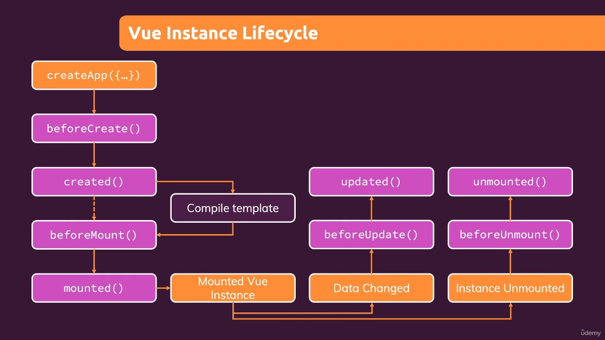

# Vue - The Complete Guide

Notes based on Udemy Course [Vue - The Complete Guide (incl. Router & Composition API)](https://www.udemy.com/course/vuejs-2-the-complete-guide/)

## 1. Getting Started

### What is Vue.js?

- A Javascript framwork that makes building interactive and reactive web frontends (= browser-side web applications) easier.

### Different Ways of Utilizing Vue

- Control parts of HTML pages or entire pages
    - Widget approach on a multi-page application
        - Some pages are still rendered on and served by a backend server
- Can also be used to control the entire frontend of a web application
    - Single-Page-Applicaton Approach.
        - Server sends only one HTML page, thereafter Vue takes over and controls the UI

### Building a First App with just Javascript

- Append item to a list.

```javascript
const buttonEl = document.querySelector('button');
const inputEl = document.querySelector('input');
const listEl = document.querySelector('ul');

function addGoal() {
    const enteredValue = inputEl.value;
    const listItemEl = document.createElement('li');
    listItemEl.textContent = enteredValue;
    listEl.appendChild(listItemEl);
}

buttonEl.addEventListener('click', addGoal);
```

### Re-building the App with Vue

- Using Vue from CDN

```html
<!DOCTYPE html>
<html lang="en">
  <head>
    <meta charset="UTF-8" />
    <meta name="viewport" content="width=device-width, initial-scale=1.0" />
    <title>A First App</title>
    <link rel="stylesheet" href="styles.css" />
  </head>
  <body>
    <div id="app">
      <div>
        <label for="goal">Goal</label>
        <input type="text" id="goal" v-model="enteredValue" />
        <button v-on:click="addGoal">Add Goal</button>
      </div>
      <ul>
        <li v-for="goal in goals">{{ goal }}</li>
      </ul>
    </div>
    <script src="https://unpkg.com/vue@3/dist/vue.global.js"></script>
    <script src="app.js"></script>
  </body>
</html>
```

```javascript
Vue.createApp({
   data() {
    return {
        goals: [],
        enteredValue: ''
    };
   } ,
   methods: {
    addGoal() {
        this.goals.push(this.enteredValue);
    }
   }
}).mount('#app');
```

### Course Content

- Basics - *Small Demos/Mini Projects*
    - Core Syntax
    - Templates
    - Directives
    - Data
    - Methods
    - Computed Properties
    - Watchers
- Intermediate - *Bigger Course Projects*
    - Components
    - Component Communication
    - Behind the Scenes
    - Forms
    - HTTP
    - Routing
    - Animations
- Advanced - *Assignments & Challenges*
    - Vuex
    - Authentication
    - Deployment & Optimizations
    - Composition API
    - Re-using Code

## Basics & Core Concepts - DOM Interaction with Vue

### Creating and Connecting Vue App Instances

- If we control a HTML element with Vue, we'll also control all child elements of that element

```html
<section id="user-goal">
  <h2>My Course Goal</h2>
  <p></p>
</section>
```

- Anything that's part of the object you return in *data* can now be used in your Vue-controlled HTML part

```javascript
const app = Vue.createApp({
  data() {
    return {
        courseGoal: 'Test!'
    };
  },
});

app.mount('#user-goal');
```

### Interpolation and Data Binding

- Reference properties that are part of the object

```html
<section id="user-goal">
  <h2>My Course Goal</h2>
  <p>{{ courseGoal }}</p>
</section>
```

### Binding Attributes with the "v-bind" Directive

- The `{{ }}` syntax is only available between opening and closing HTML tags
    - Passing dynamic value to an attribute, use Vue binding syntax, a directive
    - V-bind is a reserved name detected and understood by Vue
    - All built-in directives start with `v-`
```javascript
const app = Vue.createApp({
  data() {
    return {
        courseGoal: 'Test!',
        vueLink: 'https://vuejs.org/'
    };
  },
});

app.mount('#user-goal');
```
```html
<p>Learn more <a v-bind:href="vueLink">about Vue</a></p>
```

### Understanding "methods" in Vue apps

- Methods allow to define functions that execute when something happens
    - When you call them or a user event such as a click occurs
    - Takes an object, full of methods
    - `methods` is reserved term, such as `data`
    - All properties defined in methods object need to be functions
```javascript
const app = Vue.createApp({
  data() {
    return {
      courseGoal: 'Test!',
      vueLink: 'https://vuejs.org/',
    };
  },
  methods: {
    outputGoal() {
      const randomNumber = Math.random();
      if (randomNumber < 0.5) {
        return 'Learn Vue!';
      } else {
        return 'Master Vue!';
      }
    },
  },
});

app.mount('#user-goal');
```
```html
<section id="user-goal">
  <h2>My Course Goal</h2>
  <p>{{ outputGoal() }}</p>
  <p>Learn more <a v-bind:href="vueLink">about Vue</a></p>
</section>
```

### Working with Data inside of a Vue app

- Referencing data in methods
    - Vue packages data into the app object
```javascript
const app = Vue.createApp({
  data() {
    return {
      courseGoalA: 'Test A!',
      courseGoalB: 'Test B!',
      vueLink: 'https://vuejs.org/',
    };
  },
  methods: {
    outputGoal() {
      const randomNumber = Math.random();
      if (randomNumber < 0.5) {
        return this.courseGoalA;
      } else {
        return this.courseGoalB;
      }
    },
  },
});

app.mount('#user-goal');
```

### Outputting Raw HTML Content with v-html

- Using `v-html`
```javascript
...
courseGoalB: '<h2>Test B!</h2>',
...
```
```html
...
<p v-html="outputGoal()"></p>
...
```

### A First Summary

- Controlling section with Vue
    - And all child elements
- CSS Selector for mount
- Data-binding
- Interpolation syntax in HTML
- `v-bind` & `v-html`
- `data` & `methods` options
    - `data` returns object
    - `methods` returns functions you can call
- Declarative approach
    - Define the goal, define the template
    - Mark what is dynamic
    - Updates the DOM

### Event-binding

- React to user input, events
- `v-on` directive for adding event listeners
    - Takes event as argument after colon
    - i.e `v-on:click`
    - All default events, mouseenter, mouseleave, etc

```html
<section id="events">
  <h2>Events in Action</h2>
  <button v-on:click="counter++">Add</button>
  <button v-on:click="counter--">Reduce</button>
  <p>Result: {{ counter }}</p>
</section>
```
```javascript
const app = Vue.createApp({
  data() {
    return {
      counter: 0,
    };
  },
});

app.mount('#events');
```

### Events and Methods

- Moving logic out of HTML and into the Javascript code
- Can *point* to function, as opposed to calling it 
    - `<button v-on:click="add">Add</button>` instead of `<button v-on:click="add()">Add</button>`

```html
<section id="events">
  <h2>Events in Action</h2>
  <button v-on:click="add">Add</button>
  <button v-on:click="reduce">Reduce</button>
  <p>Result: {{ counter }}</p>
</section>
```
```javascript
const app = Vue.createApp({
  data() {
    return {
      counter: 0,
    };
  },
  methods: {
    add() {
      this.counter++;
    },
    reduce() {
      this.counter--;
    },
  },
});

app.mount('#events');
```

### Working with Event Arguments

- Add and Reduce by other numbers
    - Passing arguments

```javascript
methods: {
    add(num) {
      this.counter = this.counter + num;
    },
    reduce(num) {
      this.counter = this.counter - num;
    },
  },
```
```html
<button v-on:click="add(10)">Add 10</button>
<button v-on:click="reduce(5)">Reduce 5</button>
```

### Using the Native Event Object

- Utilizing default event object

```html
<input type="text"v-on:input="setName">
<p>Your Name: {{ name }}</p>
```
```javascript
methods: {
  setName(event) {
    this.name = event.target.value;
  },
  ...
},
```
- Accessing the event object
    - Default if pointing, need to state parameter with other args
        - `v-on:input="setName"`
        - `v-on:input="setName($event, 'Last Name')"`

### Exploring Event Modifiers

- Using form, input, and button
    - Dealing with button press default behavior to send HTTP request
    - Can do `event.preventDefault();` but there's another way with event modifier
- Can do prevent, right click only, key modifiers, etc

```html
<section id="events">
  <h2>Events in Action</h2>
  <button v-on:click="add(10)">Add 10</button>
  <button v-on:click.right="reduce(5)">Reduce 5</button>
  <p>Result: {{ counter }}</p>
  <input
    type="text"
    v-on:input="setName($event, 'Lofton')"
    v-on:keyup.enter="confirmInput"
  />
  <p>Your Name: {{ confirmedName }}</p>
  <form v-on:submit.prevent="submitForm">
    <input type="text" />
    <button>Sign Up</button>
  </form>
</section>
```
```javascript
const app = Vue.createApp({
  data() {
    return {
      counter: 0,
      name: '',
      confirmedName: '',
    };
  },
  methods: {
    confirmInput() {
      this.confirmedName = this.name;
    },
    submitForm() {
      alert('Submitted!');
    },
    setName(event, lastName) {
      this.name = event.target.value + ' ' + lastName;
    },
    add(num) {
      this.counter = this.counter + num;
    },
    reduce(num) {
      this.counter = this.counter - num;
    },
  },
});

app.mount('#events');
```

### Locking Content with v-once

- Some data that changes but want to preserve initial state
    - Utilizing `v-once`
```html
<p v-once>Starting Counter: {{ counter }}</p>
<p>Result: {{ counter }}</p>
```

### Data Binding + Event Binding = Two-Way Binding

- Resetting input with button
```html
<input type="text" v-on:input="setName($event, 'Lofton')">
<button>Reset Input</button>
<p>Your Name: {{ name }}</p>
```
```javascript
methods: {
  setName(event, lastName) {
    this.name = event.target.value + ' ' + lastName;
  },
  ...
  resetInput() {
    this.name = ''
  },
},
```
- Bind name to input
    - `<input type="text" v-bind:value="name" v-on:input="setName($event, 'Lofton')">`
- Set button to execute method on click
    - `<button v-on:click="resetInput">Reset Input</button>`
- With last name this causes issues so remove.
    - `this.name = event.target.value;`
- Shortcut for when you bind the value and listen to input changes
    - Using `v-model` as shortcut for `v-bind value v-on:input`
        - `<input type="text" v-model="name">`
        - This is two way binding, communicating in both ways, listening to an event coming out of input element and writing it back

### Methods used for Data Binding: How it Works

#### What we know (thus far)
- DOM Interaction, Templates & Data Binding
- Event Handling
- Next:
  - Advanced Relativity


- Outputting Full Name
  - `<p>Your Name: {{ outputFullName() }}</p>`
```html
<p>Your Name: {{ outputFullName() }}</p>
```
- Checking if name is empty before returning.
```javascript
methods: {
    outputFullName() {
      if (this.name === '') {
        return '';
      }
      return this.name + ' ' + 'Lofton';
    },
}
```

- This way is not ideal, behind the scenes when counter is change Vue attempts to find where counter is used in order to update the page automatically. When method is called, it is re-executed on page whenever anything changes because Vue does not know what the method does.
  - Any non-event bound method will be re-executed by Vue when anything on the page changes.
  - Not a bug, this is how Vue works. Methods are not the best solution for outputting some dynamically calculated value such as this.

### Introducing Computed Properties

- Data, Methods, and Computed
- Computed Properties are essentially like methods with one difference.
  - Vue will be aware of their dependencies and only reexecutes them if one of the dependencies is changed.
  - Should name your computed methods like data properties as they are used like such.
  - Point to it in HTML, as Vue will call it for you (`fullname` instead of `fullname()`)
  - Computed property value is cached and only recalculate and reevaluate it if the property changes, in this case `name`
  
```javascript
computed: {
    fullname() {
      console.log('Running Again...');
      if (this.name === '') {
        return '';
      }
      return this.name + ' ' + 'Lofton';
    },
  },
```
```html
<p>Your Name: {{ fullname }}</p>
```

### Working with Watchers

- Watcher is basically a function you can tell Vue to execute when one of it's properties has changed.
  - Sounds like computed properties, and can use those instead but this might not be the way you want to do it.
  - Side note, don't want to have a name clash, i.e. a data property and a computed property both named `fullname`.
  - `watch` expects an object, similar to computed and methods.
    - Can use the same name for a watcher, `name() {}`
    - They work this way, connection is set up by repeating another data or computed property name in a watcher method and it will automatically executed by Vue when a property by that name changes.
    - We don't return anything, because the watcher won't be used in the HTML code to use a return value.
    - Run logic that should be executed when `name` changes.
    - `this.name` not needed, as watcher function automatically gets last value of watched property as an argument.
      - Can also access old value if needed. `name(newValue, oldValue {...};)`
- Example with two watchers to reflect full name:
```javascript
watch: {
    name(value) {
      if (value === '') {
        this.fullname = '';
      } else {
        this.fullname = value + ' ' + this.lastName;
      }
    },
    lastName(value) {
      if (value === '') {
        this.fullname = '';
      } else {
        this.fullname = this.name + ' ' + value;
      }
    },
  },
```
- However, can do this more simply (less code) with computed:
```javascript
computed: {
    fullname() {
      console.log('Running Again...');
      if (this.name === '' || this.lastName === '') {
        return '';
      }
      return this.name + ' ' + this.lastName;
    },
  },
```
- So why use watchers?
  - Change when something specific happens. For example, when counter is greater than 50, reset it.
  - Run logic that might update a data property, but not always.
```javascript
watch: {
    counter(value) {
      if (value > 50) {
        this.counter = 0;
      }
    },
}
```
- Example use cases
  - HTML Requests to send if certain data changes
  - Timers if certain data changes
- Watcher useful for some code that maybe updates some data property in reaction to a data property changing.
- In comparison, Computed is good if you want to calculate some output dynamically.

### Methods vs Computed Properties vs Watchers

- Methods
  - Use with event binding *OR* data binding.
  - Data binding: Method is executed for every "re-render" cycle of the component.
  - Use for events or data that really needs to be re-evaluated all the time.
- Computed
  - Use with data binding
  - Computed properties are only re-evaluated if one of their "used values" changed.
  - Use for data that depends on other data.
- Watch
  - Not used directly in template.
  - Allows you to run any code in reaction to some changed data (e.g. send HTTP request, etc.)
  - Use for any non-data update you want to make.

### v-bind and v-on Shorthands

- `v-on` Shorthand
  - Using `@` in place of `v-on:`
  - `<button v-on:click="add(10)">Add 10</button>` --> `<button @click="add(10)">Add 10</button>`
- `v-bind` Shorthand
  - Omit the `v-bind`, use only `:`
  - `<input type="text" v-bind:value="..." v-model="name" />` --> `<input type="text" :value="..." v-model="name" />`
- `:attributeName` shorthand for `v-bind`, `@eventName` shorthand for `v-on`

### Dynamic Styling with Inline Styles

- Using Vue to change styling dynamically via inline using v-bind and this special style binding syntax.

```html
<section id="styling">
  <div
    class="demo"
    :style="{borderColor: boxASelected ? 'red' : '#ccc'}"
    @click="boxSelected('A')"
  ></div>
  <div class="demo" @click="boxSelected('B')"></div>
  <div class="demo" @click="boxSelected('C')"></div>
</section>
```
```javascript
const app = Vue.createApp({
  data() {
    return {
      boxASelected: false,
      boxBSelected: false,
      boxCSelected: false,
    };
  },
  methods: {
    boxSelected(box) {
      if (box === 'A') {
        this.boxASelected = true;
      } else if (box === 'B') {
        this.boxBSelected = true;
      } else if (box === 'C') {
        this.boxCSelected = true;
      }
    },
  },
});

app.mount('#styling');
```

### Adding CSS Classes Dynamically

- Inline styles not used very often since they overrule all other styles.
- In modern development and CSS inline is rarely used.
- We can bind CSS classes dynamically using `v-bind`

```html
<div
  :class="boxASelected ? 'demo active' : 'demo'"
  @click="boxSelected('A')"
></div>
```

- However, not optimal as this is difficult to read, more classes will make this even more difficult.
  - Vue supports a special syntax for class attribute if binding with `v-bind`.

```html
<div
  :class="{demo: true, active: boxASelected}"
  @click="boxSelected('A')"
></div>
```

- Same behavior but more readible and maintainable.
  - Can simplify this further, demo is always true and can be moved into a normal class attribute.
```html
<div
  class="demo"
  :class="{active: boxASelected}"
  @click="boxSelected('A')"
></div>
```
- Dynamically bound class will be evaluated by Vue and merge it with the hard-coded class.
- We can also alter our methods to create a toggle as opposed to always making it active by assigning opposite value instead of true.
  - `this.boxASelected = !this.boxASelected;`

### Classes & Computed Properties

- We can also utilize computed properties here for our styles.
- Preferable as having logic in HTML is suboptimal, although previous example with class-binding was sufficient.
  - Sufficent because of single line logic, for more complex dynamic class code computed is likely the better option.

```html
<div class="demo" :class="boxAClasses" @click="boxSelected('A')"></div>
```
```javascript
computed: {
  boxAClasses() {
    return { active: this.boxASelected };
  },
},
```

### Dynamic Classes: Array Syntax

- Another syntax supported by view for multiple class assignments by working with one dynamic class assignment.
  - Passing an array.
```html
<div :class="['demo', { active: boxBSelected }]" @click="boxSelected('B')"></div>
```
With computed: 
```html
<div :class="['demo', boxBClasses]" @click="boxSelected('B')"></div>
```

### Module Summary

- DOM & Templates
  - Vue can be used to define the goal instead of the steps (-> **declarative** approach).
  - **Connect** Vue to HTML via "**mount**": Vue **then renders the real DOM** based on the connected template.
- Data & Event Bindings
  - You can **bind data** via interpolation (**{{ }}**) or the **v-bind** ("**:**") directive.
  - You **listen for events** via **v-on** ("**@**")
- Reactivity
  - Vue updates the real DOM for you when bound data changes.
  - **Computed properties** and **watchers** allow you to reach to data changes.
- Styling
  - Dynamic CSS class and inline style bindings are supported by Vue
  - Vue offers multiple **special syntaxes** (object-based, array-based) for efficient bindings.

## Rendering Conditional Content & Lists

### Module Introduction

- Conditional Content & Lists
  - Rendering more ...sometimes
- Module Content
  - Rendering Content with Conditions
  - Outputting Lists of Data
  - A First Look Behind the Scenes

#### Understanding the Problem

- Dummy list into a growing & shrinking dynamic list.
- Message showing no goals added yet.

Starting Vue app:
```javascript
const app = Vue.createApp({
  data() {
    return { goals: [] };
  },
});

app.mount('#user-goals');
```

- If the array is empty, the unordered list should not be shown (not part of the DOM), instead paragraph should be shown.
- If we do have goals, show the unordered list and do not show paragraph.
- Conditional rendering will accomplish this.
  - Common use case: loading spinner shown while waiting for data to arrive.

#### Rendering Content Conditionally

- Show list if we do have goals, if not only show paragraph.
- Directive just for this purpose: `v-if`
  - Similar to `if` statement in javascript.
    - `<p v-if="goals.length === 0">...</p>`
- Bind our input, create method to add goals, data property for the entered goal value, click listener on button.

#### v-if, v-else, and v-else-if

- More on `v-if`
  - Can have any expression that evaluates to truthy or falsy value, just as regular `if` statement, can combine with `&&` (and) or `||` (or).
  - Can point to computed or data property, or even a method as long as it evaluates to boolean value.
  - Vue offers another directive to use in conjunction with `v-if`: `v-else`
    - `v-else` has to be used on an element that comes directly after one with `v-if`, or *direct neighbor element*
    - Additionally, `v-else-if` offered in similar way.
- These conditionals are not simply about showing/hiding things on the page, it's about whether or not they are included in the DOM, so more of attaching/re-attaching.

```javascript
const app = Vue.createApp({
  data() {
    return {
      enteredGoalValue: '',
      goals: [],
    };
  },
  methods: {
    addGoal() {
      this.goals.push(this.enteredGoalValue);
    },
  },
});

app.mount('#user-goals');
```
```html
<section id="user-goals">
  <h2>My course goals</h2>
  <input type="text" v-model="enteredGoalValue" />
  <button @click="addGoal">Add Goal</button>
  <p v-if="goals.length === 0">
    No goals have been added yet - please start adding some!
  </p>
  <ul v-else>
    <li>Goal</li>
  </ul>
</section>
```

#### Using v-show Instead Of v-if

- An alternative to `v-if`: `v-show`
  - `v-show` doesn't work together with `v-if`, `v-else`, `v-else-if`, it's standalone so if you have multiple alternatives, multiple `v-show`s are needed
  - `<p v-show="goals.length === 0">...</p>`
- What does `v-show` do then?
  - Big difference is that `v-show` adds the `display: none` style to the element, so it is still in the DOM
- Which approach is better?
  - Cost performance associated with adding/removing elements
  - A bunch of non-needed elements in the DOM also not ideal
- Rule of thumb: typically use `v-if` and only fall back to `v-show` if you have an element which visibility status changes alot.
  - For example, a button that toggles an element.

#### Rendering Lists of Data

- Need to output a list of content, a common thing in web apps, and Vue offers a tool to do just that: `v-for`
  - As with `v-if` being similar to `if` statements in javascript, `v-for` is similar to `for` loops in javascript.
    - `goal` of `goals` in JS, use `in` keyword with Vue
  - `<li v-for="goal in goals">{{ goal }}</li>`
  - Has to be inside the element, similar to how the constant in a `for` loop is only available within it.
  - Vue adds them to the DOM in an efficient way, by only adding the new list item and leaving unchanged list items alone. It does not re-render the entire list every time an item is added or removed.

#### Diving Deeper Into v-for

##### Other ways of utilizing `v-for`:
- You can get the index of item in array
  - `v-for="(goal, index) in goals"`
  - Then, use like goal: `{{ index }}`
- You can loop through objects
  - `v-for="value in {name: 'Johnny', age: '30'}"`
  - Output in list text with interpolation: `{{ value }}`
  - Can get key name of object property similar to index, or index of property in an object
  - `<li v-for="(value, key, index) in {name: 'Johnny', age: '30'}">{{ key }}: {{ value }} | {{ index }}</li>`
- Can also loop through a range of numbers
  - `<li v-for="num in 10">{{ num }}</li>`

#### Removing List items

- Add click listener on list item element
- Method for removing items from the list
  - Will need identifier for given goal: the index

```html
<li v-for="(goal, index) in goals" @click="removeGoal(index)">
  {{ goal }} - {{ index }}
</li>
```
```javascript
methods: {
    ...
    removeGoal(idx) {
      this.goals.splice(idx, 1);
    },
  },
```

#### Lists & Keys

- Put goal and index in paragraph element and add input to list element for this example:
  - `<p>{{ goal }} - {{ index }}</p>` and `<input type="text" @click.stop />` within the `li` element
- When deleting a list item and text is in the input, strange behavior. Deleting first goal deleted the input text in the second.
- Vue updates the list when you add and remove items, renders the list in the real DOM and updates it as required.
  - Attempts to do this in a optimized way for performance, thus elements are reused.
  - The content of the second element is moved into the first, to keep from rerendering the entire list or delete the first element and move them around.
    - Just the dynamic content is moved around
    - This is why we lose the input we have on the second element when the content of the second element is moved to the old first elements DOM element.
  - Generally, reusing elements is good and efficient, but sometimes elements need to be able to be told apart.
- Simple extra attribute that is not a default HTML attribute for use on elements using `v-for`
  - `key=""` allows you to give an element a unique identifier
  - Good habit and practice to always use on `v-for` elements even if not needed.
  - `key` wants a unique identification criteria for every item
    - Bind it to dynamic value
    - Index won't work here, doesn't belong to goal content
    - Unique keys likely already associated with items in database, they can be used for this purpose.
  - Helps Vue tell elements apart
- Using goal text as key: `<li v-for="(goal, index) in goals" :key="goal" @click="removeGoal(index)">`

#### Module Summary

- Conditional Content
  - **v-if** (and **v-show**) allows you to render content **only if a certain condition is met**
  - v-if can be combined with **v-else** and **v-else-if** (only on direct sibling elements)
- Lists
  - v-for can be used to render multiple elements dynamically
  - v-for can be used with arrays, objects, and ranges (numbers)
- v-for Variations
  - You can extract **values**, values and **indexes** or values, **keys** and indexes.
  - If you need v-for and v-if, **DON"T use them on the same element.** Use a wrapper with v-if instead.
- Keys
  - Vue **re-uses DOM elements** to optimize performance --> This can lead to bugs if elements contain state
  - Bind the **key** attribute to a unique value to help Vue identify elements that belong to list content

### Course Project: The Monster Slayer Game

#### Module Introduction

- Practicing core knowledge from last modules into Project
  - Data-binding
  - Interpolation
  - `v-bind`
  - Event binding with `v-on`
  - Output lists of data with `v-for`
  - Conditional content with `v-if`

#### Project Setup & First Methods

- Starting HTML
```html
<body>
  <header>
    <h1>Monster Slayer</h1>
  </header>
  <div id="game">
    <section id="monster" class="container">
      <h2>Monster Health</h2>
      <div class="healthbar">
        <div class="healthbar__value"></div>
      </div>
    </section>
    <section id="player" class="container">
      <h2>Your Health</h2>
      <div class="healthbar">
        <div class="healthbar__value"></div>
      </div>
    </section>
    <section id="controls">
      <button>ATTACK</button>
      <button>SPECIAL ATTACK</button>
      <button>HEAL</button>
      <button>SURRENDER</button>
    </section>
    <section id="log" class="container">
      <h2>Battle Log</h2>
      <ul></ul>
    </section>
  </div>
</body>
```

- Top to bottom, beginning with "Attack"
- First time calling a method within the Vue app configuration itself.
- Javascript:

```javascript
function getRandomValue(min, max) {
  return Math.floor(Math.random() * (max - min)) + min;
}

const app = Vue.createApp({
  data() {
    return {
      playerHealth: 100,
      monsterHealth: 100,
    };
  },
  methods: {
    attackMonster() {
      const attackValue = getRandomValue(5, 12);
      this.monsterHealth -= attackValue;
      this.attackPlayer();
    },
    attackPlayer() {
      const attackValue = getRandomValue(8, 15);
      this.playerHealth -= attackValue;
    },
  },
});

app.mount('#game');
```
- Next, connecting to our HTML

#### Updating the Health Bars

- Click listener on our attack button
  - `<button @click="attackMonster">ATTACK</button>`
- Adjusting the health bars by binding style and changing width.
  - Monster: `<div class="healthbar__value" :style="{width: monsterHealth + '%'}">`
    - Player health done similarly.
  - Make this more lean with computed properties, then refernce that in style bind
    - `<div class="healthbar__value" :style="playerBarStyles">`

```javascript
computed: {
  monsterBarStyles() {
    return { width: this.monsterHealth + '%' };
  },
  playerBarStyles() {
    return { width: this.playerHealth + '%' };
  },
},
```

#### Adding a "Special Attack"

- Implement "Special Attach" as a similar method to attack
  - Same method as regular attack, but change min, max to 10, 25.
  - While having more attack value, should not be available all the time, only every 3 rounds.
  - Keeping track of rounds with additional data property `currentRound` beginning at 0, increment with every player attack (monster attack occurs in same round).
  - Bind disabled to whether `currentRound` is divisable by 3.
    - `<button :disabled="currentRound % 3 !== 0" @click="specialAttackMonster">`
  - Outsource logic to Vue config in a computed property.
    - `mayUseSpecialAttack() { return this.currentRound % 3 !== 0; }`
    - `<button :disabled="mayUseSpecialAttack" @click="specialAttackMonster">`

#### Adding a "Heal" Functionality

- Implement as a method
  - However, should not heal above 100 health, so include `if` check
  - This should also count as a round in the game.
  - Monster should attack as well since this is a round.
```javascript
healPlayer() {
  this.currentRound++;
  const healValue = getRandomValue(8, 20);
  if (this.playerHealth + healValue > 100) {
    this.playerHealth = 100;
  } else {
    this.playerHealth += healValue;
  }
  this.attackPlayer();
},
```
- Attach click listener
  - `<button @click="healPlayer">HEAL</button>`

#### Adding a "Game Over Screen"

- We need to implement logic to end the game, in the event of monster health or player health below 0, or both, resulting in a draw.
- Way to keep track of health without repeating code
  - Watcher is good for this purpose
- Using `if` checks in watchers, check for draw, or player/monster lost
- Then, display a message on the screen, and use conditional content (`v-if`)
- We will use a data property, winner, initially set as null to determine winner
  - Set to 'draw', 'monster', or 'player'

```javascript
watch: {
  playerHealth(value) {
    if (value <= 0 && this.monsterHealth <= 0) {
      // a draw
      this.winner = 'draw';
    } else if (value <= 0) {
      // player lost
      this.winner = 'monster';
    }
  },
  monsterHealth(value) {
    if (value <= 0 && this.playerHealth <= 0) {
      // draw
      this.winner = 'draw';
    } else if (value <= 0) {
      // monster lost
      this.winner = 'player';
    }
  },
},
```
```html
<!-- between healthbars & controls -->
<section class="container" v-if="winner">
  <h2>Game Over!</h2>
  <h3 v-if="winner === 'monster'">You lost!</h3>
  <h3 v-else-if="winner === 'player'">You won!</h3>
  <h3 v-else>It's a draw!</h3>
</section>
```

#### Finishing the Core Functionality

- Start by fixing healthbars
  - Can adjust our computed style properties to reflect 0% when game is over.
  - Enter `if` checks to return 0% width if below 0.
```javascript
computed: {
    // ...
    playerBarStyles() {
        if (this.playerHealth < 0) {
        return { width: '0%' };
        }
        return { width: this.playerHealth + '%' };
    },
    // ...
},
```

- Restarting the game
  - Add a button to start new game.
  - Method to reset our parameters, health, round, winner.
```html
<button @click="startGame">Start New Game</button>
```
```javascript
methods: {
    startGame() {
      this.playerHealth = 100;
      this.monsterHealth = 100;
      this.winner = null;
      this.currentRound = 0;
    },
},
```

- Implementing Surrender button
  - Simply set winner to monster with method, click listener on button
```html
<button @click="surrender">SURRENDER</button>
```
```javascript
methods: {
    // ...
    surrender() {
      this.winner = 'winner';
    },
  },
```

- If game is over, controls should not be given.
  - Since controls section is neighboring our game over section, we can link the `v-if` check with a `v-else`
  - `<section id="controls" v-if="!winner">`

#### Adding a Battle Log

- Messages of which actions occurred
  - Begin with new method
    - Parameters of who, what, and value.
  - Then a data property of log messages as an empty array
    - We can also set to empty array in start game method
    - Add our logs to the *beginning* of the array, so latest is on top (`unshift`)
    - Logs will be an object.
      - `actionBy`, `actionType`, and `actionValue`
- Output into Battle Log unordered list using `v-for`
- Complete finished Game: 

```html
<!DOCTYPE html>
<html lang="en">
  <head>
    <meta charset="UTF-8" />
    <meta name="viewport" content="width=device-width, initial-scale=1.0" />
    <title>Vue Basics</title>
    <link
      href="https://fonts.googleapis.com/css2?family=Jost:wght@400;700&display=swap"
      rel="stylesheet"
    />
    <link rel="stylesheet" href="styles.css" />
    <script src="https://unpkg.com/vue@3.4.9/dist/vue.global.js" defer></script>
    <script src="app.js" defer></script>
  </head>
  <body>
    <header>
      <h1>Monster Slayer</h1>
    </header>
    <div id="game">
      <section class="container"><h2>Round: {{ currentRound }}</h2></section>
      <section id="monster" class="container">
        <h2>Monster Health</h2>
        <div class="healthbar">
          <div class="healthbar__value" :style="monsterBarStyles"></div>
        </div>
      </section>
      <section id="player" class="container">
        <h2>Your Health</h2>
        <div class="healthbar">
          <div class="healthbar__value" :style="playerBarStyles"></div>
        </div>
      </section>
      <section class="container" v-if="winner">
        <h2>Game Over</h2>
        <h3 v-if="winner === 'monster'">You lost!</h3>
        <h3 v-else-if="winner === 'player'">You won!</h3>
        <h3 v-else>It's a draw!</h3>
        <button @click="startGame">Start New Game</button>
      </section>
      <section id="controls" v-if="!winner">
        <button @click="attackMonster">ATTACK</button>
        <button :disabled="mayUseSpecialAttack" @click="specialAttackMonster">
          SPECIAL ATTACK
        </button>
        <button @click="healPlayer">HEAL</button>
        <button @click="surrender">SURRENDER</button>
      </section>
      <section id="log" class="container">
        <h2>Battle Log</h2>
        <ul>
          <li v-for="logMessage in logMessages">
            <span
              :class="{'log--player': logMessage.actionBy === 'player', 'log--monster': logMessage.actionBy === 'monster'}"
              >{{ logMessage.actionBy === 'player' ? 'Player' :
              'Monster'}}</span
            >
            <span v-if="logMessage.actionType === 'heal'">
              heals himself for
              <span class="log--heal">{{ logMessage.actionValue }}</span>
            </span>
            <span v-else>
              attacks and deals
              <span class="log--damage">{{ logMessage.actionValue }}</span>
            </span>
          </li>
        </ul>
      </section>
    </div>
  </body>
</html>
```

```javascript
function getRandomValue(min, max) {
  return Math.floor(Math.random() * (max - min)) + min;
}

const app = Vue.createApp({
  data() {
    return {
      playerHealth: 100,
      monsterHealth: 100,
      currentRound: 0,
      winner: null,
      logMessages: [],
    };
  },
  computed: {
    monsterBarStyles() {
      if (this.monsterHealth < 0) {
        return { width: '0%' };
      }
      return { width: this.monsterHealth + '%' };
    },
    playerBarStyles() {
      if (this.playerHealth < 0) {
        return { width: '0%' };
      }
      return { width: this.playerHealth + '%' };
    },
    mayUseSpecialAttack() {
      return this.currentRound % 3 !== 0;
    },
  },
  watch: {
    playerHealth(value) {
      if (value <= 0 && this.monsterHealth <= 0) {
        // a draw
        this.winner = 'draw';
      } else if (value <= 0) {
        // player lost
        this.winner = 'monster';
      }
    },
    monsterHealth(value) {
      if (value <= 0 && this.playerHealth <= 0) {
        // a draw
        this.winner = 'draw';
      } else if (value <= 0) {
        // monster lost
        this.winner = 'player';
      }
    },
  },
  methods: {
    startGame() {
      this.playerHealth = 100;
      this.monsterHealth = 100;
      this.winner = null;
      this.currentRound = 0;
      this.logMessages = [];
    },
    attackMonster() {
      this.currentRound++;
      const attackValue = getRandomValue(5, 12);
      this.monsterHealth -= attackValue;
      this.addLogMessage('player', 'attack', attackValue);
      this.attackPlayer();
    },
    attackPlayer() {
      const attackValue = getRandomValue(8, 15);
      this.playerHealth -= attackValue;
      this.addLogMessage('monster', 'attack', attackValue);
    },
    specialAttackMonster() {
      this.currentRound++;
      const attackValue = getRandomValue(10, 25);
      this.monsterHealth -= attackValue;
      this.addLogMessage('player', 'attack', attackValue);
      this.attackPlayer();
    },
    healPlayer() {
      this.currentRound++;
      const healValue = getRandomValue(8, 20);
      if (this.playerHealth + healValue > 100) {
        this.playerHealth = 100;
      } else {
        this.playerHealth += healValue;
      }
      this.addLogMessage('player', 'heal', healValue);
      this.attackPlayer();
    },
    surrender() {
      this.winner = 'winner';
    },
    addLogMessage(who, what, value) {
      this.logMessages.unshift({
        actionBy: who,
        actionType: what,
        actionValue: value,
      });
    },
  },
});

app.mount('#game');
```

### Vue: Behind the Scenes

#### Module Introduction

- Extra behind-the-scenes knowledge to work with it better.
- How Vue Works
  - Understanding "Virtual DOM" & DOM Updating

#### An Introduction to Vue's Reactivity

- Simple Vue App
  - Current input and message
  - Methods to save input and set text
  - Event bindings, interpolation, and click listener
```html
<section id="app">
  <h2>How Vue Works</h2>
  <input type="text" @input="saveInput">
  <button @click="setText">Set Text</button>
  <p>{{ message }}</p>
</section>
```
```javascript
const app = Vue.createApp({
  data() {
    return {
      currentUserInput: '',
      message: 'Vue is great!',
    };
  },
  methods: {
    saveInput(event) {
      this.currentUserInput = event.target.value;
    },
    setText() {
      this.message = this.currentUserInput;
    },
  },
});

app.mount('#app');
```

- Part of the page, what the user sees, updated by Vue
- Built-in reactivity
- Turns your data object into a reactive data object by wrapping properties with Javascript feature known as proxies
  - Proxies notify when a new value is set

#### Vue Reactivity: A Deep Dive

- Proxy functionality in Javascript that Vue utilizes
- Vanilla Javascript (no Vue involved):
```javascript
let message = 'Hello!';
let longMessage = message + ' World!';
console.log(longMessage);
message = 'Hello!!!!';
console.log(longMessage);
```
- Output is still 'Hello! World!' because Javascript by default is not reactive.
  - In other words, the 'calculation', adding of the two strings, is not executed again because we changed it.
- Vue has a built-in mechanism to be aware when message changed.
  - This utilizes Javascript Proxies
- Proxy wraps an object, the first argument, and takes an object of handlers as it's second argument.
  - Handler utilizes `set()` which takes 3 arguments (set trap)
  - `target`  - object that was wrapped
  - `key`     - property which the value was set to
  - `value`   - value that was set
  - Our setter function is triggered whenever a property is set to a new value on this proxy.
    - We can find out which property it is, what the new value is, and the original object we wrapped.
- This is a simplification of what Vue does under the hood.

```javascript
const data = {
  message: 'Hello!',
  longMessage: 'Hello! World!',
};

const handler = {
  set(target, key, value) {
    if (key === 'message') {
      target.longMessage = value + ' World!';
    }
    target.message = value;
  },
};

const proxy = new Proxy(data, handler);

proxy.message = 'Hello!!!!';
console.log(proxy.longMessage);
```

#### One App vs Multiple Apps

- You can have multiple apps per page (app that is mounted)
- They are separate, can't use data from a different app
  - Each Vue app works standalone
- Separate apps if they are independant

#### Understanding Templates

- Should not control the same HTML part with different apps
- Can't use one app to control multiple different parts.
- Not HTML part, but *template*
- By mounting your app to a certain place in the DOM, in the HTML code, you make that part of the HTML code the template of that Vue app.
- Different ways of defining a template of your app
  - Most common, convienent one, writing HTML code and mounting application to it
  - Not the only way to add a template.
    - Using the `template` option to define it manually.
    - Still need to mount so Vue knows where to display the template.

```javascript
const app2 = Vue.createApp({
  template: `
    <p>{{ favoriteMeal }}</p>
  `,
  data() {
    return {
      favoriteMeal: 'Pizza!',
    };
  },
});

app2.mount('#app2');
```

#### Working with Refs

- Different ways of getting a value out of such an input element
  - `<input type="text" @input="saveInput" />`
  - So far, listening to input, with every keystroke `saveInput` is fired
    - In `saveInput` method, current value is saved to property.
  - Can also utilize this with `v-model` as before
    - `<input type="text" v-model="currentUserInput" />`
- Vue has a feature that allows you to retreive values from DOM elements when you need them instead of all the time.
  - Using the `ref` attribute
    - Similar to `key`, it is a non-default HTML attribute
    - Assign a value, a string identifier of your choice.
    - Vue detects `ref`s  and stores them internally
      - Basically memorizes that you want access to this element
    - Can access this with `this.$refs`
      - All Vue provided properties start with `$`
      - Is an object with key-value pairs where the keys are the `ref` identifiers.
    - If we console log `this.$refs.userText`, we get the element
    - If we `console.dir(ths.$refs.userText)` we can see the Javascript object representation of the input element, with all the properties that it has.
      - For example, contains the `value` property.
      - Object we're logging essentially the same as the `event.target`
    - Now, with this, we are not doing it with every keystroke but instead when `setText` is emitted, when the button is clicked
    - The input is not logged with every keystroke

```html
<input type="text" ref="userText" />
```
```javascript
methods: {
  saveInput(event) {
    this.currentUserInput = event.target.value;
  },
  setText() {
    // this.message = this.currentUserInput;
    this.message = this.$refs.userText.value;
    // console.dir(this.$refs.userText);
  },
},
```

#### How Vue Updates the DOM

- The built-in reactivity is how Vue detects that an update is needed and where the update is needed.
- However, Vue performs the update in a performance optimized way.
- When updating the text in our example, only the paragraph with the text inside of it was updated.
- Vue utilizes something called the "Virtual DOM" to accomplish this
- ~~Possible solution: Compare old DOM values with new ones and update accordingly~~
  - While not as bad as updating the entire screen, still resource intensive to read the entire real DOM all the time. 
- How Vue Updates the DOM:

| Vue Instance ( our Vue app)                                          | Virtual DOM                                                                                       | Browser DOM (HTML content rendered in the browser)                       |
| -------------------------------------------------------------------- | ------------------------------------------------------------------------------------------------- | ------------------------------------------------------------------------ |
| Stores data, computed properties, methods, ...                       | JS-based DOM which exists only in memory                                                          | Vue-controlled template is rendered in the DOM                           |
| `title: 'Hello!', text: 'Not the title'`                             | `{el: 'h2', child: 'Hello!'},` ...                                                                | `<h2>Hello!</h2><p>Not the title</p>`                                    |
| Data and computed properties may change (e.g. because of user input) |                                                                                                   | Updates should be reflected, but Vue should **not** re-render everything |
| **title: 'Hi there!'**, text: 'Not the title'                        | Updates are made to the **virtual DOM first**, only differences are then rendered to the real DOM | `<h2>Hi there!</h2><p>Not the title</p>` (only updates reflected)        |
- General overview, Vue has a bunch of optimizations to achieve this in a non-performance intensive way.

#### Vue Instance Lifecycle



#### Vue App Lifecycle Practice

- We can add the lifecycle hook methods to our app.
  - Not like `methods` option, but alongside our `data`, `methods`, so on
- Here we will log to the console, but you could do more such as send an HTTP request, anything you need before create.
```javascript
const app = Vue.createApp({
  data() { /*... */ },
  methods: { /*... */ },
  beforeCreate() {
    console.log('beforeCreate()');
  },
});
```
- We can use the browser developer tools to create a breakpoint at this log, where we see nothing has been generated to the screen. 
- Add additional hooks, similar behavior when doing breakpoints until we get to `mounted()`
  - With `mounted()` and breakpoint we see that we now have content generated on the screen.
- Doing this further with `beforeUpdate()` and `updated()`, we can see these trigger for data updates, such as setting the text in the paragraph.
- Testing with `beforeUnmount()` and `unmounted()`, we see that the content does not disappear until we are in `unmounted()`
  - Unmounting the app is not common, and we have not used the more common case yet, so we configure a timer to unmount after 3 seconds.
- In reality, most of these hooks we will likely not use, or use sometimes, but this demonstrates the Vue application lifecycle.


```javascript
const app = Vue.createApp({
  data() { /*... */ },
  methods: { /*... */ },
  beforeCreate() {
    console.log('beforeCreate()');
  },
  created() {
    console.log('created()');
  },
  beforeMount() {
    console.log('beforeMount()');
  },
  mounted() {
    console.log('mounted()');
  },
  beforeUpdate() {
    console.log('beforeUpdate()');
  },
  updated() {
    console.log('updated()');
  },
  beforeUnmount() {
    console.log('beforeUnmount()');
  },
  unmounted() {
    console.log('unmounted()');
  },
});

app.mount('#app');

setTimeout(() => {
  app.unmount();
}, 3000);
```

### Introducing Components

#### Module Introduction

- Understanding Vue Components
  - Connected Vue Instances
- Module Content
  - What & Why
  - Working with Components

#### Understanding the Problem

- Render list items dynamically with Vue
- Attempt this with only what we have utilized so far

```html
<body>
  <header>
    <h1>FriendList</h1>
  </header>
  <section id="app">
    <ul>
      <li v-for="friend in friends" :key="friend.id">
        <h2>{{ friend.name }}</h2>
        <button @click="toggleDetails">
          {{ detailsAreVisible ? 'Hide' : 'Show'}} Details
        </button>
        <ul v-if="detailsAreVisible">
          <li><strong>Phone:</strong> {{ friend.phone }}</li>
          <li><strong>Email:</strong> {{ friend.email }}</li>
        </ul>
      </li>
    </ul>
  </section>
</body>
```
```javascript
const app = Vue.createApp({
  data() {
    return {
      detailsAreVisible: false,
      friends: [
        {
          id: 'johnny',
          name: 'Johnny Lofton',
          phone: '012-345-6789',
          email: 'jlofton479@gmail.com',
        },
        {
          id: 'julie',
          name: 'Julie Jones',
          phone: '987-654-3210',
          email: 'notAnEmail@address.com',
        },
      ],
    };
  },
  methods: {
    toggleDetails() {
      this.detailsAreVisible = !this.detailsAreVisible;
    },
  },
});

app.mount('#app');
```

#### Introducting Components

- Components are great for pieces of HTML, or blocks, which you reuse in certain parts of the page.
  - With certain functionality that should be enclosed in the HTML block, and specific to it.
  - Also good for splitting application into smaller pieces
- Created on an app we created.
  - `app.component();`
- Component method needs 2 arguments
  - Identifier, because **a component is basically like a customer HTML element**
    - Should always use an identifier that contains a dash to avoid crashing into official built-in HTML elements
  - Config object just as passed to `createApp`, our `data()`, `methods`, etc.
- Component is essentially just another app, just an app that belongs to another app.
  - We are creating another app that is connected to our main app
- Now we toggle this component specific data with our component specific method
  - We can also remove them from our main app
    - There would not be a clash if we kept `detailsAreVisible` since the component is encapselated, and doesn't communicate with the main app.

```javascript
app.component('friend-contact', {
  data() {
    return { detailsAreVisible: false };
  },
  methods: {
    toggleDetails() {
      this.detailsAreVisible = !this.detailsAreVisible;
    },
  },
});
```

- How do we use this component?
  - First, since it is it's own app, it requires a template
  - It is not mounted, we will use `template` method instead
    - Other methods of defining templates explored later
  - Use our entire `<li>` HTML as our template using backticks
  - For now we will use our first friend object as a data property on our component
  - Now we can use our component in the HTML code
    - Remember this is not an HTML element that the browser would know
- We will be able to use on in the same component with different data that we pass into the component
- Components help us encapsulate structure, content and logic into smaller reusable pieces

```html
<body>
  <header>
    <h1>FriendList</h1>
  </header>
  <section id="app">
    <ul>
      <friend-contact></friend-contact>
      <friend-contact></friend-contact>
    </ul>
  </section>
</body>
```

```javascript
const app = Vue.createApp({
  data() {
    return {
      friends: [
        {
          id: 'julie',
          name: 'Julie Jones',
          phone: '987-654-3210',
          email: 'notAnEmail@address.com',
        },
      ],
    };
  },
});

app.component('friend-contact', {
  template: `
  <li>
    <h2>{{ friend.name }}</h2>
    <button @click="toggleDetails">
      {{ detailsAreVisible ? 'Hide' : 'Show'}} Details
    </button>
    <ul v-if="detailsAreVisible">
      <li><strong>Phone:</strong> {{ friend.phone }}</li>
      <li><strong>Email:</strong> {{ friend.email }}</li>
    </ul>
  </li>
  `,
  data() {
    return {
      detailsAreVisible: false,
      friend: {
        id: 'johnny',
        name: 'Johnny Lofton',
        phone: '012-345-6789',
        email: 'jlofton479@gmail.com',
      },
    };
  },
  methods: {
    toggleDetails() {
      this.detailsAreVisible = !this.detailsAreVisible;
    },
  },
});

app.mount('#app');
```
- Some limitations with this setup so far
  - More code in same file
  - Templates in string form
  - Make reusable with different data

#### The Why: Building Complex User Interfaces with Components

- Easier to structure codebase of large apps
- Splitting code and logic into smaller, reusable pieces.

#### Multiple Vue Apps vs Multiple Components

- Can control parts of (or multiple HTML pages)
- Use to build **Single Page Applications** (**SPA**s) 
  - SPA typically with **one "root app"** and **build up user interface with multiple components**
  - Can use components in cases where you have multiple Vue apps but typically won't use multiple Vue apps if you build one big connected user interface
- **Vue apps are independent from each other**
  - Can't really communicate with one another
- Components do offer communication mechanisms

### Moving to a Better Development Setup & Workflow with the Vue CLI

#### Module Introduction

- Before digging deeper into components, we need to change the setup we currently have to write out code.
  - Single javascript file, index, etc, is not scalable.
- A Better Development Setup with the Vue CLI
  - Building Vue Apps at Scale
- Module Content
  - What is the Vue CLI?
  - Why do we need it?
  - How does the CLI work?

#### Why We Need a Development Server

- We Need A Proper (Development) Web Server
  - "Double-clicking" index.html doesn't run the app under realistic circumstances
    - We use the `file://` protocol instead of the `https://` protocol
    - Some (modern JavaScript or Browser) features will not work there
    - The final, deployedd app with be served via `https://` not via `file://`

#### Why we want a Better Developer Experience

- We Want A Better Developer Experience
  - Current State
    - We always need to reload the page whenver we make any change
    - IDE auto-completion is highly limited
    - We work in just one file OR we need to handle multiple files with multiple script imports
  - Wanted State
    - Saved changes should be auto-detected and page should reload/update
    - IDE should provide better auto-completion and hints
    - We should be able to split code into multiple files and export/import via ES Modules

#### Fixing npm run serve (Vue CLI)

- Vue CLI uses NodeJS
  - If necessary, replace script entry in project's `package.json` before running `npm run serve`

```json
"scripts": {  
  "serve": "set NODE_OPTIONS=--openssl-legacy-provider && vue-cli-service serve",  
  "build": "set NODE_OPTIONS=--openssl-legacy-provider && vue-cli-service build",  
  "lint": "set NODE_OPTIONS=--openssl-legacy-provider && vue-cli-service lint"
},
```

#### Installing & Using the Vue CLI

- Install NodeJS
  - Comes with NPM tool
    - Used to install Vue CLI, other packages
  - `npm install -g @vue/cli`
  - Various install options
  - `npm run serve`

#### Inspecting the Created Project

- Root level
  - Config files
    - Packages via `package.json`
      - Replaces our CDN import script from previously
  - `node_modules` where our packages, dependencies are installed
  - `public/` folder contains our client facing files, our pre-configured `index.html` and icon 
  - `src/` or "source" folder is our active, working directory

#### Inspecting the Vue Code & ".vue" Files

- `main.js` is our main JavaScript file and entry point.
  - The Vue project, behind the scenes, is configured such that it **loads and runs the main.js file first**
`main.js`:
```javascript
import { createApp } from 'vue'
import App from './App.vue'

createApp(App).mount('#app')
```

- We are importing `createApp` from Vue, our package, instead of using global variable
- Also importing the `App.vue` file, to pass to the function and to mount it
  - This allows us to write Vue apps and components in a better way
    - Splitting our template
    - Script tag
      - Containing our config object from previously, with new keys
    - Styles
- Using a Build Workflow
  - Our Code
    - Uses next-gen and Vue-specific Syntax & Features
  - "Build Step"
    - Changes code to use standard JS code
  - Development or Real Server 
    - Host and run a regular Javascript-based web app
- Our Vue files work as single file components

#### Adding the "Vetur" Extension to VS Code

- Vetur VS Code extension allows for linting of our code, recognizing of syntax, etc.

#### More on ".vue" Files

- `App.vue` our main *Vue* entry point
- Given a starting component, `HelloWorld.vue`
- We will split our code into components
  - Compose our user interface and the entire Vue app by combining these components

#### A New Vue Project

- Using project from course
  1. Download zipped file
  2. Extract
  3. Run `npm install` (or `npm i`)
  4. Run `npm run serve`

#### Creating a Basic Vue App

- Create `App.vue` file in our source folder
  - Add template and script tags
    - Script tag will contain our Vue app configuration
    - Here we can add things we have learned.

```html
<template></template>

<script>
const app = {
    data() {},
    methods: {},
    computed: {}
}
</script>
```

- We can enter our previous friend logic here (within script tag:)
```html
<template></template>

<script>
const app = {
  data() {
    return {
      friends: [
        {
          id: 'johnny',
          name: 'Johnny Lofton',
          phone: '012-345-6789',
          email: 'jlofton479@gmail.com',
        },
        {
          id: 'julie',
          name: 'Julie Jones',
          phone: '987-654-3210',
          email: 'notAnEmail@address.com',
        },
      ],
    };
  },
};
</script>
```

- We will import our file into our main entry point, `main.js` using default export.
  - Naming convention typically the same as the file was named.
- Instead of storing our config in an object, we will use `export` and `default`, modern JavaScript syntax
- Now define our template
  - Practice is to not use `index.html` as this is set up for us already
  - Begin with encased `<template>` tag, normal HTML tag code

`main.js`:
```javascript
import { createApp } from 'vue';

import App from './App.vue'

createApp(App).mount('#app');
```

`App.vue`
```html
<template>
  <section>
    <h2>My Friends</h2>
    <ul>
      <li></li>
    </ul>
  </section>
</template>

<script>
export default {
  data() {
    return {
      friends: [
        {
          id: 'johnny',
          name: 'Johnny Lofton',
          phone: '012-345-6789',
          email: 'jlofton479@gmail.com',
        },
        {
          id: 'julie',
          name: 'Julie Jones',
          phone: '987-654-3210',
          email: 'notAnEmail@address.com',
        },
      ],
    };
  },
};
</script>
```

*Moving forward, will be adjusting project to a customer address book instead*

#### Adding a Component

- Convention is to have `components/` folder within our source folder
  - Create a `CustomerContact.vue` file in this folder.
- Begin with our `template` and `script` tags similar to the `App.vue` file.
- We will also `export default` object as done previously
- Define our template

```html
<template>
  <li>
      <h2>{{ customer.name }}</h2>
      <button>Show Details</button>
      <ul>
          <li><strong>Address:</strong> {{ customer.address }}</li>
          <li><strong>Phone:</strong> {{ customer.phone }}</li>
          <li><strong>Email:</strong> {{ customer.email }}</li>
          <li><strong>Comment:</strong> {{ customer.comment }}</li>
      </ul>
  </li>
</template>
```

- Define our configuration (within script tag)

```javascript
export default {
  data() {
    return {
      detailsAreVisible: false,
      customer: {
        id: 'johnny',
        name: 'Johnny Lofton',
        address: '123 Test Drive, Jonesboro, Arkansas(AR) 72401',
        phone: '012-345-6789',
        email: 'jlofton479@gmail.com',
        comment: 'This is a comment!',
      },
    };
  },
  methods: {
    toggleDetails() {
      this.detailsAreVisible = !this.detailsAreVisible;
    },
  },
};
```

- Connect our template

```html
<template>
  <li>
    <h2>{{ customer.name }}</h2>
    <button @click="toggleDetails">Show Details</button>
    <ul v-if="detailsAreVisible">
      <li><strong>Address:</strong> {{ customer.address }}</li>
      <li><strong>Phone:</strong> {{ customer.phone }}</li>
      <li><strong>Email:</strong> {{ customer.email }}</li>
      <li><strong>Comment:</strong> {{ customer.comment }}</li>
    </ul>
  </li>
</template>
```

- Now connect our component where we create our app, in `main.js`

```javascript
import { createApp } from 'vue';

import App from './App.vue';
import CustomerContact from './components/CustomerContact.vue';

const app = createApp(App);

app.component('customer-contact', CustomerContact);

app.mount('#app');
```

- Now we can utilize our `customer-contact` in `App.vue`
  - For now utilizing one customer item, twice

```html
<template>
  <section>
    <h2>Customers</h2>
    <ul>
      <customer-contact></customer-contact>
      <customer-contact></customer-contact>
    </ul>
  </section>
</template>
```

#### Adding Styling

- Can add styling within a `<style>` tag, inside our `App.vue` file
- Later, can lock styles to specific components.

#### A Small Addition

- Make button caption dynamic:

`FriendContact.vue`:

```html
<button @click="toggleDetails">{{ detailsAreVisible ? 'Hide' : 'Show' }} Details</button>
```

- Add font import to beginning of style section (just after tag beginning)

```html
<script>
@import url('https://fonts.googleapis.com/css2?family=Jost&display=swap');
/* ... */
</script>
```

#### An Alternative Setup - using "npm init" & Volar

1. Use `npm init vue` instead of installing and using the Vue CLI
2. Use the Volar extension instead of Vetur

### Component Communication